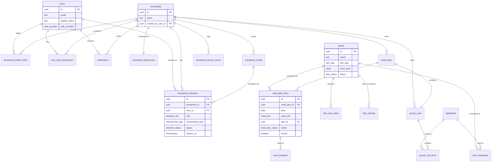

# Database Design

PostgreSQL schema for Home Meal Planner, designed for Supabase (Postgres +
Auth + Row-Level Security). This is the **source of truth** for all table,
column, and enum names used across the rest of the design docs.

Derived from [`../docs/03_data_model.md`](../docs/03_data_model.md) and hardened
for production: explicit types, foreign keys with delete behavior, constraints,
indexes, and RLS.

## Design principles

1. **UUID primary keys** (`gen_random_uuid()`) so IDs can be generated client- or
   server-side without coordination.
2. **Native enum types** for fixed value sets — self-documenting and validated at
   the DB layer. Sets that are expected to grow with content (cuisines, regions)
   stay as `text`/`text[]` with an optional future lookup table.
3. **`timestamptz` everywhere**, defaulted to `now()`. `updated_at` is maintained
   by a shared trigger, never trusted from the client.
4. **Household is the tenancy boundary.** Almost every row carries a
   `household_id`; RLS keys off active membership in that household.
5. **Soft state over hard deletes** for domain rows (statuses like `removed`,
   `archived`, `expired`) so activity history and attribution survive.
6. **Foreign keys are explicit about delete behavior** — `cascade` for rows that
   are meaningless without their parent, `set null` for actor/attribution
   references that should outlive the actor.

## Entity relationship diagram



## Extensions

```sql
create extension if not exists pgcrypto;   -- gen_random_uuid()
create extension if not exists pg_cron;     -- scheduled jobs (Supabase-managed)
create extension if not exists pg_trgm;     -- trigram index for dish name search
```

## Enum types

```sql
create type auth_provider       as enum ('google', 'email', 'magic_link');

create type diet_type           as enum ('vegetarian', 'vegan', 'eggetarian',
                                          'non_vegetarian', 'jain', 'pescatarian');
create type spice_level         as enum ('mild', 'medium', 'spicy');
create type difficulty_level    as enum ('easy', 'medium', 'hard');
create type budget_preference   as enum ('low', 'medium', 'high');

create type draft_status        as enum ('in_progress', 'completed', 'abandoned');

create type member_role         as enum ('owner', 'admin', 'member', 'viewer');
create type membership_type     as enum ('permanent', 'temporary_guest');
create type member_status       as enum ('invited', 'active', 'declined',
                                          'expired', 'removed', 'left');
create type invite_status       as enum ('pending', 'accepted', 'declined',
                                          'expired', 'cancelled');

create type meal_slot           as enum ('breakfast', 'lunch', 'dinner', 'snack');
create type dish_status         as enum ('draft', 'active', 'archived');
create type pairing_type        as enum ('main_side', 'rice_pairing',
                                          'bread_pairing', 'condiment', 'beverage');

create type meal_plan_status    as enum ('draft', 'active', 'archived');
create type meal_item_status    as enum ('suggested', 'accepted', 'rejected',
                                          'replaced', 'cooked', 'skipped',
                                          'eating_out');
create type feedback_type       as enum ('liked', 'disliked', 'too_much_effort',
                                          'ingredients_unavailable', 'kids_disliked',
                                          'do_not_suggest_again', 'suggest_more_often');

create type grocery_list_status as enum ('draft', 'active', 'archived');
```

> **Assumption:** `diet_type`, `spice_level`, `difficulty_level`, and
> `budget_preference` value sets are inferred — the product specs name the fields
> but not all values. Adjust before launch; changing an enum later requires
> `alter type ... add value` (additive, safe) or a migration (for removals).

## Shared `updated_at` trigger

```sql
create or replace function set_updated_at()
returns trigger language plpgsql as $$
begin
  new.updated_at = now();
  return new;
end; $$;
-- Attach to every table that has updated_at:
--   create trigger trg_set_updated_at before update on <table>
--   for each row execute function set_updated_at();
```

## Tables

### `users`

Public profile mirroring Supabase `auth.users`. The app never writes
authentication credentials — only profile data. `id` equals `auth.users.id`.

```sql
create table users (
  id            uuid primary key references auth.users(id) on delete cascade,
  email         text unique not null,
  phone         text unique,
  display_name  text,
  avatar_url    text,
  auth_provider auth_provider not null default 'email',
  created_at    timestamptz not null default now(),
  updated_at    timestamptz not null default now()
);
```

> A trigger on `auth.users` (`on insert`) should upsert the matching `users` row
> so a profile always exists post-signup. See doc 03.

### `households`

```sql
create table households (
  id                       uuid primary key default gen_random_uuid(),
  name                     text not null,
  created_by_user_id       uuid not null references users(id),
  default_location_country text,
  default_location_city    text,
  created_at               timestamptz not null default now(),
  updated_at               timestamptz not null default now()
);
```

### `household_preferences`

One row per household (1:1). Holds the household-level planning configuration.

```sql
create table household_preferences (
  id                          uuid primary key default gen_random_uuid(),
  household_id                uuid not null unique references households(id) on delete cascade,
  family_size                 int  not null check (family_size between 1 and 50),
  adults_count                int  not null default 0 check (adults_count >= 0),
  kids_count                  int  not null default 0 check (kids_count >= 0),
  diet_type                   diet_type not null,
  preferred_cuisines          text[] not null default '{}',
  spice_level                 spice_level not null default 'medium',
  weekday_cooking_time_minutes int check (weekday_cooking_time_minutes > 0),
  weekend_cooking_time_minutes int check (weekend_cooking_time_minutes > 0),
  meals_to_plan               text[] not null default '{}',  -- values from meal_slot
  variety_gap_days            int not null default 7 check (variety_gap_days between 0 and 60),
  allow_leftovers             boolean not null default true,
  budget_preference           budget_preference not null default 'medium',
  created_at                  timestamptz not null default now(),
  updated_at                  timestamptz not null default now()
);
```

### `household_profile_drafts`

Autosaved onboarding progress. One active (`in_progress`) draft per user is
enforced by a partial unique index. See doc 06 for the draft JSON shape.

```sql
create table household_profile_drafts (
  id                    uuid primary key default gen_random_uuid(),
  user_id               uuid not null references users(id) on delete cascade,
  household_id          uuid references households(id) on delete cascade,
  current_step          text not null,
  completion_percentage int  not null default 0 check (completion_percentage between 0 and 100),
  status                draft_status not null default 'in_progress',
  draft_data            jsonb not null default '{}',
  last_saved_at         timestamptz not null default now(),
  created_at            timestamptz not null default now(),
  updated_at            timestamptz not null default now()
);

create unique index uq_one_active_draft_per_user
  on household_profile_drafts (user_id)
  where status = 'in_progress';
```

### `household_members`

Membership and the per-member permission flags. The permission booleans are
denormalized onto the row so every access check is a single indexed read.

```sql
create table household_members (
  id                            uuid primary key default gen_random_uuid(),
  household_id                  uuid not null references households(id) on delete cascade,
  user_id                       uuid not null references users(id) on delete cascade,
  role                          member_role not null default 'member',
  membership_type               membership_type not null default 'permanent',
  status                        member_status not null default 'invited',
  invited_by_user_id            uuid references users(id),
  starts_at                     timestamptz not null default now(),
  expires_at                    timestamptz,            -- non-null for temporary_guest
  joined_at                     timestamptz,
  can_view_plan                 boolean not null default true,
  can_suggest_meals             boolean not null default true,
  can_change_today_menu         boolean not null default false,
  can_change_weekly_schedule    boolean not null default false,
  can_manage_grocery_list       boolean not null default false,
  can_invite_members            boolean not null default false,
  can_remove_members            boolean not null default false,
  can_edit_household_preferences boolean not null default false,
  created_at                    timestamptz not null default now(),
  updated_at                    timestamptz not null default now(),
  constraint guest_has_expiry
    check (membership_type <> 'temporary_guest' or expires_at is not null)
);

-- A user may have at most one non-terminal membership per household.
create unique index uq_one_live_membership
  on household_members (household_id, user_id)
  where status in ('invited', 'active');

create index ix_members_household_active
  on household_members (household_id) where status = 'active';
create index ix_members_user        on household_members (user_id);
create index ix_members_guest_expiry
  on household_members (expires_at)
  where membership_type = 'temporary_guest' and status = 'active';
```

### `household_invites`

```sql
create table household_invites (
  id                  uuid primary key default gen_random_uuid(),
  household_id        uuid not null references households(id) on delete cascade,
  invited_by_user_id  uuid not null references users(id),
  invited_email       text,
  invited_phone       text,
  invite_token        text not null unique,   -- random, opaque; see doc 03
  role                member_role not null default 'member',
  membership_type     membership_type not null default 'permanent',
  permissions         jsonb not null default '{}',
  starts_at           timestamptz not null default now(),
  expires_at          timestamptz not null,
  status              invite_status not null default 'pending',
  accepted_by_user_id uuid references users(id),
  accepted_at         timestamptz,
  declined_at         timestamptz,
  created_at          timestamptz not null default now(),
  updated_at          timestamptz not null default now(),
  constraint invite_has_target
    check (invited_email is not null or invited_phone is not null)
);

create index ix_invites_token
  on household_invites (invite_token) where status = 'pending';
create index ix_invites_pending_expiry
  on household_invites (expires_at) where status = 'pending';
```

### `user_food_preferences`

Member-level food preferences (1 row per user per household).

```sql
create table user_food_preferences (
  id                    uuid primary key default gen_random_uuid(),
  user_id               uuid not null references users(id) on delete cascade,
  household_id          uuid not null references households(id) on delete cascade,
  diet_type             diet_type,
  allergies             text[] not null default '{}',
  disliked_ingredients  text[] not null default '{}',
  liked_dishes          text[] not null default '{}',
  disliked_dishes       text[] not null default '{}',
  spice_preference      spice_level,
  health_preference_tags text[] not null default '{}',
  created_at            timestamptz not null default now(),
  updated_at            timestamptz not null default now(),
  unique (user_id, household_id)
);
```

### `dishes`

Global content (not household-scoped). Readable by all authenticated users when
`status = 'active'`; writable only by admins/operators (doc 06 of `../docs/`).

```sql
create table dishes (
  id                uuid primary key default gen_random_uuid(),
  name              text not null,
  description       text,
  cuisine           text,
  region            text,
  meal_slots        text[] not null default '{}',  -- values from meal_slot
  diet_type         diet_type not null,
  prep_time_minutes int not null default 0 check (prep_time_minutes >= 0),
  cook_time_minutes int not null default 0 check (cook_time_minutes >= 0),
  total_time_minutes int generated always as (prep_time_minutes + cook_time_minutes) stored,
  difficulty        difficulty_level not null default 'easy',
  spice_level       spice_level not null default 'medium',
  kid_friendly      boolean not null default false,
  lunchbox_friendly boolean not null default false,
  leftover_friendly boolean not null default false,
  batch_cook_friendly boolean not null default false,
  diabetic_friendly boolean not null default false,
  low_sodium        boolean not null default false,
  high_protein      boolean not null default false,
  low_carb          boolean not null default false,
  status            dish_status not null default 'draft',
  created_at        timestamptz not null default now(),
  updated_at        timestamptz not null default now()
);

create index ix_dishes_active        on dishes (status) where status = 'active';
create index ix_dishes_meal_slots_gin on dishes using gin (meal_slots);
create index ix_dishes_diet           on dishes (diet_type);
create index ix_dishes_name_trgm      on dishes using gin (name gin_trgm_ops); -- requires pg_trgm
```

### `ingredients`

```sql
create table ingredients (
  id            uuid primary key default gen_random_uuid(),
  name          text not null unique,
  category      text not null,   -- vegetables, fruits, dairy, grains, lentils, spices, eggs_meat, pantry
  default_unit  text not null,
  common_names  text[] not null default '{}',
  allergen_type text,
  created_at    timestamptz not null default now(),
  updated_at    timestamptz not null default now()
);
```

### `dish_ingredients`

```sql
create table dish_ingredients (
  id                   uuid primary key default gen_random_uuid(),
  dish_id              uuid not null references dishes(id) on delete cascade,
  ingredient_id        uuid not null references ingredients(id) on delete restrict,
  quantity_per_serving numeric(10,3) not null check (quantity_per_serving > 0),
  unit                 text not null,
  is_required          boolean not null default true,
  is_optional          boolean not null default false,
  created_at           timestamptz not null default now(),
  updated_at           timestamptz not null default now(),
  unique (dish_id, ingredient_id)
);

create index ix_dish_ingredients_dish on dish_ingredients (dish_id);
```

### `dish_prep_tasks`

```sql
create table dish_prep_tasks (
  id                     uuid primary key default gen_random_uuid(),
  dish_id                uuid not null references dishes(id) on delete cascade,
  task_name              text not null,
  required_before_minutes int not null check (required_before_minutes >= 0),
  description            text,
  created_at             timestamptz not null default now(),
  updated_at             timestamptz not null default now()
);

create index ix_prep_tasks_dish on dish_prep_tasks (dish_id);
```

### `dish_pairings`

Directional pairing (primary → paired) of one type.

```sql
create table dish_pairings (
  id              uuid primary key default gen_random_uuid(),
  primary_dish_id uuid not null references dishes(id) on delete cascade,
  paired_dish_id  uuid not null references dishes(id) on delete cascade,
  pairing_type    pairing_type not null,
  created_at      timestamptz not null default now(),
  updated_at      timestamptz not null default now(),
  constraint no_self_pair check (primary_dish_id <> paired_dish_id),
  unique (primary_dish_id, paired_dish_id, pairing_type)
);
```

### `meal_plans`

```sql
create table meal_plans (
  id                  uuid primary key default gen_random_uuid(),
  household_id        uuid not null references households(id) on delete cascade,
  start_date          date not null,
  end_date            date not null,
  status              meal_plan_status not null default 'draft',
  generated_by_user_id uuid references users(id),
  created_at          timestamptz not null default now(),
  updated_at          timestamptz not null default now(),
  constraint plan_dates_ordered check (end_date >= start_date)
);

create index ix_meal_plans_household on meal_plans (household_id, start_date desc);
-- At most one active plan covering a given start date per household:
create unique index uq_active_plan_per_start
  on meal_plans (household_id, start_date) where status = 'active';
```

### `meal_plan_items`

The individual planned meals. `household_id` is denormalized for RLS and query
locality. `dish_id` is nullable (e.g. an `eating_out` slot has no dish).

```sql
create table meal_plan_items (
  id                uuid primary key default gen_random_uuid(),
  meal_plan_id      uuid not null references meal_plans(id) on delete cascade,
  household_id      uuid not null references households(id) on delete cascade,
  date              date not null,
  meal_slot         meal_slot not null,
  dish_id           uuid references dishes(id) on delete set null,
  status            meal_item_status not null default 'suggested',
  locked            boolean not null default false,
  reason            text,                    -- recommendation explanation
  changed_by_user_id uuid references users(id),
  created_at        timestamptz not null default now(),
  updated_at        timestamptz not null default now(),
  unique (meal_plan_id, date, meal_slot)
);

create index ix_items_household_date on meal_plan_items (household_id, date);
create index ix_items_dish_recent
  on meal_plan_items (household_id, dish_id, date desc)
  where dish_id is not null;   -- powers variety/rotation lookups
```

### `meal_feedback`

```sql
create table meal_feedback (
  id                uuid primary key default gen_random_uuid(),
  household_id      uuid not null references households(id) on delete cascade,
  meal_plan_item_id uuid not null references meal_plan_items(id) on delete cascade,
  user_id           uuid not null references users(id) on delete cascade,
  feedback_type     feedback_type not null,
  reason            text,
  created_at        timestamptz not null default now()
);

create index ix_feedback_item      on meal_feedback (meal_plan_item_id);
create index ix_feedback_household  on meal_feedback (household_id, created_at desc);
```

### `grocery_lists`

```sql
create table grocery_lists (
  id           uuid primary key default gen_random_uuid(),
  household_id uuid not null references households(id) on delete cascade,
  meal_plan_id uuid not null references meal_plans(id) on delete cascade,
  status       grocery_list_status not null default 'active',
  created_at   timestamptz not null default now(),
  updated_at   timestamptz not null default now(),
  unique (meal_plan_id)
);
```

### `grocery_list_items`

`ingredient_id` is nullable so ad-hoc/manual items can be added. `name`,
`category`, and `unit` are snapshotted at generation time.

```sql
create table grocery_list_items (
  id              uuid primary key default gen_random_uuid(),
  grocery_list_id uuid not null references grocery_lists(id) on delete cascade,
  ingredient_id   uuid references ingredients(id) on delete set null,
  name            text not null,
  category        text not null,
  quantity        numeric(10,3) not null check (quantity >= 0),
  unit            text not null,
  checked         boolean not null default false,
  created_at      timestamptz not null default now(),
  updated_at      timestamptz not null default now()
);

create index ix_grocery_items_list on grocery_list_items (grocery_list_id);
```

### `household_activity_events`

Append-only audit log. `actor_user_id` uses `set null` so a removed user's
account deletion doesn't erase history.

```sql
create table household_activity_events (
  id            uuid primary key default gen_random_uuid(),
  household_id  uuid not null references households(id) on delete cascade,
  actor_user_id uuid references users(id) on delete set null,
  event_type    text not null,
  entity_type   text not null,
  entity_id     uuid,
  old_value     jsonb,
  new_value     jsonb,
  created_at    timestamptz not null default now()
);

create index ix_activity_household on household_activity_events (household_id, created_at desc);
```

### `notifications`

```sql
create table notifications (
  id                uuid primary key default gen_random_uuid(),
  household_id      uuid not null references households(id) on delete cascade,
  recipient_user_id uuid not null references users(id) on delete cascade,
  actor_user_id     uuid references users(id) on delete set null,
  event_type        text not null,
  title             text not null,
  message           text not null,
  read_at           timestamptz,
  created_at        timestamptz not null default now()
);

create index ix_notifications_recipient_unread
  on notifications (recipient_user_id, created_at desc) where read_at is null;
```

### `notification_preferences` (V2)

Deferred per `../docs/09_notifications_spec.md`; sketched here so the schema can
absorb it without rework.

```sql
create table notification_preferences (
  user_id              uuid not null references users(id) on delete cascade,
  household_id         uuid not null references households(id) on delete cascade,
  in_app_enabled       boolean not null default true,
  email_enabled        boolean not null default true,
  push_enabled         boolean not null default false,
  whatsapp_enabled     boolean not null default false,
  prep_reminders_enabled boolean not null default true,
  menu_change_enabled  boolean not null default true,
  grocery_updates_enabled boolean not null default true,
  primary key (user_id, household_id)
);
```

## Key invariants

| Invariant                                               | Enforced by                                |
| ------------------------------------------------------- | ------------------------------------------ |
| One in-progress draft per user                          | `uq_one_active_draft_per_user`             |
| One live (invited/active) membership per user+household | `uq_one_live_membership`                   |
| Temporary guests must have an expiry                    | `guest_has_expiry` check                   |
| One meal item per plan/date/slot                        | `unique (meal_plan_id, date, meal_slot)`   |
| One grocery list per meal plan                          | `unique (meal_plan_id)` on `grocery_lists` |
| Invite tokens are unique                                | `unique (invite_token)`                    |
| A dish never pairs with itself                          | `no_self_pair` check                       |
| Plan date range is ordered                              | `plan_dates_ordered` check                 |

## Row-Level Security strategy

RLS is **enabled on every household-scoped table**. Global content tables
(`dishes`, `ingredients`, `dish_ingredients`, `dish_prep_tasks`, `dish_pairings`)
are world-readable when active and admin-writable. Two `security definer` helper
functions keep policies short:

```sql
-- Is the current user an active (non-expired) member of this household?
create or replace function is_active_member(h uuid)
returns boolean language sql stable security definer set search_path = public as $$
  select exists (
    select 1 from household_members m
    where m.household_id = h
      and m.user_id = auth.uid()
      and m.status = 'active'
      and (m.expires_at is null or m.expires_at > now())
  );
$$;

-- Does the current user hold a named permission in this household?
create or replace function has_permission(h uuid, perm text)
returns boolean language plpgsql stable security definer set search_path = public as $$
declare ok boolean;
begin
  execute format(
    'select coalesce(bool_or(%I), false) from household_members
       where household_id = $1 and user_id = $2 and status = ''active''
         and (expires_at is null or expires_at > now())', perm)
  into ok using h, auth.uid();
  return ok;
end; $$;
```

Representative policies (full set in doc 03):

```sql
alter table meal_plan_items enable row level security;

create policy mpi_select on meal_plan_items
  for select using (is_active_member(household_id));

create policy mpi_update_today on meal_plan_items
  for update using (has_permission(household_id, 'can_change_today_menu'))
  with check (has_permission(household_id, 'can_change_today_menu'));
```

**Defense in depth:** RLS is the backstop, not the only gate. The service layer
still performs explicit permission checks (doc 03) so denials produce clean
domain errors rather than empty result sets, and the real-time guest-expiry
check (`expires_at > now()`) is evaluated on every access, not just by the
scheduled job.

| Table                                        | RLS read                                               | RLS write                                          |
| -------------------------------------------- | ------------------------------------------------------ | -------------------------------------------------- |
| `households`, `household_preferences`        | active member                                          | owner/`can_edit_household_preferences`             |
| `household_members`                          | active member                                          | `can_invite_members` / `can_remove_members` / self |
| `household_invites`                          | active member; token lookup is unauthenticated via RPC | `can_invite_members`                               |
| `meal_plans`, `meal_plan_items`              | active member                                          | `can_change_*` per slot                            |
| `grocery_lists`, `grocery_list_items`        | active member                                          | `can_manage_grocery_list`                          |
| `meal_feedback`                              | active member                                          | self (own feedback)                                |
| `user_food_preferences`                      | self + household admins                                | self                                               |
| `household_activity_events`, `notifications` | active member / recipient                              | system only (server role)                          |
| `dishes`, `ingredients`, `dish_*`            | any authenticated (active rows)                        | admin role only                                    |

## Migrations & seeding

- Manage schema with **Supabase migrations** (`supabase/migrations/*.sql`),
  one ordered file per change; never edit applied migrations.
- Order: extensions → enums → `set_updated_at()` → tables (respecting FK order)
  → indexes → RLS helpers & policies → triggers.
- **Seed** (`supabase/seed.sql`): ingredient catalog and the 100 starter dishes
  (Phase 0 of `../docs/12_mvp_roadmap.md`), inserted with `status = 'active'`
  only after passing the dish quality checklist in
  [`../docs/06_admin_operator_spec.md`](../docs/06_admin_operator_spec.md).
- Keep `dev` and `prod` Supabase projects separate; promote via migration, never
  by manual edits in the dashboard.
