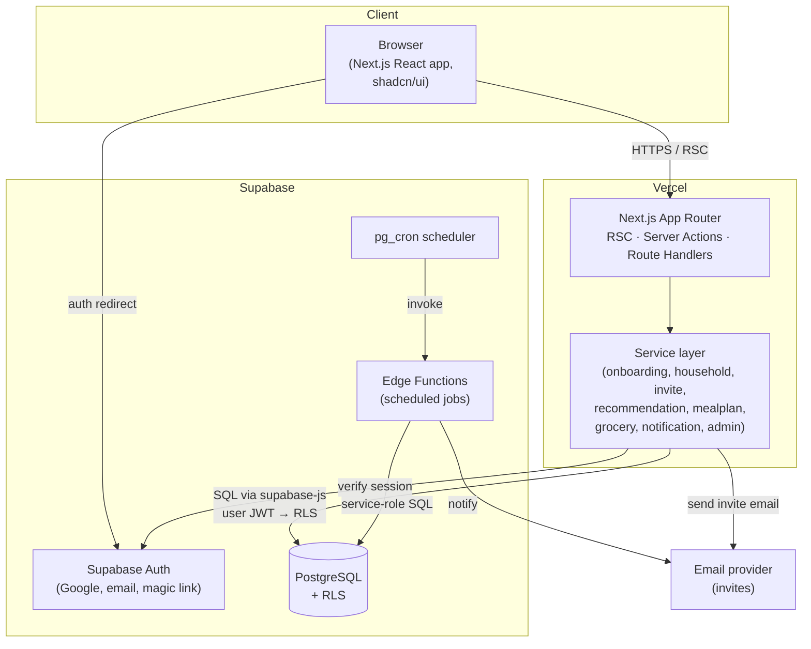
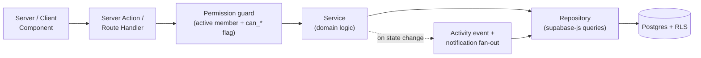
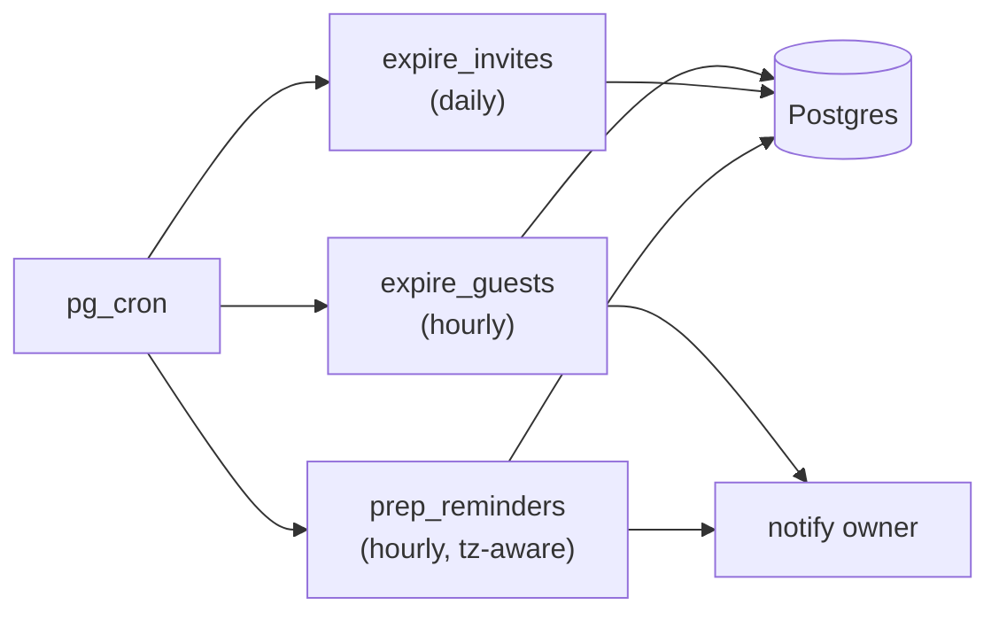

# System Architecture

How Home Meal Planner is structured, deployed, and operated. Builds on the stack
chosen in [`../docs/11_technical_architecture.md`](../docs/11_technical_architecture.md)
and the schema in [doc 01](01_database_design.md).

## Stack

| Layer | Choice | Why |
|-------|--------|-----|
| Web framework | **Next.js (App Router) + React** | Server components + server actions keep business logic on the server, close to the DB. |
| Styling / UI | **Tailwind CSS + shadcn/ui** | Fast, consistent, accessible component primitives. |
| Backend logic | **Next.js server actions / route handlers** | Co-located with the app; one deploy target. Heavy/scheduled work moves to Edge Functions. |
| Database | **Supabase PostgreSQL** | Relational fit for the schema; RLS for multi-tenant isolation. |
| Auth | **Supabase Auth** | Google OAuth + email/magic-link out of the box (`../docs/01`). |
| Authorization | **Postgres RLS + service-layer checks** | Defense in depth (doc 03). |
| Background jobs | **pg_cron + Supabase Edge Functions** | Guest expiry, invite expiry, prep reminders. |
| Hosting | **Vercel** (web) + **Supabase** (DB/auth/functions) | Managed, low-ops, separate dev/prod projects. |
| Email | **Transactional email provider** (e.g. Resend) | Invite emails (MVP); abstracted behind a notifier port. |

## Container view



## Layered request flow

Business rules live in a **service layer**, never in components or directly in
route handlers. Components call server actions; server actions resolve the
session, then delegate to services; services enforce permissions and run
queries. RLS is the final backstop in the database.



Request lifecycle for a write (e.g. *change today's dinner*):

1. Client component invokes a server action with the meal item id + new dish.
2. Action resolves the Supabase session → `userId`; rejects if unauthenticated.
3. Permission guard checks active membership + `can_change_today_menu`
   (doc 03). Fails → typed `ForbiddenError`.
4. Service applies last-write-wins update inside a transaction, writes a
   `household_activity_events` row, and enqueues notifications for other active
   members (doc 09).
5. RLS independently re-validates the write; a bug in the guard still can't leak
   across households.
6. Action returns a typed result; UI revalidates the affected cache tags.

## Service modules

Each maps to a folder under `lib/services/` and to the responsibilities in
`../docs/11_technical_architecture.md`.

| Service | Owns | Primary docs |
|---------|------|--------------|
| `onboarding` | Draft save/resume, completion, household + owner creation | doc 06 |
| `household` | Household CRUD, preferences, membership reads | docs 01, 04 |
| `invite` | Token issue/validate/accept/decline/expire | docs 03, 07 |
| `recommendation` | Hard filters, scoring, ranking, explanation | doc 05 |
| `mealPlan` | Today/weekly generation, replace, eating-out, lock | doc 08 |
| `grocery` | Aggregate + scale + group ingredients, regen | doc 08 |
| `prep` | Extract prep tasks, schedule reminders | doc 08 |
| `notification` | Create, fan-out, mark read, send email | doc 09 |
| `admin` | Dish/ingredient/prep/pairing content management | `../docs/06` |

Cross-cutting modules: `lib/auth` (session + guards), `lib/db` (supabase
clients), `lib/events` (activity log + notification dispatch), `lib/errors`
(typed domain errors).

## Proposed repository structure

```text
app/                    # Next.js App Router
  (marketing)/          # public landing
  (auth)/               # sign-in, callback
  (app)/                # authenticated shell
    onboarding/         # save/resume wizard (doc 06)
    today/              # today's meal (doc 08)
    plan/               # weekly plan (doc 08)
    grocery/            # grocery list (doc 08)
    household/          # members, invites, settings (doc 07)
    notifications/
  admin/                # operator console (../docs/06)
  api/                  # route handlers where actions don't fit
components/             # shadcn/ui-based components
lib/
  auth/                 # session, permission guards
  db/                   # supabase server/client/service-role factories
  services/             # one folder per service module above
  events/               # activity + notification dispatch
  recommendation/       # scoring engine (doc 05)
  errors/               # typed domain errors
supabase/
  migrations/           # ordered SQL migrations (doc 01)
  functions/            # edge functions (scheduled jobs)
  seed.sql              # ingredients + starter dishes
docs/                   # product specs
design/                 # these design docs
```

## Supabase client strategy

Three distinct clients, never interchanged:

- **Server (RLS) client** — created per request with the user's JWT. Used for all
  user-initiated reads/writes; RLS applies. Default everywhere in the app.
- **Browser client** — anon key, RLS applies; used only for auth and realtime
  subscriptions, not for privileged writes.
- **Service-role client** — bypasses RLS. **Only** inside Edge Functions / cron
  jobs and admin tooling. Never imported into a user-request path.

## Scheduled jobs

Run as Edge Functions invoked by `pg_cron` (per
`../docs/11_technical_architecture.md`). Each uses the service-role client and is
idempotent.



| Job | Cadence | Logic |
|-----|---------|-------|
| `expire_guests` | hourly | Active `temporary_guest` rows with `expires_at < now()` → `status = expired`; activity event + owner notification. Access checks also enforce expiry in real time (doc 03). |
| `expire_invites` | daily | Pending invites past `expires_at` → `expired`. |
| `prep_reminders` | hourly | Find `dish_prep_tasks` due before their `required_before_minutes` window for upcoming planned meals → create prep notifications (doc 08/09). |

## Environments & configuration

- Separate **dev** and **prod** Supabase + Vercel projects.
- Secrets via environment variables only: `NEXT_PUBLIC_SUPABASE_URL`,
  `NEXT_PUBLIC_SUPABASE_ANON_KEY`, `SUPABASE_SERVICE_ROLE_KEY` (server/functions
  only — never shipped to the browser), email provider key.
- Schema changes flow dev → prod **only through migrations** (doc 01).

## Cross-cutting concerns

- **Error model:** services throw typed errors (`ValidationError`,
  `ForbiddenError`, `NotFoundError`, `ConflictError`) mapped to HTTP/action
  results by a single boundary (doc 04).
- **Idempotency:** generation endpoints accept an idempotency key so retries
  don't create duplicate plans/lists.
- **Observability:** structured logs around service calls and jobs; track the
  metrics in [`../docs/13_success_metrics.md`](../docs/13_success_metrics.md)
  via activity events.
- **Testing:** unit-test the recommendation scoring (pure functions, doc 05);
  integration-test services against a disposable Supabase instance with RLS on;
  exercise permission matrices in doc 03.

## Future scaling (post-MVP)

Per `../docs/11`, if load grows: extract the recommendation engine and
notification dispatch into dedicated workers/services, add a mobile client
against the same API, and introduce a queue for fan-out instead of synchronous
dispatch. The service-layer boundary above is what makes that extraction
mechanical rather than a rewrite.
