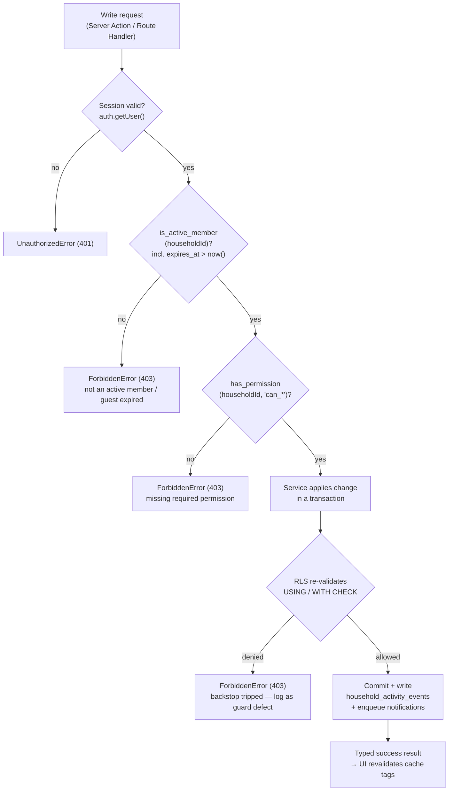

# Authentication & Security Design

How Home Meal Planner authenticates users and enforces access control. This is
the production-grade elaboration of
[`../docs/10_security_privacy_permissions.md`](../docs/10_security_privacy_permissions.md),
and it builds directly on the schema, helper functions, and RLS strategy defined
in [Database Design](01_database_design.md) and the layered request flow in
[System Architecture](02_system_architecture.md). All database identifiers below
(`snake_case`) are the exact names from [Database Design](01_database_design.md);
all API field names (`camelCase`) match [`../docs/05_api_spec.md`](../docs/05_api_spec.md).

The security posture is **defense in depth**: authentication at the edge, an
explicit service-layer permission guard, and Postgres Row-Level Security (RLS)
as an independent backstop. No single layer is trusted to be the only gate.

---

## 1. Authentication providers & session model

Authentication is delegated entirely to **Supabase Auth**. The app never stores
or handles passwords, OAuth secrets, or refresh-token rotation logic itself — it
consumes the resulting session.

### Providers (MVP)

| Provider | `auth_provider` enum value | Notes |
|----------|---------------------------|-------|
| Google OAuth | `google` | Primary, lowest-friction path. Authorization-code flow with PKCE. |
| Email / password | `email` | Standard Supabase email auth with confirmation. |
| Magic link | `magic_link` | Passwordless email link (OTP-over-link). |
| Mobile OTP (SMS) | — | **Deferred** per [`../docs/01_product_requirements.md`](../docs/01_product_requirements.md). The `users.phone` column and `auth_provider` enum are forward-compatible; no schema change needed to add it. |

The `auth_provider` enum (`'google' | 'email' | 'magic_link'`) is defined in
[Database Design](01_database_design.md) and is stored on the public
`users.auth_provider` column for analytics and support, not for authorization.

### JWT session handling

- On successful sign-in, Supabase Auth issues a short-lived **access token (JWT)**
  and a long-lived **refresh token**. The JWT carries the user id in the `sub`
  claim, surfaced in Postgres as `auth.uid()`.
- Tokens are persisted in **HTTP-only, `Secure`, `SameSite=Lax` cookies** managed
  by the Supabase SSR helpers on the Next.js side. They are never written to
  `localStorage` and are not readable by client JavaScript, which mitigates XSS
  token theft.
- The access token is short-lived (default ~1 hour); the SSR client transparently
  refreshes it using the refresh token. Refresh-token rotation is handled by
  Supabase Auth.
- RLS policies and helper functions read identity exclusively from `auth.uid()`
  (the verified JWT), never from a client-supplied `userId`.

### Server-side session resolution

Per [System Architecture](02_system_architecture.md), business logic lives in the
service layer. Every authenticated request resolves the session **on the server**
before any domain work:

1. A Next.js Server Component / Server Action / Route Handler creates a
   **per-request, RLS-scoped Supabase client** seeded with the request cookies.
2. `lib/auth` calls `supabase.auth.getUser()`, which **verifies the JWT against
   Supabase Auth** (it does not merely decode it). An unverified or expired token
   yields no user.
3. No user → the request is rejected with an `UnauthorizedError` before reaching
   any service. There is no "trust the cookie" shortcut.
4. The resolved `userId` (= `auth.users.id` = `public.users.id`) is threaded into
   the service layer; all subsequent SQL runs through the RLS-scoped client so the
   user's JWT reaches Postgres and `auth.uid()` is populated.

The three Supabase clients (per-request RLS client, browser anon client,
service-role client) are kept strictly separate as described in
[System Architecture](02_system_architecture.md). The **service-role client
bypasses RLS** and is permitted only inside Edge Functions / cron jobs and admin
tooling — never in a user-request path.

### `auth.users` → public `users` profile provisioning

Supabase owns the `auth.users` table (credentials, providers, confirmation
state). The app owns `public.users` (profile mirror, see
[Database Design](01_database_design.md)), where `public.users.id` references
`auth.users(id)`. To guarantee a profile row always exists immediately after
signup, an **on-insert trigger on `auth.users`** upserts the matching profile:

```sql
-- security definer so it can write public.users regardless of the caller's role.
create or replace function handle_new_auth_user()
returns trigger
language plpgsql
security definer
set search_path = public
as $$
begin
  insert into public.users (id, email, phone, display_name, avatar_url, auth_provider)
  values (
    new.id,
    new.email,
    new.phone,
    coalesce(new.raw_user_meta_data ->> 'full_name',
             new.raw_user_meta_data ->> 'name'),
    new.raw_user_meta_data ->> 'avatar_url',
    case
      when new.raw_app_meta_data ->> 'provider' = 'google' then 'google'::auth_provider
      when (new.raw_user_meta_data ? 'magic_link')          then 'magic_link'::auth_provider
      else 'email'::auth_provider
    end
  )
  on conflict (id) do update
    set email        = excluded.email,
        phone        = coalesce(excluded.phone, public.users.phone),
        display_name = coalesce(excluded.display_name, public.users.display_name),
        avatar_url   = coalesce(excluded.avatar_url, public.users.avatar_url),
        updated_at   = now();
  return new;
end;
$$;

create trigger trg_provision_user_profile
  after insert on auth.users
  for each row execute function handle_new_auth_user();
```

Notes:
- The `on conflict (id) do update` makes the trigger **idempotent**, so a
  re-provision or backfill is safe.
- It runs as `security definer` because `auth.users` triggers execute under the
  auth subsystem; the explicit `set search_path = public` prevents search-path
  hijacking.
- The app code treats "profile may not yet exist" defensively too, but in
  practice the trigger guarantees it before the first authenticated request lands.

---

## 2. Sign-in sequence — Google OAuth

```mermaid
sequenceDiagram
    autonumber
    participant Browser
    participant Next as Next.js (Vercel)
    participant Auth as Supabase Auth
    participant PG as Postgres

    Browser->>Next: Click "Continue with Google"
    Next->>Auth: signInWithOAuth(provider=google, redirectTo=/auth/callback) + PKCE challenge
    Auth-->>Browser: 302 redirect to Google consent
    Browser->>Auth: Google authenticates, returns to Supabase callback
    Auth-->>Browser: 302 redirect to /auth/callback?code=...
    Browser->>Next: GET /auth/callback?code=...
    Next->>Auth: exchangeCodeForSession(code) + PKCE verifier
    Auth->>PG: INSERT auth.users (first sign-in only)
    PG->>PG: trg_provision_user_profile: upsert public.users
    Auth-->>Next: { access_token (JWT), refresh_token }
    Next-->>Browser: Set HTTP-only Secure cookies; redirect to /today (or /onboarding)
    Note over Browser,PG: Subsequent requests carry the cookie → server resolves session via auth.getUser() → auth.uid() drives RLS
```

The same shape applies to email/password and magic link, differing only in the
first exchange (credential POST or link-token exchange) instead of the OAuth
code exchange. The profile-provisioning trigger fires identically on the first
`auth.users` insert regardless of provider.

---

## 3. Authorization model

Authorization is **layered** for defense in depth, matching the request
lifecycle in [System Architecture](02_system_architecture.md):

1. **Authentication** — session resolved server-side (Section 1). Missing/invalid
   session → `UnauthorizedError`.
2. **Service-layer permission guard** (`lib/auth`) — the *primary* gate. Before a
   service touches data it asserts:
   - the user is an **active, non-expired member** of the target household, and
   - for writes, the user holds the specific `can_*` flag the action requires.

   Guards throw **typed domain errors** (`ForbiddenError`, `UnauthorizedError`,
   `NotFoundError`) so callers get clean, intentional responses — not empty
   result sets that are ambiguous to debug.
3. **Postgres RLS** — the *backstop*. Even if a guard is forgotten or buggy, RLS
   re-validates every read and write at the database boundary, so a defect can
   never leak data across households.

The service layer and RLS share the **same two `security definer` helper
functions** defined in [Database Design](01_database_design.md), so the rules are
expressed once and reused:

- **`is_active_member(h uuid) → boolean`** — true iff the current user
  (`auth.uid()`) has a `household_members` row in household `h` with
  `status = 'active'` and `(expires_at is null or expires_at > now())`. The
  `expires_at > now()` clause is what makes guest expiry **real-time** (Section 8).
- **`has_permission(h uuid, perm text) → boolean`** — true iff the current user is
  an active, non-expired member of `h` whose named `can_*` column is `true`.

The service layer invokes the same logic (either by calling these functions via
RPC or by mirroring them in TypeScript) so a denial is detected *before* the
write is attempted, producing a `ForbiddenError` rather than a silent RLS rejection.

---

## 4. Role → default permission matrix

Roles (`member_role` enum: `owner | admin | member | viewer`) seed the eight
`can_*` flags on `household_members`. The flags are the **source of truth** at
runtime — a role is just a convenient default bundle applied at invite/creation
time, and individual flags can be overridden per member (matching the
"Choose permissions" capability in [`../docs/01_product_requirements.md`](../docs/01_product_requirements.md)).

Defaults below are consistent with the role capabilities in
[`../docs/08_household_collaboration_spec.md`](../docs/08_household_collaboration_spec.md)
and the column defaults in [Database Design](01_database_design.md).

| `household_members` flag | owner | admin | member | viewer |
|--------------------------|:-----:|:-----:|:------:|:------:|
| `can_view_plan`                | ✅ | ✅ | ✅ | ✅ |
| `can_suggest_meals`            | ✅ | ✅ | ✅ | ❌ |
| `can_change_today_menu`        | ✅ | ✅ | ❌¹ | ❌ |
| `can_change_weekly_schedule`   | ✅ | ✅ | ❌¹ | ❌ |
| `can_manage_grocery_list`      | ✅ | ✅ | ❌¹ | ❌ |
| `can_invite_members`           | ✅ | ✅² | ❌ | ❌ |
| `can_remove_members`           | ✅ | ❌ | ❌ | ❌ |
| `can_edit_household_preferences` | ✅ | ✅³ | ❌ | ❌ |

¹ Off by default but commonly enabled per-member ("Change meals if permission is
enabled" — [`../docs/08`](../docs/08_household_collaboration_spec.md)). Matches the
schema defaults (`can_change_*` default `false`).

² Admins may invite **only if** `can_invite_members` is enabled
([`../docs/08`](../docs/08_household_collaboration_spec.md)). Enabled by default for
admins; can be revoked.

³ Admins can edit *some* household preferences. MVP models this as a single
`can_edit_household_preferences` flag; finer-grained preference scopes are a
post-MVP refinement.

**Owner invariants** (enforced in the `household` / membership service, not by a
single column):
- An owner cannot remove themselves or be stripped of `can_remove_members` while
  they remain owner.
- Ownership must be **transferred before leaving** (`POST /api/households/{householdId}/leave`)
  — a household must always have exactly one owner.
- `can_remove_members` is owner-only by default; the schema permits granting it,
  but the membership service refuses to remove the owner regardless of flags.

---

## 5. RLS policy catalog

RLS is **enabled on every household-scoped table**; global content tables are
world-readable when active and admin-writable. The catalog below is the concrete
expansion of the RLS table in [Database Design](01_database_design.md), expressed
with the shared helper functions. Enable RLS once per table, then attach
policies:

```sql
alter table households            enable row level security;
alter table household_members     enable row level security;
alter table meal_plan_items       enable row level security;
alter table grocery_lists         enable row level security;
alter table user_food_preferences enable row level security;
alter table notifications         enable row level security;
alter table dishes                enable row level security;
```

### `households` — read: active member; write: owner / preference-editor

```sql
create policy households_select on households
  for select using (is_active_member(id));

-- Edits to the household row itself require the preference-edit permission.
create policy households_update on households
  for update using  (has_permission(id, 'can_edit_household_preferences'))
  with check        (has_permission(id, 'can_edit_household_preferences'));

-- Creation is owner-bootstrapping: the creator must be the authenticated user.
create policy households_insert on households
  for insert with check (created_by_user_id = auth.uid());
```

> `household_preferences` mirrors this: `for select using (is_active_member(household_id))`
> and `for all using/with check (has_permission(household_id, 'can_edit_household_preferences'))`.

### `household_members` — read: active member; write: invite/remove perms or self

```sql
-- Any active member can see the roster.
create policy hm_select on household_members
  for select using (is_active_member(household_id));

-- Adding members requires invite permission.
create policy hm_insert on household_members
  for insert with check (has_permission(household_id, 'can_invite_members'));

-- Updating another member (role/permission/status changes) requires remove perm
-- for status downgrades and invite perm for re-permissioning; a member may also
-- update *their own* row (e.g. accept invite, leave).
create policy hm_update on household_members
  for update using (
        has_permission(household_id, 'can_remove_members')
     or has_permission(household_id, 'can_invite_members')
     or user_id = auth.uid()
  )
  with check (
        has_permission(household_id, 'can_remove_members')
     or has_permission(household_id, 'can_invite_members')
     or user_id = auth.uid()
  );
```

> Member **removal** is modeled as a status transition to `'removed'` (soft
> state), so it flows through `hm_update`, not a hard `delete`. The membership
> service refuses to remove the owner (Section 4).

### `meal_plan_items` — read: active member; write: per-slot `can_change_*`

```sql
create policy mpi_select on meal_plan_items
  for select using (is_active_member(household_id));

-- Today's menu changes (replace, eating-out, status) require can_change_today_menu.
create policy mpi_update_today on meal_plan_items
  for update using  (has_permission(household_id, 'can_change_today_menu'))
  with check        (has_permission(household_id, 'can_change_today_menu'));
```

> Weekly generation/regeneration writes (which insert/update many
> `meal_plan_items` rows) are gated in the service layer by
> `can_change_weekly_schedule`; the RLS write policies above remain the row-level
> backstop. Grocery management edits to `meal_plan_items` are not permitted —
> they belong to `grocery_lists`.

### `grocery_lists` — read: active member; write: `can_manage_grocery_list`

```sql
create policy gl_select on grocery_lists
  for select using (is_active_member(household_id));

create policy gl_write on grocery_lists
  for all using   (has_permission(household_id, 'can_manage_grocery_list'))
  with check      (has_permission(household_id, 'can_manage_grocery_list'));
```

> `grocery_list_items` has no `household_id` column; its policies join through the
> parent list, e.g.
> `using (exists (select 1 from grocery_lists gl where gl.id = grocery_list_id and is_active_member(gl.household_id)))`
> for select, and the same with `has_permission(gl.household_id, 'can_manage_grocery_list')` for writes.

### `user_food_preferences` — read: self + household admins; write: self only

```sql
-- Owner of the row always; household admins may read for planning context.
create policy ufp_select on user_food_preferences
  for select using (
        user_id = auth.uid()
     or has_permission(household_id, 'can_edit_household_preferences')
  );

-- A user only ever writes their OWN preferences (privacy, Section 9).
create policy ufp_insert on user_food_preferences
  for insert with check (user_id = auth.uid() and is_active_member(household_id));

create policy ufp_update on user_food_preferences
  for update using (user_id = auth.uid())
  with check       (user_id = auth.uid());

create policy ufp_delete on user_food_preferences
  for delete using (user_id = auth.uid());
```

### `notifications` — read: recipient; write: system only

```sql
-- A user sees only notifications addressed to them.
create policy notif_select on notifications
  for select using (recipient_user_id = auth.uid());

-- A recipient may mark their own notification read (update read_at).
create policy notif_update on notifications
  for update using (recipient_user_id = auth.uid())
  with check       (recipient_user_id = auth.uid());

-- No INSERT policy for the user role → inserts come only from the service-role
-- client (notification fan-out runs server-side / in Edge Functions).
```

> `household_activity_events` follows the same shape: `for select using
> (is_active_member(household_id))` and **no user-role write policy** — the audit
> log is written only by the server/service-role path (Section 10), keeping it
> append-only and tamper-resistant from clients.

### Global content tables — read: any authenticated (active rows); write: admin only

`dishes`, `ingredients`, `dish_ingredients`, `dish_prep_tasks`, and
`dish_pairings` are not household-scoped.

```sql
-- Authenticated users may read only ACTIVE dishes.
create policy dishes_select_active on dishes
  for select using (
        auth.uid() is not null
    and status = 'active'
  );

-- Writes restricted to the admin/operator role (custom JWT claim set by the
-- admin console; see ../docs/06_admin_operator_spec.md). Regular users have no
-- write policy and therefore cannot insert/update/delete content.
create policy dishes_admin_write on dishes
  for all using   ((auth.jwt() ->> 'app_role') = 'admin')
  with check      ((auth.jwt() ->> 'app_role') = 'admin');
```

> `ingredients`, `dish_ingredients`, `dish_prep_tasks`, and `dish_pairings` use
> the same pattern: authenticated read (joined to an active parent dish where
> applicable) and an `app_role = 'admin'` write policy. Content authoring in
> practice runs through the admin tooling on the service-role client; the
> `app_role` claim policy is the in-band backstop for any user-JWT admin actions.

---

## 6. Permission check flow

Every write traverses the four layers below. Failures short-circuit into
**typed domain errors** (`lib/errors`, per
[System Architecture](02_system_architecture.md)).



Key properties:
- The **active-membership check (C)** includes the real-time `expires_at > now()`
  test, so an expired guest is rejected even before the scheduled job has run
  (Section 8).
- A **denial at the RLS backstop (R)** should be impossible if the guards are
  correct; when it happens it is surfaced as a `ForbiddenError` **and logged as a
  guard defect** for investigation, because it means the service layer let
  something through that the database refused.
- The action returns a typed result; on success the service writes the audit
  event and fans out notifications to other active members (Section 10).

---

## 7. Invite token security

Invites (`household_invites`) gate access to a household, so the token is a
**bearer secret** and must be treated as one.

Requirements (from
[`../docs/10_security_privacy_permissions.md`](../docs/10_security_privacy_permissions.md)):

- **Random & unguessable** — generate with a CSPRNG, ≥128 bits of entropy,
  URL-safe encoding. Tokens are opaque; they encode no household id, email, or
  role.
- **Expiry** — every invite has a non-null `expires_at` (`invite_has_target` and
  the not-null `expires_at` column in [Database Design](01_database_design.md)).
  The `expire_invites` daily job ([System Architecture](02_system_architecture.md))
  flips pending invites past `expires_at` to `'expired'`, **and** every lookup
  re-checks `status = 'pending' and expires_at > now()` in real time.
- **Single-use** — on acceptance the invite transitions
  `pending → accepted` (sets `accepted_by_user_id`, `accepted_at`) in the **same
  transaction** that creates the `household_members` row, so a token cannot be
  redeemed twice. `declined`/`cancelled`/`expired` are likewise terminal.

### Hashed-at-rest token (recommended)

Store only a **hash** of the token, never the plaintext:

- On issue: generate plaintext `token`; persist `invite_token = sha256(token)`
  (or HMAC with a server pepper) in the unique `invite_token` column; return the
  plaintext **once** in the `inviteLink` and never again.
- On lookup/accept: hash the incoming token the same way and match against the
  stored hash via the existing unique index (`ix_invites_token`).
- This means a database read (leak, backup, or over-broad RLS) does not yield
  usable invite links — the same rationale as not storing password plaintext.

### Unauthenticated lookup must not leak

`GET /api/invites/{token}` ([`../docs/05_api_spec.md`](../docs/05_api_spec.md)) is
called **before** the invitee has authenticated, so it cannot run under normal
RLS member checks. It is exposed via a narrow `security definer` RPC (per the
"token lookup is unauthenticated via RPC" note in
[Database Design](01_database_design.md)) that:

- Accepts the hashed token, validates `status = 'pending' and expires_at > now()`.
- Returns **only** the minimal, non-sensitive preview fields:
  `householdName`, `invitedBy` (display name), `membershipType`, `role`,
  `expiresAt`.
- Returns **none** of: household id, member roster, preferences, meal plans,
  grocery lists, other members' emails/phones, or the raw stored hash.
- Returns a generic "invite not found or expired" for any non-redeemable token —
  no distinction between "wrong token", "expired", and "already accepted" — to
  avoid token-enumeration and existence oracles.
- Is **rate-limited** at the edge to blunt brute-force enumeration (defense in
  depth on top of the high token entropy).

Acceptance (`POST /api/invites/{token}/accept`) requires an authenticated
session: the invitee signs in first (creating `auth.users` + `public.users` via
the Section 1 trigger), then the token is redeemed.

---

## 8. Guest expiry enforcement

Temporary guests (`household_members.membership_type = 'temporary_guest'`) have a
non-null `expires_at` (enforced by the `guest_has_expiry` check in
[Database Design](01_database_design.md)). Expiry is enforced on **two
independent paths** — never the job alone:

1. **Real-time check on every access (authoritative).** Both helper functions —
   `is_active_member()` and `has_permission()` — include
   `(expires_at is null or expires_at > now())`. Because every read and write
   passes through these (service guard *and* RLS), a guest loses access **the
   instant** their window passes, regardless of job timing. This is the gate that
   actually protects data.
2. **Scheduled `expire_guests` job (hourly, housekeeping).** Per
   [System Architecture](02_system_architecture.md), it flips active
   `temporary_guest` rows with `expires_at < now()` to `status = 'expired'`, then
   writes a `household_activity_events` row and notifies the owner. This keeps the
   stored `status` consistent for the roster UI, notifications, and reporting —
   but it is **not** relied upon for access control, since it runs only hourly.

This matches the explicit guidance in
[`../docs/10`](../docs/10_security_privacy_permissions.md): *"Access checks should
also verify expiry in real time. Do not rely only on scheduled expiry."*
Similarly, **removed members** (`status = 'removed' | 'left'`) fail
`is_active_member()` immediately and lose access on their next request, while
retaining historical attribution in `household_activity_events`.

---

## 9. Privacy & sensitive data

The app collects sensitive household data: `user_food_preferences.allergies`,
`disliked_ingredients`, `health_preference_tags`, `diet_type`,
`spice_preference`, and household composition
(`household_preferences.adults_count`, `kids_count`, `family_size`). This is
treated as sensitive personal data.

Handling rules (from
[`../docs/10_security_privacy_permissions.md`](../docs/10_security_privacy_permissions.md)):

- **Least exposure.** Personal food preferences are owner-readable by default;
  `user_food_preferences` is **written only by its owner** (`ufp_*` policies,
  Section 5). Household admins may read for planning context but cannot edit
  another member's preferences.
- **No race.** The app never asks for race. Cultural food signals are captured as
  **cuisine / cultural preference** (`household_preferences.preferred_cuisines`,
  `dishes.cuisine` / `dishes.region`), not ethnicity.
- **No medical claims.** Health-related fields are framed as **"dietary
  preferences"** (`health_preference_tags`, dish flags like `diabetic_friendly`,
  `low_sodium`, `high_protein`, `low_carb`), never as medical treatment or
  diagnosis.
- **Children data minimization.** Only an aggregate `kids_count` is stored; no
  names, ages, or per-child profiles in MVP.
- **User control.** Users can **edit or delete** their own preferences at any
  time (`ufp_update` / `ufp_delete` policies). Account/profile deletion cascades
  via `on delete cascade` from `auth.users → users → user_food_preferences`,
  while `household_activity_events.actor_user_id` uses `set null` so audit
  history survives without re-identifying the deleted user.

### Medical disclaimer (exact text)

Wherever health-related meal tags are shown, display verbatim the text from
[`../docs/10`](../docs/10_security_privacy_permissions.md):

> "This app provides meal planning assistance and is not medical advice. Please
> consult a qualified healthcare professional for medical dietary guidance."

---

## 10. Audit logging

Important household changes write an append-only row to
`household_activity_events` (see [Database Design](01_database_design.md)), in the
**same transaction** as the change, before notification fan-out (per the request
lifecycle in [System Architecture](02_system_architecture.md)).

Logged actions include (from
[`../docs/10`](../docs/10_security_privacy_permissions.md) and
[`../docs/08`](../docs/08_household_collaboration_spec.md)):

| Action | `event_type` (example) | `entity_type` | Captured |
|--------|------------------------|---------------|----------|
| Today's menu changed / meal replaced | `meal_changed` | `meal_plan_item` | `old_value` → `new_value` (dish, status) |
| Marked eating out | `meal_eating_out` | `meal_plan_item` | new status |
| Weekly schedule changed | `weekly_schedule_changed` | `meal_plan` | affected range |
| Member invited / joined | `member_joined` | `household_member` | role, membership type |
| Member removed / left | `member_removed` | `household_member` | prior status |
| Permissions / role changed | `permissions_changed` | `household_member` | old vs new flags |
| Household preferences changed | `household_preferences_changed` | `household_preferences` | changed fields |
| Guest expired (by job) | `guest_expired` | `household_member` | expiry timestamp |

Properties:
- `actor_user_id` records who made the change (`set null` on actor deletion to
  preserve history); for job-driven events (e.g. `guest_expired`) the actor is
  null/system.
- The table has **no user-role write RLS policy** (Section 5) — it is written only
  via the server/service-role path, keeping the log tamper-resistant and truly
  append-only.
- Active members can **read** their household's activity feed
  (`for select using (is_active_member(household_id))`), powering the shared
  activity view in [`../docs/08`](../docs/08_household_collaboration_spec.md).

---

## 11. MVP security checklist

Mapping to the checklist in
[`../docs/10_security_privacy_permissions.md`](../docs/10_security_privacy_permissions.md):

- [ ] **Auth required for app access** — server-side session resolution via
  `auth.getUser()`; unauthenticated requests rejected with `UnauthorizedError`
  (Section 1).
- [ ] **Household membership checks** — `is_active_member()` enforced in both the
  service guard and RLS on every household-scoped read/write (Sections 3, 5).
- [ ] **Permission checks on write APIs** — `has_permission(h, 'can_*')` in the
  service guard, with matching RLS write policies as backstop (Sections 3–6).
- [ ] **Invite token expiry** — non-null `expires_at`; `expire_invites` job plus
  real-time `expires_at > now()` check; hashed-at-rest tokens (Section 7).
- [ ] **Guest expiry enforcement** — real-time `expires_at > now()` in helper
  functions **and** the hourly `expire_guests` job; never the job alone
  (Section 8).
- [ ] **Removed members blocked** — `removed`/`left`/`expired` statuses fail
  `is_active_member()` immediately; historical attribution preserved (Section 8).
- [ ] **Activity log for important actions** — `household_activity_events` written
  in-transaction, append-only, no user write path (Section 10).
- [ ] **Privacy guardrails** — no race; "dietary preferences" framing; medical
  disclaimer displayed; users can edit/delete their own preferences (Section 9).
- [ ] **Defense in depth** — service-layer guards + Postgres RLS as independent
  backstop; service-role client confined to jobs/admin, never user-request paths
  (Sections 3, 5).
