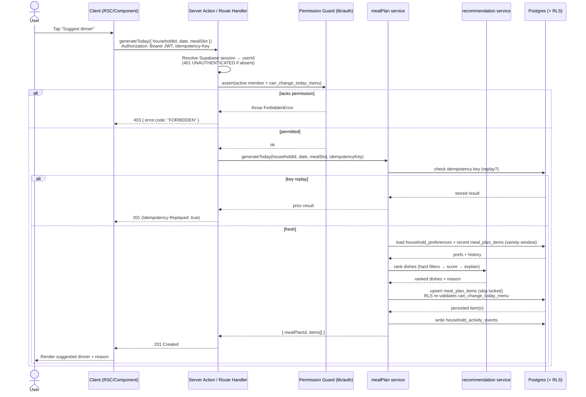
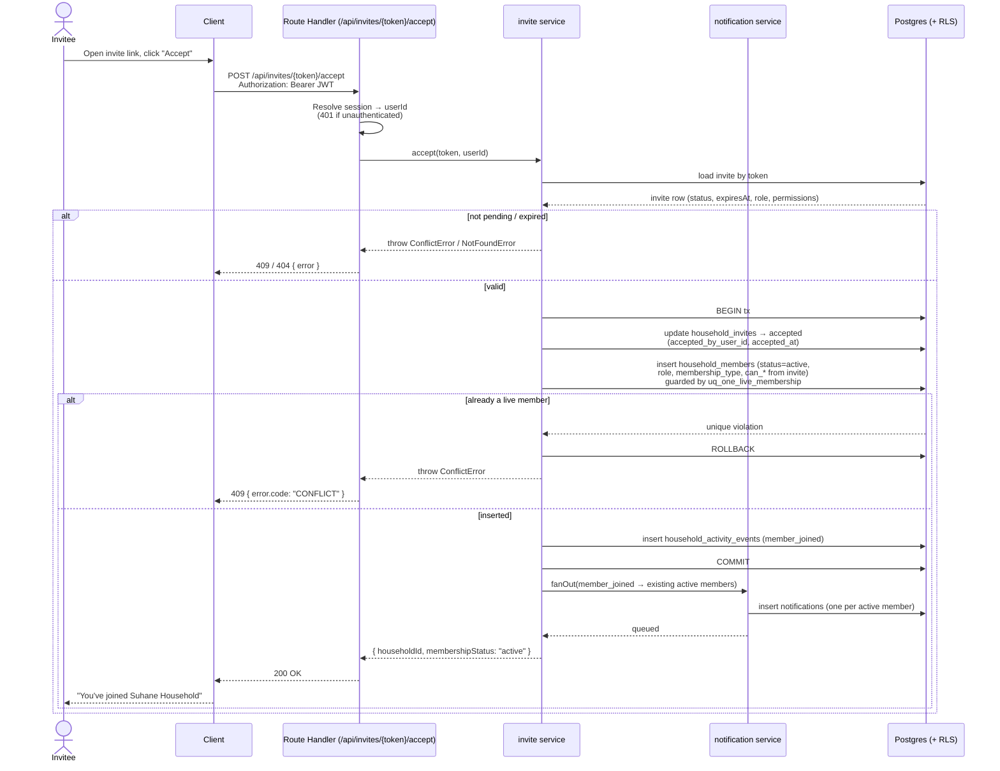

# API Design

The HTTP/server-action contract for Home Meal Planner. This document expands the
base endpoint list in [`../docs/05_api_spec.md`](../docs/05_api_spec.md) into
precise, production-grade contracts. It is consistent with the schema and enums
in [`01_database_design.md`](01_database_design.md) (the **source of truth** for
entity, column, and enum names) and the service/permission layering in
[`02_system_architecture.md`](02_system_architecture.md).

Where this doc and `../docs/05_api_spec.md` differ in detail, this doc is the
expanded contract — it never contradicts the base list, only sharpens it
(status codes, error cases, permissions, field shapes).

---

## 1. API conventions

**Transport.** All endpoints are implemented as Next.js **route handlers**
(`app/api/...`) or **server actions**, per
[doc 02 § Layered request flow](02_system_architecture.md). Mutations triggered
from React components prefer server actions; the route-handler paths below are
the stable URL contract (also used by a future mobile client, per doc 02
§ Future scaling). A route handler is a thin boundary: it resolves the session,
runs the permission guard, delegates to a single service, and serializes the
result or the error envelope.

**Bodies & content type.** Request and response bodies are JSON
(`Content-Type: application/json`). All payloads use UTF-8.

**Field casing — the translation boundary.** The database is **snake_case**
(see doc 01, e.g. `household_id`, `can_change_today_menu`, `meal_slot`). The API
boundary is **camelCase** (`householdId`, `canChangeTodayMenu`, `mealSlot`).
Translation happens exactly once, at the route handler / server action boundary
(inbound: camelCase → snake_case before hitting a repository; outbound:
snake_case row → camelCase DTO). Services and repositories work in DB-native
snake_case; clients only ever see camelCase. Enum **values** are passed through
unchanged (e.g. `"temporary_guest"`, `"vegetarian"`, `"dinner"`,
`"eating_out"`) — they are part of the data, defined in doc 01 § Enum types, not
of the naming convention.

**Resource URL patterns.** REST-style, plural nouns, IDs in the path. Nesting
reflects ownership through the tenancy boundary (`households` → everything else,
per doc 01 principle 4):

| Pattern                                | Example                                                  |
| -------------------------------------- | -------------------------------------------------------- |
| Collection                             | `POST /api/households`                                   |
| Instance                               | `GET /api/households/{householdId}`                      |
| Sub-collection                         | `GET /api/households/{householdId}/members`              |
| Sub-instance                           | `PATCH /api/households/{householdId}/members/{memberId}` |
| Action on instance (non-CRUD verb)     | `POST /api/meal-plan-items/{mealPlanItemId}/lock`        |
| Token-addressed (unauthenticated read) | `GET /api/invites/{token}`                               |

Globally-unique child resources whose parent is implied by the row itself
(`meal-plan-items`, `notifications`) are addressed at the top level by id; the
household is resolved server-side from the row's denormalized `household_id` and
re-checked by RLS.

**Authentication.** Every endpoint requires an authenticated Supabase session
**except** the unauthenticated invite preview (`GET /api/invites/{token}`, served
via a `security definer` RPC per doc 01 § RLS). The session JWT reaches the server
by **either of two transports**, and the per-request RLS client
(`createServerSupabaseClient`, doc 02 § Supabase client strategy) resolves the
same user from whichever is present:

| Caller            | Transport                              | How it's read                                                          |
| ----------------- | -------------------------------------- | ---------------------------------------------------------------------- |
| Browser (web app) | Supabase auth **cookies** (`sb-*`)     | `createServerSupabaseClient` seeds the client from `cookies()`.        |
| Native (mobile)   | `Authorization: Bearer <access-token>` | `createServerSupabaseClient` forwards the header via `global.headers`. |

```
Authorization: Bearer <supabase-access-token>
```

**Bearer-token contract (mobile).** Native clients
([`design/10_mobile_app_design.md` § 3](10_mobile_app_design.md)) carry no auth
cookies, so they attach the Supabase access token as an `Authorization: Bearer`
header on **every** `/api/*` call. When that header is present,
`createServerSupabaseClient` passes it through `global.headers.Authorization` on
`createServerClient`; that single header makes **both** `supabase.auth.getUser()`
(the `getAuthUser` session resolver) and PostgREST/RLS resolve the bearer user's
JWT. Properties of this path:

- **Additive / zero web change.** The cookie path is unchanged; the header path
  only engages when an `Authorization` header is present, which browser requests
  never send. (Verified by `lib/db/server.test.ts`.)
- **No `proxy.ts` change.** The edge proxy does cookie refresh + HTML redirect
  gating only; `/api` is not a protected prefix, so a header-auth request falls
  straight through as a harmless no-op.
- **Defense-in-depth intact.** `can_*` permission checks, active-membership
  checks, and RLS all run exactly as before — they key off the resolved user,
  regardless of how the JWT arrived.

The route handler constructs the **per-request RLS client** with this JWT so
`auth.uid()` and RLS apply to every query. Missing/expired token →
`UNAUTHENTICATED` (401). The service-role client is **never** reachable from
these request paths.

**Pagination (list endpoints).** List endpoints use **cursor pagination** —
stable under inserts, and a natural fit for the
`(recipient_user_id, created_at desc)` and `(household_id, created_at desc)`
indexes in doc 01. Query params:

| Param    | Meaning                                            | Default | Max |
| -------- | -------------------------------------------------- | ------- | --- |
| `limit`  | page size                                          | 20      | 100 |
| `cursor` | opaque token from the previous page's `nextCursor` | —       | —   |

Response envelope for collections:

```json
{
  "data": [
    /* items */
  ],
  "page": { "nextCursor": "eyJjcmVhdGVkQXQiOiIyMDI2...", "hasMore": true }
}
```

`nextCursor` is `null` when `hasMore` is `false`. Small, naturally-bounded
collections (a household's `members`) may return the full set with
`page.hasMore = false` and no cursor.

**Timestamps.** All timestamps are **ISO-8601 in UTC** with a `Z` suffix
(`2026-05-22T18:30:00Z`), serialized from Postgres `timestamptz` (doc 01
principle 3). **Calendar dates** (planning days — `meal_plans.start_date`,
`meal_plan_items.date`) are `YYYY-MM-DD` with no time component.

**Versioning.** Unversioned for MVP (single first-party client deployed in
lockstep). A future `Accept: application/vnd.hmp.v2+json` header or `/api/v2`
prefix can be introduced without breaking these paths.

---

## 2. Standard error model

Every non-2xx response shares one envelope. Services throw the typed domain
errors from [doc 02 § Cross-cutting concerns](02_system_architecture.md)
(`ValidationError`, `ForbiddenError`, `NotFoundError`, `ConflictError`, plus
`UnauthenticatedError` and a catch-all); a single boundary mapper translates
them to this shape and the right status code.

**Envelope:**

```json
{
  "error": {
    "code": "VALIDATION_ERROR",
    "message": "familySize must be between 1 and 50.",
    "details": [{ "field": "familySize", "rule": "range", "min": 1, "max": 50 }]
  }
}
```

- `error.code` — stable machine-readable string (table below). Clients branch on
  this, never on `message`.
- `error.message` — human-readable, safe to surface in UI. Never leaks
  stack traces, SQL, or internal IDs.
- `error.details` — optional, code-specific. For `VALIDATION_ERROR` it is an
  array of field issues; for `CONFLICT` it names the violated invariant; omitted
  (or `null`) otherwise.

**Code → status → domain error mapping:**

| `error.code`       | HTTP | Typed domain error (doc 02) | When                                                                                                                                                                                        |
| ------------------ | ---- | --------------------------- | ------------------------------------------------------------------------------------------------------------------------------------------------------------------------------------------- |
| `VALIDATION_ERROR` | 400  | `ValidationError`           | Malformed body, bad enum value, failed check (e.g. `family_size` out of `1..50`, `end_date < start_date`).                                                                                  |
| `UNAUTHENTICATED`  | 401  | `UnauthenticatedError`      | No/expired/invalid Supabase JWT.                                                                                                                                                            |
| `FORBIDDEN`        | 403  | `ForbiddenError`            | Authenticated but lacks the required `can_*` flag / role, or not an active member of the household.                                                                                         |
| `NOT_FOUND`        | 404  | `NotFoundError`             | Resource absent **or** hidden by RLS (we do not distinguish, to avoid leaking existence across households).                                                                                 |
| `CONFLICT`         | 409  | `ConflictError`             | Violated invariant from doc 01 § Key invariants (duplicate live membership, in-progress draft already exists, active plan already covers that start date, invite already accepted/expired). |
| `RATE_LIMITED`     | 429  | `RateLimitedError`          | Too many requests (notably generation endpoints). Includes `Retry-After` header.                                                                                                            |
| `INTERNAL`         | 500  | `InternalError` (catch-all) | Unhandled/unexpected. `message` is generic; full context only in server logs.                                                                                                               |

**Notes.**

- A FORBIDDEN-vs-NOT_FOUND choice favors NOT_FOUND when revealing existence
  itself would leak cross-household data; FORBIDDEN is used when the resource is
  known to be in the caller's household but the action is not permitted.
- RLS denials that surface as empty result sets are converted to typed
  `NotFoundError`/`ForbiddenError` by the service layer (doc 01 § "Defense in
  depth"), so clients always get a clean envelope rather than a silent empty set.

---

## 3. Idempotency

The generation endpoints are **non-idempotent by nature** (each call could
create a new `meal_plans` / `grocery_lists` row) and are the most likely to be
retried on a flaky mobile connection. They therefore honor an
**`Idempotency-Key`** request header, consistent with doc 02 § Cross-cutting
concerns.

Applies to:

- `POST /api/households/{householdId}/meal-plans/today/generate`
- `POST /api/households/{householdId}/meal-plans/week/generate`
- `POST /api/households/{householdId}/grocery-list/regenerate`

**Contract.**

```
Idempotency-Key: 0f7c2d9a-3b1e-4a2c-9f10-7d6e5c4b3a21
```

- The client sends a unique key (UUID v4 recommended) per logical operation and
  **reuses the same key on retries**.
- The server records `(household_id, idempotency_key)` with the first response
  (status + body) for a 24h window.
- **First call** with a key: executes, persists the result and the key, returns
  it.
- **Replay** with the same key + identical request: returns the **stored
  response** (same status, same body) without re-running generation — so a
  retry never produces a second plan/list. The replayed response carries
  `Idempotency-Replayed: true`.
- **Same key, different request body**: `409 CONFLICT` with
  `error.details.reason = "idempotency_key_reused"`.
- Missing header: the call still works but offers no replay protection
  (discouraged for these endpoints). The header is **ignored** on all other
  endpoints.

This complements — does not replace — the DB invariants: e.g.
`uq_active_plan_per_start` (doc 01) still prevents two active plans for one start
date even if idempotency is bypassed.

---

## 4. Endpoint catalog

Conventions for this section: **Permission** names the guard (active membership
plus a `household_members.can_*` flag or `role`, per doc 01); `(member)` means
"any active member, no extra flag." All request/response fields are camelCase per
§1. Common errors (`UNAUTHENTICATED`, `INTERNAL`) are omitted from per-endpoint
"Errors" lists unless notable.

### 4.1 Households

#### `POST /api/households` — Create household

- **Permission:** any authenticated user (becomes `owner`).
- **Service:** `household`.
- **Request:**
  ```json
  { "name": "Suhane Household" }
  ```
- **Success — 201 Created:**
  ```json
  { "householdId": "5b1f8c0e-9a2d-4e7b-bc31-2f0a6d4e1c88" }
  ```
  Creates the `households` row (`created_by_user_id = auth.uid()`) and an
  `owner` `household_members` row with all `can_*` flags `true`, in one
  transaction.
- **Errors:** `VALIDATION_ERROR` (empty/oversized `name`).

> Most users arrive at a household via onboarding completion (§4.2) rather than
> this raw create; this endpoint exists for the "create another household" path.

#### `GET /api/households/{householdId}` — Get household

- **Permission:** `(member)` — `is_active_member`.
- **Service:** `household`.
- **Success — 200 OK:**
  ```json
  {
    "id": "5b1f8c0e-9a2d-4e7b-bc31-2f0a6d4e1c88",
    "name": "Suhane Household",
    "createdByUserId": "a1...",
    "preferences": {
      "familySize": 4,
      "adultsCount": 2,
      "kidsCount": 2,
      "dietType": "vegetarian",
      "preferredCuisines": ["North Indian", "South Indian"],
      "spiceLevel": "medium",
      "weekdayCookingTimeMinutes": 30,
      "weekendCookingTimeMinutes": 60,
      "mealsToPlan": ["breakfast", "lunch", "dinner"],
      "varietyGapDays": 7,
      "allowLeftovers": true,
      "budgetPreference": "medium"
    },
    "currentUserPermissions": {
      "role": "owner",
      "membershipType": "permanent",
      "canViewPlan": true,
      "canSuggestMeals": true,
      "canChangeTodayMenu": true,
      "canChangeWeeklySchedule": true,
      "canManageGroceryList": true,
      "canInviteMembers": true,
      "canRemoveMembers": true,
      "canEditHouseholdPreferences": true
    }
  }
  ```
  `preferences` mirrors the `household_preferences` row (doc 01);
  `currentUserPermissions` mirrors the caller's `household_members` flags so the
  client can hide controls it can't use.
- **Errors:** `NOT_FOUND` (no household, or caller not an active member).

#### `PATCH /api/households/{householdId}/preferences` — Update preferences

- **Permission:** `can_edit_household_preferences` (or `owner`).
- **Service:** `household`.
- **Request (partial update; any subset of preference fields):**
  ```json
  {
    "familySize": 4,
    "dietType": "vegetarian",
    "preferredCuisines": ["North Indian", "South Indian"],
    "varietyGapDays": 7
  }
  ```
- **Success — 200 OK:** the full updated `preferences` object (same shape as in
  `GET /api/households/{householdId}`).
- **Errors:** `VALIDATION_ERROR` (e.g. `familySize` outside `1..50`, unknown
  `dietType` enum value, `varietyGapDays` outside `0..60` — all per doc 01
  checks), `FORBIDDEN`, `NOT_FOUND`.

### 4.2 Onboarding draft

Backed by `household_profile_drafts` (doc 01). At most one `in_progress` draft
per user (`uq_one_active_draft_per_user`). Service: `onboarding`.

#### `GET /api/onboarding/draft` — Get current draft

- **Permission:** authenticated user (own draft only).
- **Success — 200 OK:**
  ```json
  {
    "id": "d3...",
    "status": "in_progress",
    "currentStep": "food_preferences",
    "completionPercentage": 45,
    "draftData": {},
    "lastSavedAt": "2026-05-22T18:05:11Z"
  }
  ```
  If the user has no `in_progress` draft → **204 No Content** (nothing to
  resume).

#### `PUT /api/onboarding/draft` — Save (upsert) draft

- **Permission:** authenticated user (own draft).
- **Request:**
  ```json
  {
    "currentStep": "meal_schedule",
    "completionPercentage": 60,
    "draftData": {}
  }
  ```
- **Success — 200 OK:**
  ```json
  {
    "id": "d3...",
    "status": "in_progress",
    "lastSavedAt": "2026-05-22T18:09:42Z"
  }
  ```
  Idempotent autosave: upserts the caller's single `in_progress` draft, refreshes
  `last_saved_at`.
- **Errors:** `VALIDATION_ERROR` (`completionPercentage` outside `0..100`),
  `CONFLICT` (an `in_progress` draft already exists for a _different_ logical
  flow — surfaces `uq_one_active_draft_per_user`).

#### `POST /api/onboarding/complete` — Complete onboarding

- **Permission:** authenticated user (own draft).
- **Request:**
  ```json
  { "draftId": "d3..." }
  ```
- **Success — 201 Created:**
  ```json
  { "householdId": "5b1f8c0e-...", "status": "completed" }
  ```
  Transactionally: marks the draft `completed`, creates the `households` row,
  the `household_preferences` row from `draftData`, and the `owner`
  `household_members` row.
- **Errors:** `VALIDATION_ERROR` (incomplete draft / missing required
  preferences), `NOT_FOUND` (no such draft owned by caller), `CONFLICT` (draft
  already `completed`).

### 4.3 Invites

Backed by `household_invites` (doc 01). Service: `invite`. Token preview is the
only unauthenticated endpoint.

#### `POST /api/households/{householdId}/invites` — Create invite

- **Permission:** `can_invite_members`.
- **Request:**
  ```json
  {
    "email": "guest@example.com",
    "phone": null,
    "membershipType": "temporary_guest",
    "role": "viewer",
    "expiresAt": "2026-05-26T00:00:00Z",
    "permissions": {
      "canViewPlan": true,
      "canSuggestMeals": true,
      "canChangeTodayMenu": false,
      "canChangeWeeklySchedule": false,
      "canInviteMembers": false
    }
  }
  ```
- **Success — 201 Created:**
  ```json
  {
    "inviteId": "9c...",
    "inviteLink": "https://app.example.com/invite/3f9a...token"
  }
  ```
  Generates an opaque `invite_token`, persists the invite (`status = 'pending'`),
  and asks the `notification` service to send the invite email (doc 02 § Stack →
  Email).
- **Errors:** `VALIDATION_ERROR` (neither `email` nor `phone` —
  `invite_has_target` check; `temporary_guest` without `expiresAt` —
  `guest_has_expiry` semantics), `FORBIDDEN`.

#### `GET /api/invites/{token}` — Get invite preview (**unauthenticated**)

- **Permission:** none — public, token-addressed. Served via a `security
definer` RPC (doc 01 § RLS) that returns only non-sensitive preview fields.
- **Success — 200 OK:**
  ```json
  {
    "householdName": "Suhane Household",
    "invitedBy": "Aishvarya",
    "membershipType": "temporary_guest",
    "role": "viewer",
    "expiresAt": "2026-05-26T00:00:00Z"
  }
  ```
- **Errors:** `NOT_FOUND` (unknown token), `CONFLICT`
  (`details.reason in ["expired","cancelled","accepted","declined"]` — invite no
  longer pending).

#### `POST /api/invites/{token}/accept` — Accept invite

- **Permission:** authenticated user (the acceptor).
- **Success — 200 OK:**
  ```json
  { "householdId": "5b1f8c0e-...", "membershipStatus": "active" }
  ```
  Transactionally: validates the invite is `pending` and not expired, sets it
  `accepted` (`accepted_by_user_id`, `accepted_at`), creates an `active`
  `household_members` row applying the invite's `role`/`membership_type`/
  `permissions`, then fans out notifications to existing active members. See
  §5(b).
- **Errors:** `NOT_FOUND` (unknown token), `CONFLICT` (already accepted/declined,
  expired, **or** caller already has a live membership — `uq_one_live_membership`,
  doc 01).

#### `POST /api/invites/{token}/decline` — Decline invite

- **Permission:** authenticated user (the invitee).
- **Success — 200 OK:**
  ```json
  { "status": "declined" }
  ```
  Sets invite `status = 'declined'`, `declined_at = now()`.
- **Errors:** `NOT_FOUND`, `CONFLICT` (not `pending`).

### 4.4 Members

Backed by `household_members` (doc 01). Service: `household`.

#### `GET /api/households/{householdId}/members` — List members

- **Permission:** `(member)`.
- **Success — 200 OK** (small bounded collection; full set, no cursor):
  ```json
  {
    "data": [
      {
        "memberId": "m1...",
        "userId": "a1...",
        "displayName": "Aishvarya",
        "role": "owner",
        "membershipType": "permanent",
        "status": "active",
        "expiresAt": null,
        "joinedAt": "2026-04-01T09:00:00Z",
        "permissions": {
          "canViewPlan": true,
          "canSuggestMeals": true,
          "canChangeTodayMenu": true,
          "canChangeWeeklySchedule": true,
          "canManageGroceryList": true,
          "canInviteMembers": true,
          "canRemoveMembers": true,
          "canEditHouseholdPreferences": true
        }
      }
    ],
    "page": { "nextCursor": null, "hasMore": false }
  }
  ```
- **Errors:** `NOT_FOUND` (caller not an active member).

#### `PATCH /api/households/{householdId}/members/{memberId}` — Update member permissions

- **Permission:** `can_remove_members` **or** `owner` (the role that manages
  membership; permission edits are an admin action).
- **Request (any subset of role + `can_*` flags):**
  ```json
  {
    "role": "member",
    "canChangeTodayMenu": true,
    "canManageGroceryList": true
  }
  ```
- **Success — 200 OK:** the updated member object (same shape as a `data[]` item
  above).
- **Errors:** `VALIDATION_ERROR` (unknown `role` enum value), `FORBIDDEN`,
  `NOT_FOUND`, `CONFLICT` (attempt to demote/strip the **last** `owner`).

#### `POST /api/households/{householdId}/members/{memberId}/remove` — Remove member

- **Permission:** `can_remove_members` (or `owner`).
- **Success — 200 OK:**
  ```json
  { "memberId": "m4...", "status": "removed" }
  ```
  Soft state per doc 01 principle 5: sets `status = 'removed'` (history
  preserved); writes an activity event and notifies the removed user.
- **Errors:** `FORBIDDEN`, `NOT_FOUND`, `CONFLICT` (removing the last `owner`, or
  removing self via this endpoint — use `leave`).

#### `POST /api/households/{householdId}/leave` — Leave household

- **Permission:** `(member)` acting on self.
- **Success — 200 OK:**
  ```json
  { "householdId": "5b1f8c0e-...", "status": "left" }
  ```
  Sets the caller's membership `status = 'left'`.
- **Errors:** `NOT_FOUND` (no active membership), `CONFLICT` (sole `owner`
  leaving without transferring ownership).

### 4.5 Meal plans

Backed by `meal_plans` / `meal_plan_items` (doc 01). Services: `mealPlan` (+
`recommendation` for dish selection). Generation endpoints honor
`Idempotency-Key` (§3).

#### `POST /api/households/{householdId}/meal-plans/today/generate` — Generate today's meal

- **Permission:** `can_change_today_menu`.
- **Headers:** `Idempotency-Key` (recommended).
- **Request:**
  ```json
  { "date": "2026-05-22", "mealSlot": "dinner" }
  ```
- **Success — 201 Created:**
  ```json
  {
    "mealPlanId": "p7...",
    "items": [
      {
        "mealPlanItemId": "i9...",
        "date": "2026-05-22",
        "mealSlot": "dinner",
        "dishId": "d2...",
        "dishName": "Palak Paneer",
        "status": "suggested",
        "locked": false,
        "reason": "High protein, vegetarian, not cooked in the last 7 days."
      }
    ]
  }
  ```
  Runs the `recommendation` service (hard filters → scoring → ranking →
  explanation, doc 05) and upserts the `meal_plan_items` row(s) for that
  `(date, mealSlot)`; respects `unique (meal_plan_id, date, meal_slot)`. **Locked
  items are never overwritten.** See §5(a).
- **Errors:** `VALIDATION_ERROR` (unknown `mealSlot` enum value, malformed
  `date`), `FORBIDDEN`, `RATE_LIMITED`, `CONFLICT` (`idempotency_key_reused`).

#### `POST /api/households/{householdId}/meal-plans/week/generate` — Generate weekly plan

- **Permission:** `can_change_weekly_schedule`.
- **Headers:** `Idempotency-Key` (recommended).
- **Request:**
  ```json
  { "startDate": "2026-05-25", "endDate": "2026-05-31" }
  ```
- **Success — 201 Created:**
  ```json
  {
    "mealPlanId": "p8...",
    "status": "active",
    "startDate": "2026-05-25",
    "endDate": "2026-05-31",
    "itemCount": 21
  }
  ```
  Creates an `active` `meal_plans` row covering the range and a
  `meal_plan_items` row per (day × `meals_to_plan` slot). Locked items from any
  overlapping prior plan are preserved.
- **Errors:** `VALIDATION_ERROR` (`endDate < startDate` — `plan_dates_ordered`),
  `FORBIDDEN`, `RATE_LIMITED`, `CONFLICT` (`uq_active_plan_per_start` — an active
  plan already covers `startDate`; or `idempotency_key_reused`).

#### `POST /api/meal-plan-items/{mealPlanItemId}/replace` — Replace a meal

- **Permission:** `can_change_today_menu` (today) — guard reads the item's date
  and household from the row.
- **Request:**
  ```json
  { "replacementDishId": "d5...", "reason": "User selected replacement" }
  ```
- **Success — 200 OK:**
  ```json
  {
    "mealPlanItemId": "i9...",
    "dishId": "d5...",
    "dishName": "Rajma Chawal",
    "status": "replaced",
    "changedByUserId": "a1...",
    "reason": "User selected replacement"
  }
  ```
- **Errors:** `VALIDATION_ERROR` (`replacementDishId` not an `active` dish),
  `FORBIDDEN`, `NOT_FOUND` (no such item in caller's household), `CONFLICT` (item
  is `locked`).

#### `POST /api/meal-plan-items/{mealPlanItemId}/eating-out` — Mark eating out

- **Permission:** `can_change_today_menu`.
- **Request:** empty body (or `{}`).
- **Success — 200 OK:**
  ```json
  { "mealPlanItemId": "i9...", "status": "eating_out", "dishId": null }
  ```
  Sets `status = 'eating_out'` and clears `dish_id` (nullable per doc 01); the
  slot is excluded from grocery aggregation.
- **Errors:** `FORBIDDEN`, `NOT_FOUND`, `CONFLICT` (`locked`).

#### `POST /api/meal-plan-items/{mealPlanItemId}/lock` — Lock a meal

- **Permission:** `can_change_today_menu`.
- **Success — 200 OK:**
  ```json
  { "mealPlanItemId": "i9...", "locked": true }
  ```
  Sets `locked = true`; future generation will not overwrite this item.
- **Errors:** `FORBIDDEN`, `NOT_FOUND`.

#### `POST /api/meal-plan-items/{mealPlanItemId}/unlock` — Unlock a meal

- **Permission:** `can_change_today_menu`.
- **Success — 200 OK:**
  ```json
  { "mealPlanItemId": "i9...", "locked": false }
  ```
- **Errors:** `FORBIDDEN`, `NOT_FOUND`.

### 4.6 Grocery

Backed by `grocery_lists` / `grocery_list_items` (doc 01). Service: `grocery`.

#### `GET /api/households/{householdId}/grocery-list?mealPlanId={mealPlanId}` — Get grocery list

- **Permission:** `(member)`.
- **Query:** `mealPlanId` (required) — one list per plan
  (`unique (meal_plan_id)`).
- **Success — 200 OK:**
  ```json
  {
    "groceryListId": "g3...",
    "mealPlanId": "p8...",
    "status": "active",
    "items": [
      {
        "groceryListItemId": "gi1...",
        "ingredientId": "ing7...",
        "name": "Spinach",
        "category": "vegetables",
        "quantity": 750.0,
        "unit": "g",
        "checked": false
      }
    ]
  }
  ```
  Items are grouped by `category` (doc 01 `ingredients.category` value set) for
  client display; quantities are aggregated and scaled to `family_size`.
- **Errors:** `VALIDATION_ERROR` (missing `mealPlanId`), `NOT_FOUND` (no list for
  that plan in the caller's household).

#### `POST /api/households/{householdId}/grocery-list/regenerate` — Regenerate grocery list

- **Permission:** `can_manage_grocery_list`.
- **Headers:** `Idempotency-Key` (recommended).
- **Request:**
  ```json
  { "mealPlanId": "p8..." }
  ```
- **Success — 200 OK:** the full grocery-list object (same shape as the GET
  above), rebuilt from current `meal_plan_items` (excluding `eating_out` /
  `skipped`). Re-aggregates `dish_ingredients` × servings, snapshots
  `name`/`category`/`unit` at generation time (doc 01), and preserves manual
  ad-hoc items (`ingredient_id is null`) and prior `checked` state where the item
  still applies.
- **Errors:** `FORBIDDEN`, `NOT_FOUND` (no such plan), `RATE_LIMITED`, `CONFLICT`
  (`idempotency_key_reused`).

### 4.7 Notifications

Backed by `notifications` (doc 01). Service: `notification`. Recipient-scoped.

#### `GET /api/notifications` — List notifications

- **Permission:** authenticated user (own notifications;
  `recipient_user_id = auth.uid()`).
- **Query:** `limit`, `cursor` (§1 cursor pagination — uses the
  `(recipient_user_id, created_at desc)` index); optional `unreadOnly=true`.
- **Success — 200 OK:**
  ```json
  {
    "data": [
      {
        "id": "n5...",
        "householdId": "5b1f8c0e-...",
        "actorUserId": "b2...",
        "eventType": "member_joined",
        "title": "New member joined",
        "message": "Priya accepted your invite to Suhane Household.",
        "readAt": null,
        "createdAt": "2026-05-22T18:30:00Z"
      }
    ],
    "page": {
      "nextCursor": "eyJjcmVhdGVkQXQiOiIyMDI2LTA1LTIyVDE4OjMwOjAwWiJ9",
      "hasMore": true
    }
  }
  ```

#### `POST /api/notifications/{notificationId}/read` — Mark notification read

- **Permission:** authenticated user (must be the recipient).
- **Success — 200 OK:**
  ```json
  { "id": "n5...", "readAt": "2026-05-22T18:32:10Z" }
  ```
  Idempotent — re-marking an already-read notification returns the existing
  `readAt`.
- **Errors:** `NOT_FOUND` (not the recipient, or no such notification).

---

## 5. Key flow sequence diagrams

### (a) Generate today's meal

`can_change_today_menu` gate → recommendation service → persist `meal_plan_items`.
Mirrors the write lifecycle in [doc 02 § Layered request flow](02_system_architecture.md).



### (b) Accept invite

Token validation → create `household_members` row → notification fan-out.
Covers `POST /api/invites/{token}/accept` (§4.3).



---

## 6. Endpoint → service → permission mapping

One row per endpoint. **Service** is the owning module from
[doc 02 § Service modules](02_system_architecture.md); **Permission** is the
guard (active membership plus the `household_members.can_*` flag or `role` from
[doc 01](01_database_design.md)). `(member)` = active member, no extra flag;
"auth" = any authenticated user; "public" = unauthenticated.

| Method & Path                                                  | Service                       | Permission                                 |
| -------------------------------------------------------------- | ----------------------------- | ------------------------------------------ |
| `POST /api/households`                                         | `household`                   | auth (becomes `owner`)                     |
| `GET /api/households/{householdId}`                            | `household`                   | `(member)`                                 |
| `PATCH /api/households/{householdId}/preferences`              | `household`                   | `can_edit_household_preferences` / `owner` |
| `GET /api/onboarding/draft`                                    | `onboarding`                  | auth (own draft)                           |
| `PUT /api/onboarding/draft`                                    | `onboarding`                  | auth (own draft)                           |
| `POST /api/onboarding/complete`                                | `onboarding`                  | auth (own draft)                           |
| `POST /api/households/{householdId}/invites`                   | `invite`                      | `can_invite_members`                       |
| `GET /api/invites/{token}`                                     | `invite`                      | public (token RPC)                         |
| `POST /api/invites/{token}/accept`                             | `invite`                      | auth (acceptor)                            |
| `POST /api/invites/{token}/decline`                            | `invite`                      | auth (invitee)                             |
| `GET /api/households/{householdId}/members`                    | `household`                   | `(member)`                                 |
| `PATCH /api/households/{householdId}/members/{memberId}`       | `household`                   | `can_remove_members` / `owner`             |
| `POST /api/households/{householdId}/members/{memberId}/remove` | `household`                   | `can_remove_members` / `owner`             |
| `POST /api/households/{householdId}/leave`                     | `household`                   | `(member)` (self)                          |
| `POST /api/households/{householdId}/meal-plans/today/generate` | `mealPlan` + `recommendation` | `can_change_today_menu`                    |
| `POST /api/households/{householdId}/meal-plans/week/generate`  | `mealPlan` + `recommendation` | `can_change_weekly_schedule`               |
| `POST /api/meal-plan-items/{mealPlanItemId}/replace`           | `mealPlan`                    | `can_change_today_menu`                    |
| `POST /api/meal-plan-items/{mealPlanItemId}/eating-out`        | `mealPlan`                    | `can_change_today_menu`                    |
| `POST /api/meal-plan-items/{mealPlanItemId}/lock`              | `mealPlan`                    | `can_change_today_menu`                    |
| `POST /api/meal-plan-items/{mealPlanItemId}/unlock`            | `mealPlan`                    | `can_change_today_menu`                    |
| `GET /api/households/{householdId}/grocery-list`               | `grocery`                     | `(member)`                                 |
| `POST /api/households/{householdId}/grocery-list/regenerate`   | `grocery`                     | `can_manage_grocery_list`                  |
| `GET /api/notifications`                                       | `notification`                | auth (recipient)                           |
| `POST /api/notifications/{notificationId}/read`                | `notification`                | auth (recipient)                           |

> Every permission above is enforced **twice**: once in the service-layer guard
> (producing the typed errors in §2) and again by Postgres RLS using
> `is_active_member` / `has_permission` (doc 01 § RLS) as the backstop.
