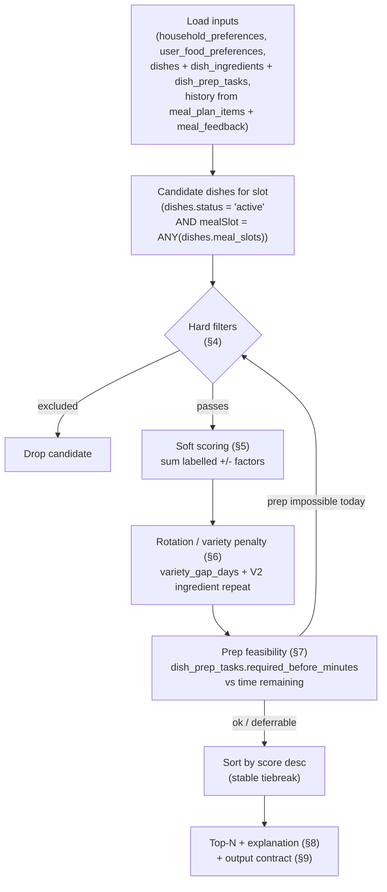
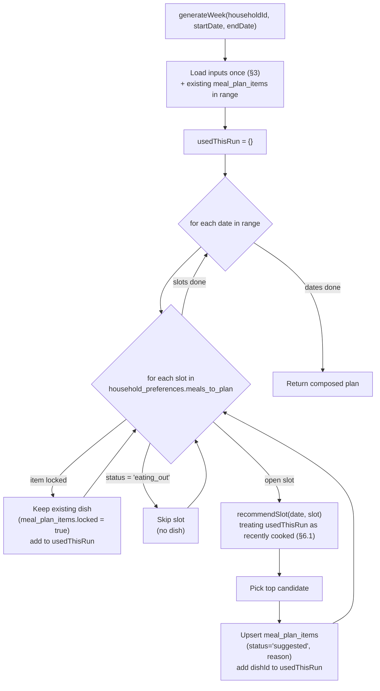

# Recommendation Engine Design

How Home Meal Planner turns a household's constraints, preferences, history, and
prep state into ranked, explainable meal suggestions for a given slot — and how
those per-slot calls compose into a weekly plan.

This is a **deterministic, explainable, rule-based scoring engine — not an AI
model**. Given the same inputs it always produces the same ranked output, and
every suggestion carries a human-readable reason derived from the exact factors
that scored it. The behavior, the hard filters, and the scoring weights are taken
verbatim from the product spec
[`../docs/04_recommendation_engine.md`](../docs/04_recommendation_engine.md); the
table and column names are the source-of-truth schema in
[doc 01](01_database_design.md). The generate/replace endpoints that drive it are
defined in [doc 04](04_api_design.md) (spec:
[`../docs/05_api_spec.md`](../docs/05_api_spec.md)).

> **Convention reminder** (see [doc 00](00_design_index.md)): database identifiers
> are `snake_case`; API/engine payload fields are `camelCase`. Where this doc
> names a table or column it uses the exact schema name from doc 01; where it
> names an output field it uses camelCase.

---

## 1. Design goals

| Goal              | What it means                                              | How this design delivers it                                                                                                                                |
| ----------------- | ---------------------------------------------------------- | ---------------------------------------------------------------------------------------------------------------------------------------------------------- |
| **Explainable**   | A user can see _why_ a dish was suggested.                 | Each candidate accumulates labelled positive factors; the winning factors are stitched into `reason` (§8) and persisted on `meal_plan_items.reason`.       |
| **Controllable**  | Behavior is governed by visible rules, not a black box.    | Hard filters (§4) and weights (§5) are explicit; nothing is learned implicitly.                                                                            |
| **Deterministic** | Same inputs → same ranked output, every time.              | Pure scoring functions over loaded inputs; ties broken by a stable key (`score desc, total_time_minutes asc, dish.id asc`). No randomness, no model state. |
| **Tunable**       | Product can adjust behavior without code changes to logic. | All weights and thresholds live in a single config object (§11); scoring functions read from it.                                                           |

### Why not AI for the MVP

Per [`../docs/04`](../docs/04_recommendation_engine.md) ("Do not start with a
fully AI-based system. The first version should be explainable and
controllable."):

- **Trust & debuggability.** Cooking decisions are personal and constraint-heavy
  (allergies, diet, prep time). A wrong AI suggestion that can't be explained
  erodes trust fast; a rule that fired wrongly can be read, fixed, and unit-tested.
- **Hard constraints are non-negotiable.** Allergy and diet exclusions must be
  _guaranteed_, not probabilistic. These belong in deterministic filters (§4),
  never in a ranking model.
- **Cold start.** A new household has no interaction history to train on. Rules
  produce sensible output from day one using onboarding preferences.
- **Cost & latency.** Generating a 7-day plan is dozens of slot evaluations; an
  in-process scoring pass is cheap and fast versus per-slot model calls.

A future version can layer a learned re-ranker _on top of_ the same hard filters
and explanation contract — the filters stay deterministic regardless.

---

## 2. Pipeline overview

The engine runs once **per slot** (one `date` + one `meal_slot`). It loads inputs
once, then walks every active candidate dish through hard filters, soft scoring,
variety/rotation penalties, and a prep-feasibility check, then sorts and returns
the top-N with explanations.



> The prep-feasibility step both adjusts score (a soft `Missing required prep:
-60`) **and** can hard-exclude a dish when prep can no longer be completed in
> time (e.g. soaking after 6 PM). The "prep impossible today" edge feeds back into
> the hard-filter decision; see §4 and §7.

---

## 3. Inputs & data loading

Inputs are loaded **once per generate call** and passed to the pure scoring
functions. Each group below names the table(s) and the query that feeds it (all
schema names per [doc 01](01_database_design.md)).

### 3.1 Household inputs — `household_preferences`

One row per household (`household_preferences.household_id` is unique). Supplies:
`family_size`, `adults_count`, `kids_count`, `diet_type`, `preferred_cuisines`,
`spice_level`, `weekday_cooking_time_minutes`, `weekend_cooking_time_minutes`,
`meals_to_plan`, `variety_gap_days`, `allow_leftovers`, `budget_preference`.

```text
select * from household_preferences where household_id = $1;
```

The applicable cooking-time limit is `weekday_cooking_time_minutes` or
`weekend_cooking_time_minutes` chosen by whether `date` is a weekday or weekend.

### 3.2 Member inputs — `user_food_preferences` (+ `household_members`)

Per-member food preferences for the household's **currently active** members.
Allergies and disliked ingredients are unioned across all active members and
become the household-wide exclusion set (allergies are hard; dislikes inform
scoring). Supplies: `diet_type` (member override), `allergies`,
`disliked_ingredients`, `liked_dishes`, `disliked_dishes`, `spice_preference`,
`health_preference_tags`.

```text
select ufp.*
from user_food_preferences ufp
join household_members m
  on m.user_id = ufp.user_id
 and m.household_id = ufp.household_id
where ufp.household_id = $1
  and m.status = 'active'
  and (m.expires_at is null or m.expires_at > now());   -- excludes expired temporary_guest
```

`household_members.membership_type = 'temporary_guest'` rows that are active on
`date` contribute their restrictions for the duration of the guest stay (§4).

### 3.3 Dish inputs — `dishes` (+ `dish_ingredients`, `dish_prep_tasks`, `dish_pairings`)

Active candidate dishes whose `meal_slots` array contains the requested slot,
with their ingredients, prep tasks, and pairings preloaded.

```text
select d.*
from dishes d
where d.status = 'active'
  and $mealSlot = any (d.meal_slots);

-- per dish, preloaded in bulk:
select * from dish_ingredients where dish_id = any($dishIds);   -- is_required, ingredient_id, ...
select * from dish_prep_tasks  where dish_id = any($dishIds);   -- required_before_minutes, task_name
select * from dish_pairings    where primary_dish_id = any($dishIds);  -- paired_dish_id, pairing_type
```

Relevant `dishes` columns used by scoring: `diet_type`, `cuisine`,
`prep_time_minutes`, `cook_time_minutes`, `total_time_minutes` (generated),
`difficulty`, `spice_level`, `kid_friendly`, `lunchbox_friendly`,
`leftover_friendly`.

### 3.4 Historical inputs — `meal_plan_items` (+ `meal_feedback`)

Computed for the household over a lookback window (≥ `variety_gap_days`):

| Signal                | Source            | Query intent                                                                                   |
| --------------------- | ----------------- | ---------------------------------------------------------------------------------------------- |
| **Recently cooked**   | `meal_plan_items` | dishes scheduled/cooked within `variety_gap_days` before `date`.                               |
| **Recently rejected** | `meal_plan_items` | items with `status = 'rejected'` (or `replaced`) recently.                                     |
| **Eating-out dates**  | `meal_plan_items` | items with `status = 'eating_out'` (no dish) — those slots are skipped.                        |
| **Feedback history**  | `meal_feedback`   | per-dish feedback, esp. `do_not_suggest_again` (hard) and `disliked` / `kids_disliked` (soft). |

```text
-- recently cooked / rejected (uses ix_items_dish_recent)
select dish_id, date, status
from meal_plan_items
where household_id = $1
  and dish_id is not null
  and date >= ($date - $varietyGapDays * interval '1 day')
  and date <  $date;

-- eating-out slots in the target range
select date, meal_slot from meal_plan_items
where household_id = $1 and status = 'eating_out';

-- do-not-suggest-again and other feedback, joined back to the dish
select mpi.dish_id, f.feedback_type
from meal_feedback f
join meal_plan_items mpi on mpi.id = f.meal_plan_item_id
where f.household_id = $1;
```

---

## 4. Hard filters

A candidate that matches **any** rule below is excluded before scoring (it can
never appear in the output). Every rule from
[`../docs/04`](../docs/04_recommendation_engine.md) is reproduced with its data
condition against doc-01 schema.

| Exclusion rule                                    | Data condition                                                                                                                                                                                                                                                                                                                                                                                                                                                                                                                    |
| ------------------------------------------------- | --------------------------------------------------------------------------------------------------------------------------------------------------------------------------------------------------------------------------------------------------------------------------------------------------------------------------------------------------------------------------------------------------------------------------------------------------------------------------------------------------------------------------------- |
| **Violates diet type**                            | `dishes.diet_type` is not compatible with the effective household diet (`household_preferences.diet_type`, tightened by any stricter member `user_food_preferences.diet_type`). E.g. household `vegetarian` excludes `non_vegetarian` / `pescatarian` / `eggetarian` dishes; `vegan` excludes `vegetarian` dishes containing dairy/egg ingredients; `jain` excludes onion/garlic-containing dishes.                                                                                                                               |
| **Contains an allergy ingredient**                | A `dish_ingredients.ingredient_id` for the dish maps to an `ingredients.name`/`common_names`/`allergen_type` present in the union of active members' `user_food_preferences.allergies`. Required _and_ optional ingredients are checked for allergens.                                                                                                                                                                                                                                                                            |
| **Does not match the meal slot**                  | `NOT ($mealSlot = ANY(dishes.meal_slots))`. (Already applied at candidate load §3.3; restated here as the canonical rule.)                                                                                                                                                                                                                                                                                                                                                                                                        |
| **Outside the household's "suitable for" slots**  | The household restricted this dish to specific slots in `build` mode (`household_dish_preferences.suitable_meal_slots` non-empty for `(household, dish)`) and `NOT ($mealSlot = ANY(suitable_meal_slots))` (P10-8). An empty list = no restriction beyond the global `meal_slots` rule above.                                                                                                                                                                                                                                     |
| **Not one of the household's chosen dishes**      | The household built its own list — `household_dish_preferences` is non-empty for the household — and this dish is **not** in it (`dishes.id NOT IN (chosen set)`) (BUG-027). When the household chose nothing the rule is inert and the full catalog is eligible. This is a hard restriction so "try another" and every suggestion stay within the household's picks (filtered by slot), rather than the soft `householdChosenDish` re-ranking bonus (§5). Gated on the combinations feature so the doc-04 baseline is unchanged. |
| **Impossible prep for available time**            | A `dish_prep_tasks.required_before_minutes` exceeds the minutes remaining before the slot's mealtime on `date` (see §7). E.g. an 8h soak required at 6 PM for dinner.                                                                                                                                                                                                                                                                                                                                                             |
| **Marked do-not-suggest-again**                   | The dish has a `meal_feedback.feedback_type = 'do_not_suggest_again'` row for this household (via `meal_plan_items` join, §3.4).                                                                                                                                                                                                                                                                                                                                                                                                  |
| **Temporary-guest restriction during guest stay** | While an active `household_members.membership_type = 'temporary_guest'` member's window covers `date` (`starts_at <= date` and `expires_at > now()`), their `user_food_preferences` allergies/diet are folded into the diet and allergy rules above, so guest-incompatible dishes are excluded for the stay.                                                                                                                                                                                                                      |

> **Diet compatibility** is a small fixed lookup (a matrix in config, §11), not a
> guess. Allergy and `do_not_suggest_again` are absolute — they are intentionally
> hard filters, never merely penalized.

---

## 5. Soft scoring

Surviving candidates accumulate the **exact** weighted factors from
[`../docs/04`](../docs/04_recommendation_engine.md). The weights below are
reproduced verbatim and must stay identical to that spec. Each factor records its
label so the explanation generator (§8) can reuse the positive ones.

| Factor                                 |   Weight | Data condition                                                                                                                                                                             |
| -------------------------------------- | -------: | ------------------------------------------------------------------------------------------------------------------------------------------------------------------------------------------ |
| **Diet match**                         | **+100** | `dishes.diet_type` is compatible with the effective household diet (`household_preferences.diet_type`). (Survivors always satisfy this; the points anchor diet-correct dishes at the top.) |
| **Meal slot match**                    |  **+50** | `$mealSlot = ANY(dishes.meal_slots)`.                                                                                                                                                      |
| **Cuisine preference match**           |  **+30** | `dishes.cuisine = ANY(household_preferences.preferred_cuisines)`.                                                                                                                          |
| **Cooking time within limit**          |  **+30** | `dishes.total_time_minutes <= applicable cooking-time limit` (`weekday_cooking_time_minutes` or `weekend_cooking_time_minutes` per §3.1).                                                  |
| **Not repeated recently**              |  **+40** | Dish has no `meal_plan_items` row for the household within `household_preferences.variety_gap_days` before `date` (§6).                                                                    |
| **Kid-friendly when kids exist**       |  **+20** | `dishes.kid_friendly = true` AND `household_preferences.kids_count > 0`.                                                                                                                   |
| **Lunchbox-friendly for lunch**        |  **+15** | `dishes.lunchbox_friendly = true` AND `$mealSlot = 'lunch'`.                                                                                                                               |
| **Uses preferred ingredient**          |  **+10** | A `dish_ingredients.ingredient_id` matches a member's liked signal (e.g. `user_food_preferences.liked_dishes` / a preferred-ingredient set).                                               |
| **Recently rejected**                  |  **−80** | Dish has a recent `meal_plan_items.status = 'rejected'` (or `replaced`) for the household (§3.4).                                                                                          |
| **Recently cooked within variety gap** |  **−60** | Dish was scheduled/cooked within `variety_gap_days` before `date` (the negative counterpart to _Not repeated recently_; §6).                                                               |
| **Missing required prep**              |  **−60** | Dish has a `dish_prep_tasks` row whose prep was not completed but is still completable in time (deferrable, not impossible — §7).                                                          |
| **Exceeds cooking time**               |  **−40** | `dishes.total_time_minutes > applicable cooking-time limit`.                                                                                                                               |
| **High difficulty on weekday**         |  **−30** | `dishes.difficulty = 'hard'` AND `date` is a weekday.                                                                                                                                      |

`finalScore = Σ(applicable factors)`. Sorting is `score desc`, with a stable
tiebreak of `total_time_minutes asc, dish.id asc` to preserve determinism.

> **Disliked ingredients/dishes** (`user_food_preferences.disliked_ingredients` /
> `disliked_dishes`) and `meal_feedback` `disliked` / `kids_disliked` are _not_
> in the doc-04 weight table. They are folded into the existing factors (they
> suppress the _preferred ingredient_ bonus and add to the _recently rejected_
> signal) rather than introducing new weights, so the scoring contract here stays
> identical to [`../docs/04`](../docs/04_recommendation_engine.md). Add an explicit
> weight only if the spec adds one (§11).

---

## 6. Variety & rotation

### 6.1 `variety_gap_days` (MVP)

The household configures `household_preferences.variety_gap_days` (default 7,
range 0–60). A dish scheduled within that many days before `date` is treated as
"recently cooked":

- It **loses** the _Not repeated recently_ `+40`, and
- It **takes** the _Recently cooked within variety gap_ `−60`.

Net swing versus a fresh dish is **−100**, which is enough to push a just-cooked
dish well below novel alternatives without making it impossible (a user who
explicitly asks for it can still select it — the penalty ranks, it does not
filter). Per [`../docs/04`](../docs/04_recommendation_engine.md): _"If
variety_gap_days = 7, do not recommend the same dish within 7 days unless user
explicitly asks."_

```text
recentlyCooked(dishId, date, gap) :=
  exists row in meal_plan_items
    where household_id = H
      and dish_id = dishId
      and date in [date - gap, date)        -- uses ix_items_dish_recent
```

Within a single weekly-generation run, dishes already chosen earlier in the run
are added to an in-memory "used this run" set and treated as recently cooked for
the remaining slots (§10), so the engine does not repeat itself before the data
is even persisted.

### 6.2 Primary-ingredient repetition reduction (V2)

Per [`../docs/04`](../docs/04_recommendation_engine.md) ("In later versions … also
reduce repetition of the same primary ingredient … If paneer was used yesterday,
reduce score for paneer dishes today."):

- Derive each dish's **primary ingredient** from `dish_ingredients` (the required
  ingredient flagged primary, or the highest-quantity `is_required` row).
- If that primary ingredient was the primary of any dish cooked within a short
  window (e.g. 1–2 days, configurable), apply a **configurable** penalty.
- This is gated behind a config flag and is **off in the MVP** so the V1 scoring
  contract (§5) stays exactly as in doc 04. When enabled, the penalty weight lives
  in config (§11) alongside the V1 weights.

---

## 7. Prep-aware recommendation

Some dishes need advance prep recorded in `dish_prep_tasks`
(`task_name`, `required_before_minutes`, `description`). The engine compares
`dish_prep_tasks.required_before_minutes` against the **time remaining until the
slot's mealtime** on `date`:

```text
minutesUntilMeal = mealtimeFor(mealSlot, date) - now()          -- only meaningful for "today"
maxPrepLead       = max(t.required_before_minutes for t in dish_prep_tasks[dish])

if prep already completed for this dish/date:        no penalty, no filter
elif maxPrepLead <= minutesUntilMeal:                deferrable  → soft "Missing required prep: -60"
else (maxPrepLead > minutesUntilMeal):               impossible  → HARD EXCLUDE for today
```

Two outcomes, matching [`../docs/04`](../docs/04_recommendation_engine.md):

- **Reject for today** when prep can no longer finish in time → the dish is
  **hard-filtered** out of _today's_ slot (§4 row "Impossible prep for available
  time").
- **Defer to later with a prep task** when prep is still completable, or when
  planning a future date → the dish stays a candidate, takes the soft _Missing
  required prep_ `−60`, and the engine emits a prep task in the output contract
  (`prepTasks`, §9) so the app can create the reminder.

> **Example (rajma — from doc 04):** rajma needs an 8-hour (480-minute) soak.
> `dish_prep_tasks.required_before_minutes = 480`. For **dinner today at 6 PM**
> with `now ≈ 6 PM`, `minutesUntilMeal ≈ 90 < 480` → **hard-excluded**. For
> **tomorrow's dinner**, lead time is ample → it remains a candidate and the
> engine returns a "soak rajma overnight" prep task instead of dropping it.

For future-dated planning (the weekly generator, §10), `minutesUntilMeal` is the
full lead from "now" to that future mealtime, so prep is almost always feasible —
prep then surfaces as actionable `prepTasks` rather than exclusions.

---

## 8. Explanation generation

Every recommendation gets a short, human-readable `reason`, composed
**deterministically from the winning positive factors** recorded during scoring
(§5). The generator:

1. Collects the positive factors that actually fired for the chosen dish (e.g.
   _Diet match_, _Cooking time within limit_, _Not repeated recently_, _Meal slot
   match_).
2. Orders them by weight (highest first) and maps each to a phrase fragment.
3. Joins them into one sentence and persists it on
   `meal_plan_items.reason`.

Reproducing the example sentence from
[`../docs/04`](../docs/04_recommendation_engine.md):

> "Suggested because it is vegetarian, fits your 45-minute cooking window, has not
> been repeated this week, and works well for dinner."

Mapping of that sentence to factors:

| Phrase fragment                      | Source factor (§5)                                                       |
| ------------------------------------ | ------------------------------------------------------------------------ |
| "it is vegetarian"                   | Diet match (+100)                                                        |
| "fits your 45-minute cooking window" | Cooking time within limit (+30), using the applicable cooking-time limit |
| "has not been repeated this week"    | Not repeated recently (+40), phrased with `variety_gap_days`             |
| "works well for dinner"              | Meal slot match (+50)                                                    |

Negative factors are **not** narrated in `reason` (the user is being shown an
_accepted_ suggestion); they are surfaced separately as `missingConstraints` in
the output contract (§9) so the UI can show caveats like "needs soaking" without
muddying the positive rationale. Because the factor set is deterministic, the same
dish/household/date always yields the same sentence.

---

## 9. Output contract

The per-slot recommender returns a ranked list; each entry uses **camelCase**
fields (per [doc 00](00_design_index.md)):

```jsonc
{
  "dishId": "uuid", // dishes.id
  "score": 215, // final summed score (§5)
  "reason": "Suggested because it is vegetarian, fits your 45-minute cooking window, has not been repeated this week, and works well for dinner.",
  "missingConstraints": [
    // why it is less-than-ideal (soft negatives that fired)
    { "type": "missingPrep", "label": "Needs soaking 8h ahead", "weight": -60 },
  ],
  "prepTasks": [
    // from dish_prep_tasks; drives prep reminders (§7)
    {
      "taskName": "Soak rajma",
      "requiredBeforeMinutes": 480,
      "description": "Soak overnight",
    },
  ],
  "pairedDishes": [
    // from dish_pairings where primary_dish_id = dishId
    { "dishId": "uuid", "pairingType": "rice_pairing" },
  ],
}
```

Field provenance:

| Field                | Source                                                                                                                 |
| -------------------- | ---------------------------------------------------------------------------------------------------------------------- |
| `dishId`             | `dishes.id`                                                                                                            |
| `score`              | sum of applicable §5 factors                                                                                           |
| `reason`             | §8; persisted to `meal_plan_items.reason`                                                                              |
| `missingConstraints` | the soft negative factors that fired (recently rejected, recently cooked, missing prep, exceeds time, high difficulty) |
| `prepTasks`          | `dish_prep_tasks` rows for the dish (`taskName`, `requiredBeforeMinutes`, `description`)                               |
| `pairedDishes`       | `dish_pairings` where `primary_dish_id = dishId` (`paired_dish_id`, `pairing_type`)                                    |

This maps doc-04's MVP output (`dish_id`, `score`, `reason`,
`missing_constraints`, `prep_tasks`, `paired_dishes`) to camelCase per the API
convention. The `POST /api/households/{householdId}/meal-plans/today/generate`
endpoint (doc 04 / [`../docs/05_api_spec.md`](../docs/05_api_spec.md)) returns
this for the single requested slot.

---

## 10. Weekly plan composition

`POST /api/households/{householdId}/meal-plans/week/generate`
(`{ startDate, endDate }`) composes a plan by invoking the per-slot recommender
across the date range, slot by slot, while respecting locked items, eating-out
slots, and not repeating within the run.



Rules enforced during composition:

- **Locked items** (`meal_plan_items.locked = true`) are never overwritten; their
  dish is added to `usedThisRun` so the rest of the run respects it for variety.
- **Eating-out slots** (`meal_plan_items.status = 'eating_out'`) are skipped — no
  dish is recommended (consistent with the eating-out signal in §3.4).
- **No repeat within the run:** every dish chosen earlier in this generation is
  added to `usedThisRun`; the per-slot recommender treats that set as "recently
  cooked" (§6.1) so the week stays varied even before the items are persisted.
- **Idempotency:** items are upserted on the schema's
  `unique (meal_plan_id, date, meal_slot)`; re-running regenerates only the open,
  unlocked, non-eating-out slots.
- **Determinism:** because inputs are loaded once and slots are processed in a
  fixed `date → slot` order with stable tiebreaks, the same request yields the
  same plan.

---

## 11. Tuning & testing

### Weights live in config

All weights, thresholds, and feature flags are a single typed config object — the
**only** place numbers live. Scoring functions read from it; changing behavior is
a config edit, not a logic change. The values below are the doc-04 weights.

```ts
export const RECOMMENDATION_CONFIG = {
  weights: {
    dietMatch: 100,
    mealSlotMatch: 50,
    cuisineMatch: 30,
    cookingTimeWithinLimit: 30,
    notRepeatedRecently: 40,
    kidFriendlyWhenKids: 20,
    lunchboxFriendlyForLunch: 15,
    preferredIngredient: 10,
    recentlyRejected: -80,
    recentlyCookedWithinGap: -60,
    missingRequiredPrep: -60,
    exceedsCookingTime: -40,
    highDifficultyOnWeekday: -30,
  },
  topN: 5,
  // V2 only — off by default so the MVP scoring contract matches ../docs/04
  ingredientRepetition: { enabled: false, penalty: -25, windowDays: 2 },
} as const;
```

> The `weights` block must stay numerically identical to the table in
> [`../docs/04_recommendation_engine.md`](../docs/04_recommendation_engine.md) and
> §5. Any divergence is a bug; doc 04 (and §5) is the authority.

### Pure functions are unit-testable

- Each `scoreX(...)` is a **pure function** of `(dish, household, members,
history, date, config)` → `{ weight, label }`. No I/O, no clock except an
  injected `now`/`mealtime`, so tests are deterministic.
- Hard filters are pure predicates → trivially table-tested for each exclusion
  rule (§4).
- Fixtures: a small library of fixture households (e.g. _vegetarian, 2 kids, 45-min
  weekday limit, gap=7_) and fixture dishes (e.g. _rajma with an 8h prep task_,
  _paneer paratha kid-friendly_, _hard biryani_) drives golden-output tests over
  whole-pipeline runs.
- Determinism is itself a test: run the same fixture twice, assert identical
  ranked output and identical `reason` strings.
- The clock is injected so prep-feasibility (§7) edge cases (5:59 PM vs 6:01 PM,
  today vs future date) are reproducible.

---

## Refined pseudocode

Extends the pseudocode in
[`../docs/04_recommendation_engine.md`](../docs/04_recommendation_engine.md) with
labelled factors, prep feasibility, the explanation, and the full output
contract.

```text
recommendSlot(householdId, date, mealSlot, now, usedThisRun = {}):
    cfg       = RECOMMENDATION_CONFIG
    household = loadHouseholdPreferences(householdId)               # household_preferences
    members   = loadActiveMembers(householdId, date)               # household_members + user_food_preferences
    dishes    = loadActiveDishesForMealSlot(mealSlot)              # dishes WHERE status='active' AND mealSlot = ANY(meal_slots)
    history   = loadRecentMealHistory(householdId, date,           # meal_plan_items + meal_feedback
                                      household.variety_gap_days)
    timeLimit = isWeekend(date) ? household.weekend_cooking_time_minutes
                                : household.weekday_cooking_time_minutes

    candidates = []

    for dish in dishes:
        # --- hard filters (§4): any match -> drop ---
        if violatesDiet(dish, household, members):            continue
        if containsAllergen(dish, members):                   continue          # dish_ingredients vs allergies
        if not slotMatches(dish, mealSlot):                   continue
        if hasDoNotSuggestAgain(dish, history):               continue          # meal_feedback
        if prepImpossibleToday(dish, date, now, mealSlot):    continue          # dish_prep_tasks.required_before_minutes > timeLeft

        # --- soft scoring (§5): collect labelled factors ---
        factors = []
        factors += dietMatch(dish, household)                 # +100
        factors += mealSlotMatch(dish, mealSlot)              #  +50
        factors += cuisineMatch(dish, household)              #  +30
        factors += cookingTimeWithinLimit(dish, timeLimit)    #  +30  / exceedsCookingTime -40
        factors += variety(dish, history, usedThisRun,        #  +40 not-repeated  / -60 recently-cooked
                           household.variety_gap_days)
        factors += kidFriendly(dish, household)               #  +20
        factors += lunchboxForLunch(dish, mealSlot)           #  +15
        factors += preferredIngredient(dish, members)         #  +10
        factors += recentlyRejected(dish, history)            #  -80
        factors += missingPrep(dish, date, now, mealSlot)     #  -60 (deferrable prep)
        factors += highDifficultyOnWeekday(dish, date)        #  -30
        if cfg.ingredientRepetition.enabled:                  # V2, off by default (§6.2)
            factors += ingredientRepetition(dish, history, cfg)

        score = sum(f.weight for f in factors)
        candidates.add({ dish, score, factors })

    # --- sort: deterministic (§5) ---
    sort candidates by (score desc, dish.total_time_minutes asc, dish.id asc)

    # --- build output contract (§9) for the top-N ---
    return [ {
        dishId:             c.dish.id,
        score:              c.score,
        reason:             buildReason(positiveFactors(c.factors), household),   # §8
        missingConstraints: negativeFactors(c.factors),
        prepTasks:          prepTasksFor(c.dish),                                 # dish_prep_tasks
        pairedDishes:       pairingsFor(c.dish),                                  # dish_pairings (primary_dish_id = dish.id)
      } for c in candidates[:cfg.topN] ]


generateWeek(householdId, startDate, endDate):
    plan        = ensureMealPlan(householdId, startDate, endDate)
    usedThisRun = {}
    for date in dateRange(startDate, endDate):
        for slot in household.meals_to_plan:                      # household_preferences.meals_to_plan
            item = existingItem(plan, date, slot)                 # meal_plan_items unique(meal_plan_id,date,meal_slot)
            if item and item.locked:                              # respect locks
                usedThisRun.add(item.dish_id); continue
            if item and item.status == 'eating_out':              # skip eating-out
                continue
            top = recommendSlot(householdId, date, slot, now(), usedThisRun)[0]
            if top:
                upsertMealItem(plan, date, slot,                  # status='suggested', reason=top.reason
                               dishId=top.dishId, reason=top.reason)
                usedThisRun.add(top.dishId)                       # no repeat within the run (§10)
    return plan
```

---

### Related documents

- Spec basis & weights: [`../docs/04_recommendation_engine.md`](../docs/04_recommendation_engine.md)
- Schema (source of truth): [doc 01 — Database Design](01_database_design.md)
- Endpoints that invoke the engine: [doc 04 — API Design](04_api_design.md) /
  [`../docs/05_api_spec.md`](../docs/05_api_spec.md)
- Where it sits in the build order: [doc 00 — Design Index](00_design_index.md)
- Plan/grocery/prep consumers: doc 08 — Meal Planning, Grocery & Prep Design
