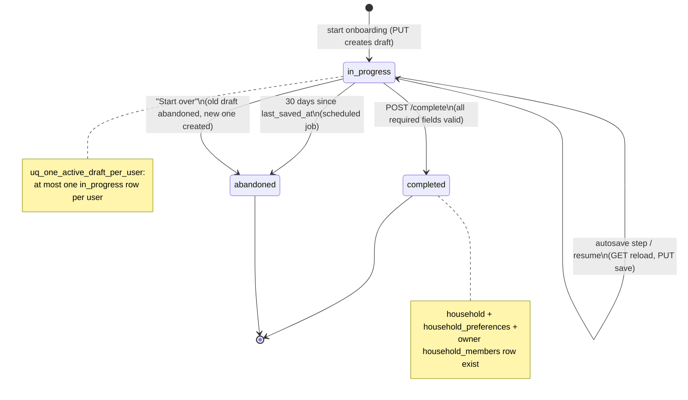
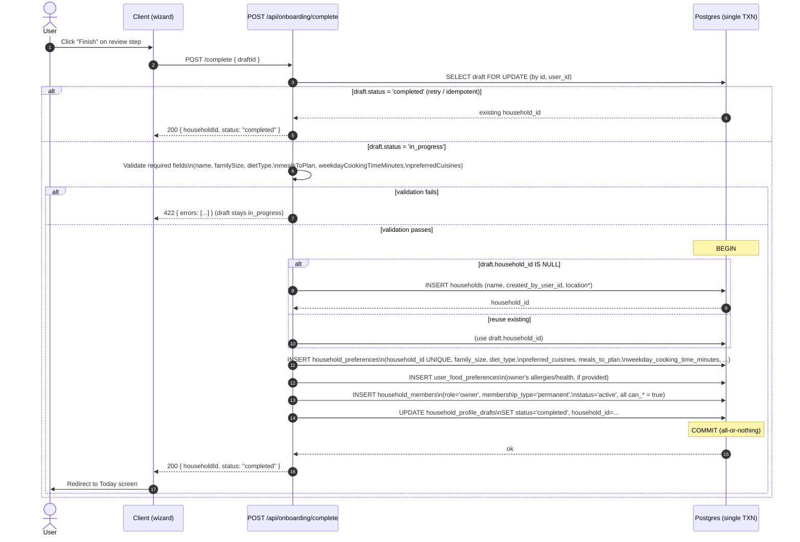

# Onboarding (Save & Resume) Design

How a new user completes household setup as a resumable, autosaved wizard, and
how that draft is promoted into real `households` / `household_preferences` /
`household_members` rows on completion.

This document is the _how_ for the requirements in
[`../docs/07_onboarding_save_resume_spec.md`](../docs/07_onboarding_save_resume_spec.md)
and the user journeys in
[`../docs/02_user_flows.md`](../docs/02_user_flows.md) (Flow 1 and Flow 2). It is
bound by the schema in [`01_database_design.md`](01_database_design.md) — every
table/column/enum named here comes from that doc, which is the source of truth.
API contracts follow [`04_api_design.md`](04_api_design.md), derived from
[`../docs/05_api_spec.md`](../docs/05_api_spec.md).

**Conventions** (per [`00_design_index.md`](00_design_index.md)): database
identifiers are `snake_case`; API/JSON payload fields are `camelCase`. Enum
values are quoted exactly as defined in doc 01.

---

## 1. Goals

- Let a user complete a **lengthy** household setup across multiple sessions and
  devices **without losing progress** — preference setup can exceed a minute and
  drop-off is the risk we are designing against.
- **Autosave after every step** so a closed tab, dead battery, or navigation
  away never costs more than the current in-progress field edits.
- Let users **finish with the minimum required fields** and defer the optional
  ones (allergies, health, budget, pantry, kids/guest prefs) without blocking
  completion.
- Make completion **atomic and idempotent**: a household, its preferences, and an
  owner membership are created together or not at all, and a retried request is
  safe.
- Enforce **one in-progress draft per user** so resume is unambiguous.

Non-goals: inviting members and generating the first meal are downstream of
completion (Flow 1 steps 9–10), covered in
[`07_household_collaboration_design.md`](07_household_collaboration_design.md) and
[`08_meal_planning_grocery_prep_design.md`](08_meal_planning_grocery_prep_design.md).

---

## 2. Step model

The wizard is an ordered list of steps. Each step maps its UI fields onto columns
in `households`, `household_preferences`, and (for member-level food data)
`user_food_preferences`. Forward/backward navigation is allowed; the current
position is persisted as `current_step` (see §3).

The **minimum required set** (a draft cannot be completed without these) is, per
the spec: household name, family size, diet type, meals to plan, cooking time,
cuisine preference.

| #   | Step (`current_step`) | Field (`camelCase`)         | Target column                                        | Required?                     |
| --- | --------------------- | --------------------------- | ---------------------------------------------------- | ----------------------------- |
| 1   | `household_basics`    | `name`                      | `households.name`                                    | **Required**                  |
| 1   | `household_basics`    | `familySize`                | `household_preferences.family_size`                  | **Required**                  |
| 1   | `household_basics`    | `adultsCount`               | `household_preferences.adults_count`                 | Optional                      |
| 1   | `household_basics`    | `kidsCount`                 | `household_preferences.kids_count`                   | Optional                      |
| 1   | `household_basics`    | `locationCountry`           | `households.default_location_country`                | Optional                      |
| 1   | `household_basics`    | `locationCity`              | `households.default_location_city`                   | Optional                      |
| 2   | `food_preferences`    | `dietType`                  | `household_preferences.diet_type`                    | **Required**                  |
| 2   | `food_preferences`    | `preferredCuisines`         | `household_preferences.preferred_cuisines`           | **Required** (≥1 cuisine)     |
| 2   | `food_preferences`    | `spiceLevel`                | `household_preferences.spice_level`                  | Optional (default `'medium'`) |
| 3   | `meal_schedule`       | `mealsToPlan`               | `household_preferences.meals_to_plan`                | **Required** (≥1 slot)        |
| 3   | `meal_schedule`       | `weekdayCookingTimeMinutes` | `household_preferences.weekday_cooking_time_minutes` | **Required**                  |
| 3   | `meal_schedule`       | `weekendCookingTimeMinutes` | `household_preferences.weekend_cooking_time_minutes` | Optional                      |
| 3   | `meal_schedule`       | `varietyGapDays`            | `household_preferences.variety_gap_days`             | Optional (default `7`)        |
| 3   | `meal_schedule`       | `allowLeftovers`            | `household_preferences.allow_leftovers`              | Optional (default `true`)     |
| 4   | `allergies_health`    | `allergies`                 | `user_food_preferences.allergies`                    | Optional                      |
| 4   | `allergies_health`    | `dislikedIngredients`       | `user_food_preferences.disliked_ingredients`         | Optional                      |
| 4   | `allergies_health`    | `healthPreferenceTags`      | `user_food_preferences.health_preference_tags`       | Optional                      |
| 4   | `allergies_health`    | `spicePreference`           | `user_food_preferences.spice_preference`             | Optional                      |
| 5   | `budget`              | `budgetPreference`          | `household_preferences.budget_preference`            | Optional (default `'medium'`) |
| 6   | `review`              | — (read-only confirmation)  | —                                                    | n/a                           |

Notes:

- `mealsToPlan` values are drawn from the `meal_slot` enum (`'breakfast'`,
  `'lunch'`, `'dinner'`, `'snack'`) and stored in the `text[]` column
  `meals_to_plan`. `dietType` / `spicePreference` use the `diet_type` /
  `spice_level` enums; `budgetPreference` uses `budget_preference`.
- **"Cooking time"** in the minimum set is satisfied by
  `weekdayCookingTimeMinutes`; the weekend value is optional and, if omitted,
  the recommendation engine falls back to the weekday value.
- Steps 4 (`allergies_health`) and 5 (`budget`) are **fully optional** — the
  Review step can be reached and `complete` invoked with them empty.
- `allergies_health` writes to **`user_food_preferences`** (the member-level,
  per-user table), not `household_preferences`. At completion this becomes the
  owner's `user_food_preferences` row for the new household.

---

## 3. Draft data model

All progress lives in one `household_profile_drafts` row per user (the
`in_progress` one). The wizard payload is held in the `jsonb` column
`draft_data`, keyed by step. This extends the example in
[`../docs/07_onboarding_save_resume_spec.md`](../docs/07_onboarding_save_resume_spec.md)
to cover every step:

```json
{
  "householdBasics": {
    "name": "Suhane Household",
    "familySize": 4,
    "adultsCount": 2,
    "kidsCount": 2,
    "locationCountry": "IN",
    "locationCity": "Pune"
  },
  "foodPreferences": {
    "dietType": "vegetarian",
    "preferredCuisines": ["North Indian", "South Indian"],
    "spiceLevel": "medium"
  },
  "mealSchedule": {
    "mealsToPlan": ["lunch", "dinner"],
    "weekdayCookingTimeMinutes": 45,
    "weekendCookingTimeMinutes": 90,
    "varietyGapDays": 7,
    "allowLeftovers": true
  },
  "allergiesHealth": {
    "allergies": ["peanuts"],
    "dislikedIngredients": ["okra"],
    "healthPreferenceTags": ["high_protein", "low_sodium"],
    "spicePreference": "mild"
  },
  "budget": {
    "budgetPreference": "medium"
  }
}
```

### How position and progress are tracked

These are **first-class columns** on `household_profile_drafts`, not nested in
`draft_data`, so resume and abandonment queries don't have to parse JSON:

| Column                  | Type                   | Meaning                                                                                                                  |
| ----------------------- | ---------------------- | ------------------------------------------------------------------------------------------------------------------------ |
| `current_step`          | `text`                 | The step the user is on, e.g. `'meal_schedule'`. Matches a `#`/`current_step` value in §2. Used to deep-link the resume. |
| `completion_percentage` | `int` (0–100, checked) | Progress shown in the resume prompt.                                                                                     |
| `status`                | `draft_status`         | `'in_progress'` \| `'completed'` \| `'abandoned'`.                                                                       |
| `draft_data`            | `jsonb`                | The shape above. Defaults to `'{}'`.                                                                                     |
| `household_id`          | `uuid` (nullable)      | Set if a household row was created early (e.g. Flow 1 step 5 captures the name first). Lets completion be idempotent.    |
| `last_saved_at`         | `timestamptz`          | Stamped on every save; drives "Last saved 2 minutes ago" and the abandonment job.                                        |
| `updated_at`            | `timestamptz`          | Maintained by the shared `set_updated_at()` trigger.                                                                     |

**`completion_percentage`** is computed server-side on each `PUT` from the
minimum required set only (so finishing the optional steps never makes the bar
exceed the point at which completion is allowed). With six required fields across
three steps, each satisfied required field contributes a fixed weight, e.g.
`round(satisfiedRequired / 6 * 100)`. The Review step renders at 100% once all
six are present. The client may send a `completionPercentage`, but the server
recomputes and stores its own value.

### One-in-progress-draft-per-user rule

A user has **at most one** `'in_progress'` draft at a time, enforced by the
partial unique index from doc 01:

```sql
create unique index uq_one_active_draft_per_user
  on household_profile_drafts (user_id)
  where status = 'in_progress';
```

Because the index is partial (`where status = 'in_progress'`), a user can
accumulate any number of `'completed'` / `'abandoned'` rows (history) but only
ever one live draft. "Start over" works by moving the current row to
`'abandoned'` and inserting a fresh `'in_progress'` row — both inside one
transaction so the unique index is never transiently violated.

---

## 4. Draft lifecycle

`status` (the `draft_status` enum) is the draft's state machine. A draft is born
`'in_progress'`, and leaves that state in exactly one of two ways: the user
**completes** it, or the scheduled job **abandons** it after 30 idle days (§8).
Resume is a self-transition: it reloads the same `'in_progress'` row, it does not
change `status`.



Transition rules:

- `in_progress -> completed` is allowed **only** when validation passes
  (§7). A failed validation leaves the draft `'in_progress'`.
- `in_progress -> abandoned` happens either via the scheduled job (idle 30 days)
  or explicitly when the user chooses "Start over".
- `completed` and `abandoned` are **terminal**. Reopening setup after completion
  is an "edit household preferences" action against the live household, not a new
  draft.

---

## 5. Autosave

### When we save

1. **Per-step autosave (required).** On "Next"/"Back" and on leaving a step, the
   client issues `PUT /api/onboarding/draft` with the merged `draftData`,
   `currentStep`, and `completionPercentage`. This is the guarantee in the spec:
   _progress is saved after each step_.
2. **Debounced field autosave (optional enhancement).** While editing within a
   step, field changes are buffered and flushed after ~800 ms of inactivity (and
   on blur) with the same `PUT`. This reduces loss between step boundaries; it is
   additive and degrades cleanly to (1) if disabled.

Both paths hit the same idempotent `PUT` (upsert of the single `in_progress`
draft), so a debounced flush and a step save can't conflict — last write wins on
`draft_data`, and the server always re-stamps `last_saved_at` and recomputes
`completion_percentage`.

### Save-state UI strings

A single status indicator near the wizard header reflects the autosave state,
using exactly these strings (from the spec):

| State                        | String                                                               |
| ---------------------------- | -------------------------------------------------------------------- |
| Request in flight            | `Saving...`                                                          |
| Just succeeded (< 1 min ago) | `Saved just now`                                                     |
| Succeeded earlier            | `Last saved 2 minutes ago` (relative, recomputed from `lastSavedAt`) |
| Request failed               | `Save failed. Retry.` (the text is an actionable retry control)      |

The relative time is derived client-side from the `lastSavedAt` returned by the
last successful `PUT`/`GET`.

### Error handling

- **Keep local state.** A failed save never discards in-memory field values; the
  wizard keeps the user's edits and the UI shows `Save failed. Retry.`.
- **Retry.** Auto-retry with backoff (e.g. 1s, 2s, 4s, capped) plus the manual
  retry affordance. A `409` (lost the `in_progress` race / concurrent device)
  triggers a `GET` to reconcile before re-saving.
- **Warn before leaving.** If there are unsaved buffered changes, a
  `beforeunload` handler (and an in-app route guard) warns the user before
  navigating away — satisfying the spec's "warn user before leaving if latest
  changes are not saved".

---

## 6. Resume flow

On entering onboarding (and on app load for a signed-in user without a
household), the client calls `GET /api/onboarding/draft`.

- **No `in_progress` draft** → start a fresh wizard at step 1; the first `PUT`
  creates the draft row.
- **An `in_progress` draft exists** → show the resume prompt instead of jumping
  straight in (Flow 2, steps 6–7):

  > **Continue setting up your household profile?**
  > You're **45% done**. Last saved **2 minutes ago**.
  > [ **Resume** ] [ Start over ]
  - **Resume** → hydrate the wizard from `draftData` and deep-link to
    `currentStep` (Flow 2 step 8). No status change.
  - **Start over** → confirm, then atomically set the current draft to
    `'abandoned'` and create a new `'in_progress'` draft (keeps the partial
    unique index satisfied; preserves the abandoned row as history).

`completionPercentage` and the relative `lastSavedAt` in the prompt come straight
from the `GET` response.

---

## 7. Completion transaction

`POST /api/onboarding/complete` promotes the draft into live rows. It is **one
database transaction** (atomic) and **idempotent** (a retried call returns the
same `householdId` without creating duplicates).

Idempotency hinges on the draft's `household_id` and the `status`/uniqueness
constraints:

- If the draft already references a `household_id`, completion **reuses** it
  (Flow 1 captures the name early, so a `households` row may pre-exist).
- `household_preferences.household_id` is `unique` (1:1), so a second insert is
  prevented at the DB level.
- `household_members` has `uq_one_live_membership (household_id, user_id)` for
  `('invited','active')`, so the owner row can't be duplicated.
- If the draft is already `'completed'`, the endpoint short-circuits and returns
  its `householdId` with `status: "completed"`.

The owner membership is created with `role = 'owner'`, `membership_type =
'permanent'`, `status = 'active'`, and **all `can_*` permission flags set to
`true`** (the owner can do everything: `can_view_plan`, `can_suggest_meals`,
`can_change_today_menu`, `can_change_weekly_schedule`, `can_manage_grocery_list`,
`can_invite_members`, `can_remove_members`, `can_edit_household_preferences`).



After the redirect to **Today**, Flow 1 continues with first-meal generation
(out of scope here — see doc 08). Because `complete` is the only writer of the
owner membership and runs in one transaction, a crash mid-way rolls everything
back and the draft remains safely `'in_progress'` for the user to retry.

---

## 8. Abandoned drafts

Stale drafts are reclaimed by a scheduled job, matching the spec's 30-day
threshold. The platform already enables `pg_cron` (doc 01, Extensions), so the
sweep runs as a Supabase-managed cron job (see also
[`02_system_architecture.md`](02_system_architecture.md) on scheduled jobs):

```sql
-- Mark drafts abandoned after 30 days with no updates.
-- Scheduled daily via pg_cron.
update household_profile_drafts
set    status = 'abandoned'
where  status = 'in_progress'
  and  last_saved_at < now() - interval '30 days';
```

- The job keys off `last_saved_at` (re-stamped on every autosave), so any
  activity within the window keeps the draft alive.
- Moving a draft to `'abandoned'` frees the `uq_one_active_draft_per_user` slot,
  so a returning user starts cleanly rather than seeing a stale resume prompt.
- Abandoned rows are **retained** (not deleted) as product/history signal and to
  preserve the partial-index semantics; a separate retention policy can purge
  them later if needed.

---

## 9. API mapping

The wizard talks to three endpoints from
[`04_api_design.md`](04_api_design.md) /
[`../docs/05_api_spec.md`](../docs/05_api_spec.md). All require an authenticated
user; the draft is always scoped to `auth.uid()`.

### `GET /api/onboarding/draft` — load / detect (§6)

Returns the caller's single `in_progress` draft, or an empty/`null` indicator
when none exists.

```json
{
  "status": "in_progress",
  "currentStep": "food_preferences",
  "completionPercentage": 45,
  "lastSavedAt": "2026-05-22T09:14:00Z",
  "draftData": {}
}
```

| Response field (`camelCase`) | Column                                           |
| ---------------------------- | ------------------------------------------------ |
| `status`                     | `household_profile_drafts.status`                |
| `currentStep`                | `household_profile_drafts.current_step`          |
| `completionPercentage`       | `household_profile_drafts.completion_percentage` |
| `lastSavedAt`                | `household_profile_drafts.last_saved_at`         |
| `draftData`                  | `household_profile_drafts.draft_data`            |

### `PUT /api/onboarding/draft` — autosave (§5)

Upserts the single `in_progress` draft for the user (creating it on first call).
Server **recomputes** `completion_percentage` and re-stamps `last_saved_at`
regardless of client input.

```json
{
  "currentStep": "meal_schedule",
  "completionPercentage": 60,
  "draftData": {}
}
```

| Request field          | Column                                                |
| ---------------------- | ----------------------------------------------------- |
| `currentStep`          | `current_step`                                        |
| `completionPercentage` | `completion_percentage` (advisory; server recomputes) |
| `draftData`            | `draft_data` (merged/replaced per step)               |

### `POST /api/onboarding/complete` — promote (§7)

```json
// request
{ "draftId": "uuid" }
```

```json
// response
{ "householdId": "uuid", "status": "completed" }
```

| Field                | Source / target                                                                                      |
| -------------------- | ---------------------------------------------------------------------------------------------------- |
| `draftId` (req)      | `household_profile_drafts.id` (must belong to `auth.uid()`, be `in_progress` or already `completed`) |
| `householdId` (resp) | `households.id` (created or reused)                                                                  |
| `status` (resp)      | `household_profile_drafts.status` after commit (`'completed'`)                                       |

Error cases: `422` when required fields are missing/invalid (draft stays
`in_progress`); `404` when the `draftId` is unknown or not owned by the caller;
`409` reserved for a concurrent completion race (resolved idempotently by
re-reading the now-`completed` draft).
