# Household Collaboration Design

How multiple people share one Home Meal Planner household: roles and
permissions, the membership and invite lifecycles, permanent vs. temporary
guests, conflict handling, and the leave / ownership-transfer mechanics.

This document is the implementation reference for the collaboration
specification in
[`../docs/08_household_collaboration_spec.md`](../docs/08_household_collaboration_spec.md)
and the user flows (Flows 6–11) in
[`../docs/02_user_flows.md`](../docs/02_user_flows.md). It builds directly on the
schema in [`01_database_design.md`](01_database_design.md) — the **source of
truth** for every table, column, and enum named below — and on the permission
model and Row-Level Security in
[`03_auth_and_security_design.md`](03_auth_and_security_design.md). Endpoint
contracts referenced here are defined in [`04_api_design.md`](04_api_design.md)
(and sketched in [`../docs/05_api_spec.md`](../docs/05_api_spec.md)).

Conventions (per [`00_design_index.md`](00_design_index.md)): database
identifiers are `snake_case`; API/JSON payloads are `camelCase`; enum values are
quoted exactly as declared in doc 01.

---

## 1. Concepts

| Concept       | Definition                                                                                                                                                                                                                                                   | Backed by                          |
| ------------- | ------------------------------------------------------------------------------------------------------------------------------------------------------------------------------------------------------------------------------------------------------------ | ---------------------------------- |
| **Household** | The **tenancy boundary**. Almost every domain row carries a `household_id`; access is keyed off active membership in that household. Meal plans, preferences, grocery lists, prep tasks, the activity feed, and notifications all live inside one household. | `households`                       |
| **Member**    | A user with a row in `household_members` for a household. A _permanent_ member (`membership_type = 'permanent'`) has long-term access — spouse, parent, roommate, cook.                                                                                      | `household_members`                |
| **Guest**     | A user invited for a bounded date range (`membership_type = 'temporary_guest'`). Access exists only between `starts_at` and `expires_at`.                                                                                                                    | `household_members`                |
| **Owner**     | The household creator (`households.created_by_user_id`) or the user a previous owner transferred ownership to. Exactly one active `role = 'owner'` member per household.                                                                                     | `household_members.role = 'owner'` |

The tenancy boundary is enforced at the database layer: RLS on every
household-scoped table calls `is_active_member(household_id)`, which checks for a
`household_members` row with `status = 'active'` and a live window
(`expires_at is null or expires_at > now()`). See doc 01 §"Row-Level Security
strategy" and doc 03.

---

## 2. Roles & permissions

Permissions are eight `can_*` boolean columns denormalized onto each
`household_members` row, so every access check is a single indexed read (doc 01).
Role sets the **defaults** at invite/accept time; for `admin` and `member` rows
those defaults can be **toggled per member** afterward via
`PATCH /api/households/{householdId}/members/{memberId}`. `owner` and `viewer`
defaults are fixed by role (an owner always holds every flag; a viewer is
read-only).

Default permission matrix (consistent with `../docs/08` "Roles" and "Permission
flags"):

| `can_*` flag                     | `owner` | `admin` | `member` | `viewer` |
| -------------------------------- | :-----: | :-----: | :------: | :------: |
| `can_view_plan`                  |   ✅    |   ✅    |    ✅    |    ✅    |
| `can_suggest_meals`              |   ✅    |   ✅    |    ✅    |    ❌    |
| `can_change_today_menu`          |   ✅    |   ✅    |    ✅    |    ❌    |
| `can_change_weekly_schedule`     |   ✅    |   ✅    |    ✅    |    ❌    |
| `can_manage_grocery_list`        |   ✅    |   ✅    |   ❌¹    |    ❌    |
| `can_invite_members`             |   ✅    |   ❌¹   |    ❌    |    ❌    |
| `can_remove_members`             |   ✅    |   ❌¹   |    ❌    |    ❌    |
| `can_edit_household_preferences` |   ✅    |   ✅²   |    ❌    |    ❌    |

¹ Toggleable per member by an owner (or an admin acting within their own
authority). The raw `can_*` column defaults in doc 01 are `false`, but the
service layer's `member` bundle (`defaultPermissionsForRole`) enables
`can_change_today_menu` / `can_change_weekly_schedule` so an invited member can
collaborate on meals immediately; grocery management stays opt-in. Admin/owner
flags are raised at row creation.
² Admin edits "some" household preferences per `../docs/08`; scope is enforced in
the service layer, not by a separate column.

Rules:

- **Owner** is all-powerful within its household and is the only role that can
  `can_remove_members` on other owners-elect and transfer ownership (§11). An
  owner's flags are not individually toggleable — demoting an owner means a role
  change.
- **Admin** mirrors the owner's day-to-day editing capability but defaults
  _without_ `can_invite_members` / `can_remove_members`; an owner may grant
  those per admin.
- **Member** can view, suggest, and change today's + weekly meals by default;
  grocery management and household-level capabilities remain opt-in per member.
- **Viewer** is strictly read-only (`can_view_plan` only) and may receive
  notifications.

Authorization is defense-in-depth: the service layer checks the flag before
acting (clean domain error on denial), and RLS via `has_permission(household_id,
'<flag>')` is the backstop (doc 01, doc 03).

---

## 3. Membership lifecycle

A `household_members` row moves through `member_status`:
`invited → active → {removed, left, expired}`, with terminal `declined` /
`expired` reachable from `invited`. The partial unique index
`uq_one_live_membership` guarantees at most one row per `(household_id, user_id)`
in a **non-terminal** status (`invited` or `active`), so a re-invite after a
terminal status is a fresh row.

```mermaid
stateDiagram-v2
    [*] --> invited: invite created\n(row inserted, status='invited')

    invited --> active: accept\n(joined_at=now())
    invited --> declined: invitee declines
    invited --> expired: invite window passes\nbefore accept

    active --> removed: removed by\ncan_remove_members
    active --> left: member leaves\n(non-owner; Flow 10/11)
    active --> expired: temporary_guest\npast expires_at

    declined --> [*]
    expired --> [*]
    removed --> [*]
    left --> [*]
```



Notes:

- **`invited → active`** sets `joined_at = now()` and is the only path that grants
  access. Triggered by `POST /api/invites/{token}/accept`.
- **`active → removed`** is an admin/owner action (§10). The row is _not_ deleted
  — soft state preserves historical attribution.
- **`active → left`** is self-service (§11); owners must transfer first.
- **`active → expired`** applies only to `temporary_guest` rows whose
  `expires_at` has passed (§7).
- **`invited → expired`** covers an invite that lapses before acceptance; the
  member row (if pre-created) and its `household_invites` row both expire.
- All four terminal statuses (`declined`, `expired`, `removed`, `left`) drop the
  row out of `uq_one_live_membership` and out of `is_active_member`, so access is
  revoked immediately.

---

## 4. Invite lifecycle

A `household_invites` row tracks `invite_status`:
`pending → {accepted, declined, expired, cancelled}`. It is the bridge between
the inviter's action and the resulting `household_members` row
(`household_invites ||--o| household_members` in doc 01).

```mermaid
stateDiagram-v2
    [*] --> pending: owner/can_invite_members\ncreates invite\n(invite_token issued)

    pending --> accepted: invitee accepts\n(accepted_by_user_id, accepted_at set;\nmember row -> 'active')
    pending --> declined: invitee declines\n(declined_at set)
    pending --> expired: now() > expires_at\n(scheduled job / token lookup)
    pending --> cancelled: inviter revokes\nbefore acceptance

    accepted --> [*]
    declined --> [*]
    expired --> [*]
    cancelled --> [*]
```

Notes:

- Only `pending` is non-terminal. The partial indexes `ix_invites_token` and
  `ix_invites_pending_expiry` are scoped to `status = 'pending'` (doc 01) so token
  lookup and expiry sweeps stay cheap.
- **`pending → accepted`** writes `accepted_by_user_id` and `accepted_at`, and is
  transactionally paired with the membership transition `invited → active` (§3).
- **`pending → expired`** fires when `now() > expires_at`, detected either by the
  scheduled sweep or lazily during the `GET /api/invites/{token}` lookup.
- **`pending → cancelled`** is the inviter rescinding an unaccepted invite.
- `invite_token` is a random, opaque, single-use secret; its generation,
  hashing, and unauthenticated-lookup handling are specified in
  [`03_auth_and_security_design.md`](03_auth_and_security_design.md) and are
  **not** re-specified here.

---

## 5. Permanent vs. temporary guest

`membership_type` distinguishes the two membership shapes:

|               | `permanent`                   | `temporary_guest`                |
| ------------- | ----------------------------- | -------------------------------- |
| `starts_at`   | `now()` at accept (immediate) | inviter-selected window start    |
| `expires_at`  | `null` (no expiry)            | **required**, non-null           |
| Access window | indefinite while `active`     | `starts_at ≤ now() ≤ expires_at` |
| DB constraint | —                             | `guest_has_expiry`               |

The `guest_has_expiry` check on `household_members` enforces the invariant at the
database layer:

```sql
constraint guest_has_expiry
  check (membership_type <> 'temporary_guest' or expires_at is not null)
```

i.e. any `temporary_guest` row **must** carry an `expires_at`. A permanent member
may leave `expires_at` null.

Access is gated by the window on **every** read, not only at accept time. Both
`is_active_member()` and `has_permission()` include
`(expires_at is null or expires_at > now())` (doc 01), so a guest past
`expires_at` is denied immediately even before the scheduled job flips the row to
`expired`. The partial index `ix_members_guest_expiry`
(`where membership_type = 'temporary_guest' and status = 'active'`) makes the
expiry sweep efficient.

---

## 6. Invite flow

Maps `../docs/08` "Invite flow" and Flow 6 (permanent member). Endpoints are
those in [`04_api_design.md`](04_api_design.md) / `../docs/05_api_spec.md`.

```mermaid
sequenceDiagram
    autonumber
    actor Owner
    participant API as API (service layer)
    participant DB as Supabase (Postgres + RLS)
    participant Email as Email/SMS sender
    actor Invitee
    participant Members as Existing members

    Owner->>API: POST /api/households/{householdId}/invites\n{ email, membershipType, role, expiresAt, permissions }
    API->>API: check can_invite_members
    API->>DB: insert household_invites (status='pending', invite_token)
    DB-->>API: inviteId, invite_token
    API->>Email: send invite link\n(https://app.example.com/invite/{token})
    API-->>Owner: { inviteId, inviteLink }

    Invitee->>API: GET /api/invites/{token}
    API->>DB: look up pending invite by token\n(lazy-expire if past expires_at)
    DB-->>API: { householdName, invitedBy, membershipType, role, expiresAt }
    API-->>Invitee: invite preview

    Invitee->>API: sign in (Google / email / magic link)
    note over API,DB: auth handled per doc 03;\ninvite token is opaque & single-use

    Invitee->>API: POST /api/invites/{token}/accept
    API->>DB: tx: invite -> 'accepted'\n(accepted_by_user_id, accepted_at);\nhousehold_members -> 'active' (joined_at=now())
    DB-->>API: { householdId, membershipStatus: 'active' }
    API->>DB: write household_activity_events (member_joined)
    API->>DB: insert notifications for all active members except actor
    API-->>Invitee: { householdId, membershipStatus }
    API-->>Members: in-app notification: "<name> joined the household"
```

Key points:

- The accept step is a single transaction: the `household_invites` row goes
  `pending → accepted` and the `household_members` row goes `invited → active`
  together, so `uq_one_live_membership` is never violated and there is no window
  where the invite is consumed but the member is not active.
- A response payload uses `camelCase` (`householdId`, `inviteLink`,
  `membershipStatus`); the underlying enums are the `snake_case`/quoted values
  from doc 01 (`'active'`, `'accepted'`).
- Notification fan-out (one `notifications` row per active member except the
  actor) follows the pattern in `../docs/08` "Notifications" and is detailed in
  [`09_notifications_design.md`](09_notifications_design.md).
- Invite-token security (opacity, single use, expiry, unauthenticated lookup via
  RPC) is owned by [`03_auth_and_security_design.md`](03_auth_and_security_design.md).

---

## 7. Temporary guest flow

Maps `../docs/08` "Temporary guest flow" and Flow 7.

1. **Duration selection.** When creating the invite the owner selects
   `membershipType = 'temporary_guest'` and a duration. The service computes
   `expiresAt` (and optionally `startsAt`) and sends them on
   `POST /api/households/{householdId}/invites`. The `household_invites` row
   stores `starts_at` / `expires_at`; `invite_status = 'pending'`.
2. **Set `starts_at` / `expires_at` on the member.** On accept, the
   `household_members` row is created with `membership_type = 'temporary_guest'`,
   `starts_at`, and the **non-null** `expires_at` carried over from the invite —
   satisfying the `guest_has_expiry` constraint (§5).
3. **Accept.** Same `POST /api/invites/{token}/accept` transition as §6; the
   member row becomes `active`.
4. **Access until expiry.** The guest sees the shared household view (§8) gated by
   their permission flags, but only while `now() ≤ expires_at`. Because the RLS
   helpers re-evaluate `expires_at > now()` on every request (the **real-time
   expiry check**, doc 01 "Defense in depth"), access stops the instant the
   window closes — independent of any job.
5. **Scheduled `expire_guests` job.** A `pg_cron` job (the scheduled jobs are
   listed in [`02_system_architecture.md`](02_system_architecture.md)) runs
   periodically and flips eligible rows
   (`membership_type = 'temporary_guest' and status = 'active' and expires_at <= now()`)
   to `status = 'expired'` using the `ix_members_guest_expiry` index. This is a
   bookkeeping/cleanup step that makes the terminal status durable for the
   activity feed and member list; the real-time check is what actually enforces
   denial.

So expiry is enforced two ways: **real-time** on every access (correctness) and
the **`expire_guests` job** (durable state + cleanup).

---

## 8. Shared view

Every `active` member (gated by `is_active_member`) sees one consistent household
view (`../docs/08` "Shared view"):

| Surface       | Data source                            | Visible to                           | Action gate                                 |
| ------------- | -------------------------------------- | ------------------------------------ | ------------------------------------------- |
| Today's meal  | `meal_plan_items` (today, by slot)     | all active members (`can_view_plan`) | `can_change_today_menu`                     |
| Weekly plan   | `meal_plans` + `meal_plan_items`       | all active members                   | `can_change_weekly_schedule`                |
| Prep tasks    | `dish_prep_tasks` for planned dishes   | all active members                   | (derived from plan changes)                 |
| Grocery list  | `grocery_lists` + `grocery_list_items` | all active members                   | `can_manage_grocery_list`                   |
| Activity feed | `household_activity_events`            | all active members                   | read-only                                   |
| Members       | `household_members`                    | all active members                   | `can_invite_members` / `can_remove_members` |

The **view** is the same for everyone with `can_view_plan`; only the **actions**
exposed on it differ by permission. The client reads `currentUserPermissions`
(returned by `GET /api/households/{householdId}`) to decide which controls to
render, and the server re-checks every mutating call. A `viewer` sees the full
plan but no edit affordances; a guest sees it only within its window (§7).

### 8.1 Household switcher (BETA)

A user can be an active member of several households at once. They choose **which
one they're viewing** via the switcher (the `/households` page, surfaced from the
nav). Two pointers persist on the `users` row so the choice follows the user
across devices:

- `active_household_id` — the household currently being viewed. Set by
  `PUT /api/households/active` → the `set_active_household` RPC.
- `preferred_household_id` — the default loaded on login. Set by
  `PUT /api/households/preferred` → the `set_preferred_household` RPC.

`resolveCurrentHousehold` picks **active → preferred → earliest-joined** (the last
being the historical default, so a single-household user is unaffected). Both RPCs
are `security definer` and verify `is_active_member` before writing, so a user can
only point at a household they actively belong to. Everything downstream still
takes an explicit `householdId`, so no other surface changes.

---

## 9. Conflict handling

MVP uses **last-write-wins** (`../docs/08` "Conflict handling"). There is no
optimistic-locking version column on `meal_plan_items` for collaboration; the
most recent successful write to a `(meal_plan_id, date, meal_slot)` slot is the
current truth, and `updated_at` (maintained by the shared trigger, doc 01)
records when.

Reconciliation is the **activity feed**, not a merge dialog:

- Every household-state change writes a `household_activity_events` row
  (`event_type`, `entity_type`, `entity_id`, `old_value`, `new_value`,
  `actor_user_id`) — append-only, with `actor_user_id` using `set null` so
  history survives account deletion (doc 01).
- The feed is the single surface where members see who changed what and when,
  so a clobbered change is always **visible and attributable** rather than
  silently lost.
- Each qualifying change also fans out `notifications` to other active members
  (§6, `../docs/08` "Notifications") so concurrent editors learn about the
  overwrite promptly.

This keeps the MVP simple while preserving auditability; richer conflict
resolution (per-field merge, locks beyond the existing `meal_plan_items.locked`)
is out of scope.

---

## 10. Remove member

Per Flow 9 and `../docs/08` "Remove member":

- **Who can.** A member holding `can_remove_members` (owner by default; admins
  only if granted). Endpoint:
  `POST /api/households/{householdId}/members/{memberId}/remove`. The service
  checks the flag; RLS on `household_members` is the backstop (doc 01 RLS table).
- **Transition.** The target row goes `active → removed` (§3). The row is
  **not** deleted (soft state).
- **Effects:**
  - **Loses access immediately** — `removed` is terminal, so the row drops out of
    `is_active_member` / `uq_one_live_membership` and RLS denies all
    household-scoped reads and writes.
  - **Keeps historical attribution** — past `household_activity_events`,
    `meal_feedback`, and `changed_by_user_id` references remain intact (those FKs
    are `set null` only on account deletion, not on removal).
  - **No future notifications** — fan-out targets only `active` members except
    the actor, so a removed user receives nothing further.
- Remaining active members receive a "member removed" notification.
- An owner cannot be removed via this path; changing who is owner is the transfer
  flow (§11).

---

## 11. Leave & ownership transfer

Per Flows 10–11 and `../docs/08` "Leave household":

**Non-owner leaves freely.** Any `active` member whose `role <> 'owner'` calls
`POST /api/households/{householdId}/leave`; their row goes `active → left` (§3),
access is revoked, attribution is preserved, and the **owner** is notified
(Flow 10).

**Owner must transfer ownership first.** An owner cannot simply leave — that
would orphan the household (the invariant: exactly one active `owner`). Flow 11:

```text
Owner taps "Leave"
  → service checks for another active member eligible to own
      → if none: block with a domain error ("transfer ownership first")
      → if some: require ownership transfer
  → owner transfers ownership (promote target to owner)
  → owner may now leave (active → left)
```

Transfer mechanics:

1. Pick a **promotion target**: an existing `active` member (typically an
   `admin` or `member`) of the same household.
2. In one transaction: set the target row's `role = 'owner'` (and grant the full
   owner permission set, §2), and set the outgoing owner's `role` to a non-owner
   role (e.g. `admin`). This preserves "exactly one active owner."
3. The outgoing user — now a non-owner — calls
   `POST /api/households/{householdId}/leave`, transitioning `active → left`.
4. Both the role change and the leave are recorded as `household_activity_events`
   and notified to active members.

Transfer is exposed through the member-update path
(`PATCH /api/households/{householdId}/members/{memberId}`, setting `role`) under
owner authority; the leave then follows. There is no separate "delete household"
in MVP — ownership always lands on a remaining member.

---

## 12. Guest preference impact (V2)

Per `../docs/08` "Guest preference impact", whether a guest's food preferences
should influence the household's meal planning is a **V2** feature. When
inviting a guest, V2 will ask: _"Should this guest's food preferences affect
meal planning?"_

For the **MVP**, this is skipped — the planner does not blend guest preferences
into recommendations. At most, the MVP may **collect the guest's diet type
only** (a `diet_type` value in `user_food_preferences`, doc 01), recorded for
visibility but not yet wired into the recommendation pipeline
([`05_recommendation_engine_design.md`](05_recommendation_engine_design.md)).
The schema already supports the V2 expansion (`user_food_preferences` is scoped
per `(user_id, household_id)`), so adding the toggle and feeding guest
preferences into scoring is additive and requires no migration of the
collaboration tables.
