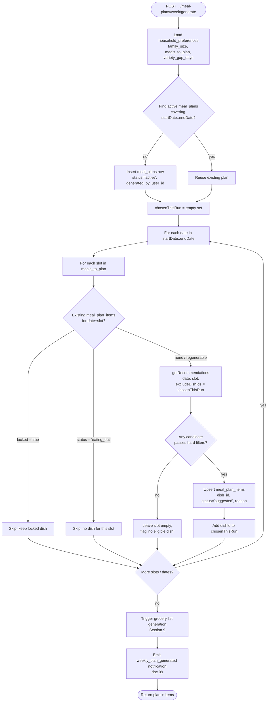
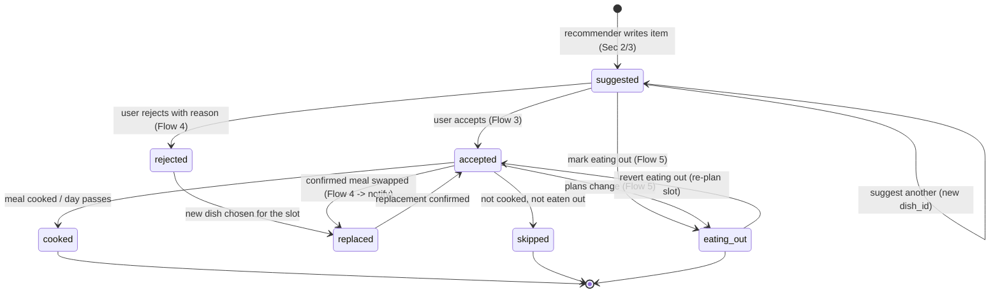
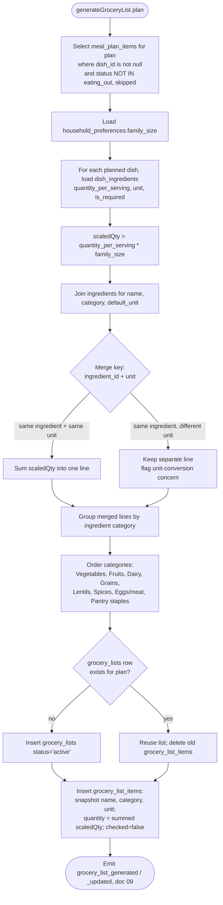

# Meal Planning, Grocery & Prep Design

This document specifies _how_ the meal-planning, grocery, and advance-prep
features are built. It is the implementation reference for **Phase 5 (Meal
planning)** and **Phase 7 (Grocery & prep)** of
[`../docs/12_mvp_roadmap.md`](../docs/12_mvp_roadmap.md).

It composes three other layers and never restates their contracts:

- **[`01_database_design.md`](01_database_design.md)** — the source of truth for
  every table, column, and enum used here (`meal_plans`, `meal_plan_items`,
  `grocery_lists`, `grocery_list_items`, `dish_ingredients`, `dish_prep_tasks`,
  `dishes`, `ingredients`, `meal_feedback`). Where this doc and doc 01 disagree,
  doc 01 wins.
- **[`05_recommendation_engine_design.md`](05_recommendation_engine_design.md)**
  (specified by [`../docs/04_recommendation_engine.md`](../docs/04_recommendation_engine.md))
  — the rule-based scorer this feature _invokes_ to pick dishes. We treat it as
  a pure function `getRecommendations(householdId, date, mealSlot, opts)`.
- **[`04_api_design.md`](04_api_design.md)** (contracts in
  [`../docs/05_api_spec.md`](../docs/05_api_spec.md)) — the endpoint surface for
  meal plans and grocery lists.

Prep reminder fan-out and grocery/menu-change notifications are owned by
[`09_notifications_design.md`](09_notifications_design.md) (spec:
[`../docs/09_notifications_spec.md`](../docs/09_notifications_spec.md)); this doc
only states _when_ an event is emitted.

> **Conventions** (per [`00_design_index.md`](00_design_index.md)): database
> identifiers are `snake_case`; API/JSON payloads are `camelCase`; enum values
> are quoted exactly as defined in doc 01.

---

## 1. Overview

The planning domain is a four-level hierarchy rooted at the household:

```
households
  └── meal_plans              (one row = one date range: start_date .. end_date)
        ├── meal_plan_items    (one row = one (date, meal_slot) cell)
        └── grocery_lists      (exactly one per meal_plan — unique(meal_plan_id))
              └── grocery_list_items  (one row per merged ingredient line)
```

| Entity               | Grain                                                           | Key columns (doc 01)                                                                                             | Notes                                                                                                                                                      |
| -------------------- | --------------------------------------------------------------- | ---------------------------------------------------------------------------------------------------------------- | ---------------------------------------------------------------------------------------------------------------------------------------------------------- |
| `meal_plans`         | A date range for a household                                    | `household_id`, `start_date`, `end_date`, `status` (`meal_plan_status`: `draft`/`active`/`archived`)             | "Today" generation creates/extends a single-day-or-current plan; weekly generation creates a 7-day plan.                                                   |
| `meal_plan_items`    | One `(meal_plan_id, date, meal_slot)` cell — `unique` in doc 01 | `dish_id` (nullable), `status` (`meal_item_status`), `locked`, `reason`, `eating_out_note`, `changed_by_user_id` | `dish_id` is null for an `eating_out` slot. `reason` holds the recommender explanation; `eating_out_note` (BETA) an optional place for an eating-out slot. |
| `grocery_lists`      | One per meal plan — `unique(meal_plan_id)`                      | `meal_plan_id`, `status` (`grocery_list_status`)                                                                 | Regeneration replaces items in place; never creates a second list.                                                                                         |
| `grocery_list_items` | One merged ingredient line                                      | `ingredient_id` (nullable), snapshotted `name`/`category`/`unit`, `quantity`, `checked`                          | Snapshot fields survive catalog edits.                                                                                                                     |
| Prep tasks           | Derived, not stored per plan                                    | sourced from `dish_prep_tasks`                                                                                   | Computed on read from the planned dishes; no `meal_plan_prep_tasks` table in MVP.                                                                          |

The relationships above mirror the ERD in
[`01_database_design.md`](01_database_design.md#entity-relationship-diagram):
`meal_plans ||--o{ meal_plan_items`, `meal_plans ||--|| grocery_lists`, and
`dishes ||--o{ dish_prep_tasks`.

**Design stance.** `meal_plan_items` is the authoritative record of _what was
planned and what happened_ — it doubles as the meal-history source for the
recommender's variety logic (Section 8). Grocery and prep are **derived
projections** of the accepted/planned items, regenerated whenever the plan
changes, so they never drift from the plan.

---

## 2. Today's meal generation

Implements **Flow 3 (Generate today's meal)** and the front half of
**Flow 4 (Reject and replace)** from
[`../docs/02_user_flows.md`](../docs/02_user_flows.md).

Endpoint: `POST /api/households/{householdId}/meal-plans/today/generate`
(doc 04 / [`../docs/05_api_spec.md`](../docs/05_api_spec.md)).

Request:

```json
{ "date": "2026-05-22", "mealSlot": "dinner" }
```

### Algorithm

1. **Resolve the plan.** Find the `active` `meal_plans` row whose
   `[start_date, end_date]` contains `date`. If none exists, create a one-day
   `meal_plans` row (`status = 'active'`, `start_date = end_date = date`,
   `generated_by_user_id = auth.uid()`).
2. **Idempotency on the cell.** Look up the `meal_plan_items` row for
   `(meal_plan_id, date, mealSlot)` — the `unique` constraint guarantees at most
   one. If it exists and is `locked`, return it unchanged. If it exists and is
   `eating_out`, do not overwrite (use replace/eating-out endpoints instead).
3. **Invoke the recommender** (Section/doc 05):
   `getRecommendations(householdId, date, mealSlot, { excludeDishIds: [] })`.
   The engine applies hard filters and soft scoring and returns ranked
   candidates with `dishId`, `score`, `reason`, `prepTasks`, `pairedDishes`.
4. **Persist the top candidate** as a `meal_plan_items` row with
   `status = 'suggested'`, `dish_id = topCandidate.dishId`, and
   `reason = topCandidate.reason` (the human-readable explanation surfaced in
   Flow 3 step 5, e.g. _"Vegetarian, fits your 45-minute window, not repeated
   this week, good for dinner."_). On a re-suggest, `update` the existing row.
5. **Return** the item plus the runner-up candidates so the client can show
   "Suggest another" without a round trip.

Response (camelCase):

```json
{
  "mealPlanItem": {
    "id": "uuid",
    "date": "2026-05-22",
    "mealSlot": "dinner",
    "dishId": "uuid",
    "status": "suggested",
    "reason": "Vegetarian, fits your 45-minute window, not repeated this week.",
    "locked": false
  },
  "alternatives": [{ "dishId": "uuid", "score": 218, "reason": "..." }]
}
```

### Accept / Reject / Suggest-another

| User action (Flow 3/4)          | Server effect                                                                                                                      | Status transition                  |
| ------------------------------- | ---------------------------------------------------------------------------------------------------------------------------------- | ---------------------------------- |
| **Accept**                      | `update meal_plan_items set status = 'accepted', changed_by_user_id = auth.uid()`                                                  | `suggested → accepted`             |
| **Suggest another** (no reason) | Re-invoke recommender with `excludeDishIds = [currentDishId]`; rewrite the same row's `dish_id`/`reason`; status stays `suggested` | `suggested → suggested` (new dish) |
| **Reject with reason**          | Record feedback, penalize dish, then re-suggest                                                                                    | `suggested → suggested` (new dish) |

### Recording rejection feedback (Flow 4 step 3–4)

When the user rejects with a reason, before re-suggesting:

1. Insert a `meal_feedback` row keyed to the `meal_plan_item_id`:
   `{ household_id, meal_plan_item_id, user_id, feedback_type, reason }`.
   `feedback_type` is a `feedback_type` enum value (doc 01) mapped from the UI
   choice — e.g. `'too_much_effort'`, `'ingredients_unavailable'`,
   `'kids_disliked'`, or `'do_not_suggest_again'`.
2. **Penalize the dish** for this household. The recommender (doc 05) reads
   recent `meal_feedback` and applies the _"Recently rejected: −80"_ soft
   adjustment; a `'do_not_suggest_again'` feedback becomes a **hard filter**
   exclusion. The penalty is data-driven — we persist feedback, the scorer
   reacts — so no separate penalty table is needed.
3. Re-invoke `getRecommendations(..., { excludeDishIds: [rejectedDishId] })` and
   overwrite the suggested item.

> If the rejected item was already `accepted` (a _confirmed_ meal), changing it
> follows the Replace path in Section 5 and emits the `meal_changed`
> notification.

---

## 3. Weekly plan generation

Endpoint: `POST /api/households/{householdId}/meal-plans/week/generate`
with `{ "startDate": "2026-05-25", "endDate": "2026-05-31" }`.

The generator walks every `(date, meal_slot)` cell in the range, but only for
slots the household actually plans — `household_preferences.meals_to_plan`
(a `text[]` of `meal_slot` values, doc 01). It **skips locked items** and
**eating_out slots** so user intent is preserved across regenerations, and it
**excludes dishes already chosen in the current run** so the week has variety
beyond the per-day rotation gap. After items are written it triggers grocery
generation (Section 9).



Notes:

- **`excludeDishIds = chosenThisRun`** is layered on top of the recommender's own
  `variety_gap_days` rotation (Section 8 / doc 05). The two are complementary:
  rotation looks at _history_, `chosenThisRun` looks at _this batch_.
- The whole walk runs in **one transaction** so a partial week is never
  persisted; grocery generation runs after commit (or in the same transaction
  with the list written last) for consistency.
- Regeneration of an existing week is **idempotent for locked/eating-out cells**
  and refreshes everything else — see Section 7.

---

## 4. Meal item status lifecycle

`meal_plan_items.status` is the `meal_item_status` enum from doc 01:
`'suggested'`, `'accepted'`, `'rejected'`, `'replaced'`, `'cooked'`,
`'skipped'`, `'eating_out'`.



| Transition              | Trigger                                    | API / mechanism                                                   |
| ----------------------- | ------------------------------------------ | ----------------------------------------------------------------- |
| `[*] → suggested`       | Recommender picks a dish for the cell      | `today/generate`, `week/generate`                                 |
| `suggested → accepted`  | User accepts the suggestion                | accept action on `today/generate` result                          |
| `suggested → suggested` | "Suggest another" rewrites `dish_id`       | re-invoke recommender, same row                                   |
| `suggested → rejected`  | User rejects with a reason                 | feedback insert + re-suggest (Section 2)                          |
| `rejected → replaced`   | A replacement dish is written for the slot | `POST /api/meal-plan-items/{id}/replace`                          |
| `accepted → replaced`   | A **confirmed** meal is swapped            | `POST .../replace` → `meal_changed` notify (Section 5)            |
| `replaced → accepted`   | Replacement is the new confirmed dish      | set by the replace handler                                        |
| `* → eating_out`        | Slot marked eating out                     | `POST /api/meal-plan-items/{id}/eating-out` (Section 6)           |
| `eating_out → accepted` | Eating-out reverted, slot re-planned       | replace endpoint with a `replacementDishId`                       |
| `accepted → cooked`     | Meal is cooked / the day rolls over        | client mark-cooked, or nightly job promotes past `accepted` items |
| `accepted → skipped`    | Day passed, not cooked, not eaten out      | nightly reconciliation job                                        |

`cooked`, `skipped`, and `eating_out` are the **terminal** outcomes that feed
history (Section 8). Note that `cooked` counts toward rotation penalty;
`eating_out` and `skipped` deliberately do **not** (Section 6).

---

## 5. Replace / reject

Endpoint: `POST /api/meal-plan-items/{mealPlanItemId}/replace` with
`{ "replacementDishId": "uuid", "reason": "User selected replacement" }`.
Implements **Flow 4 (Reject and replace meal)**.

Handler steps:

1. **Permission gate.** Require `can_change_today_menu` (today's slot) or
   `can_change_weekly_schedule` (future slot) per doc 01 RLS / doc 03.
2. **Capture the old state** (`old_dish_id`, `old_status`) for the activity log
   and notification message.
3. If `replacementDishId` is omitted, re-invoke the recommender to pick one
   (excluding the current and any rejected dishes); otherwise validate the
   supplied dish passes hard filters for the slot.
4. **Record the reason.** Persist a `meal_feedback` row when a rejection reason
   is provided (same shape as Section 2). Store the human note on the item's
   `reason` column as well.
5. **Apply the swap.** If the old item was `accepted`/`cooked`, set its status to
   `'replaced'` then write the new dish (`status` → `'accepted'`,
   `changed_by_user_id = auth.uid()`). For a still-`suggested` item, overwrite in
   place. Implemented as: mark `old → replaced`, set new `dish_id`/`reason`,
   `status = 'accepted'`.
6. **Notify on confirmed-meal change (Flow 4 step 6).** _Only if the old status
   was `accepted` or `cooked`_ (i.e. a confirmed meal actually changed), append a
   `household_activity_events` row and emit a `meal_changed` notification to
   active members (excluding the actor) via doc 09. A swap of a still-`suggested`
   item is silent.
7. **Trigger grocery regeneration** (Section 10) because ingredients changed.

Response returns the updated `mealPlanItem` and a `groceryListUpdated: true` flag.

---

## 6. Mark eating out

Endpoint: `POST /api/meal-plan-items/{mealPlanItemId}/eating-out`.
Implements **Flow 5 (Mark eating out)**.

Optional JSON body `{ note }` (BETA) — a place the household has in mind (e.g. a
restaurant), persisted to `meal_plan_items.eating_out_note` (≤200 chars) and shown
on the slot tile. The body may be omitted for a bare "eating out".

Handler steps:

1. Permission gate (`can_change_today_menu` / `can_change_weekly_schedule`).
2. Capture the prior `dish_id` for the notification message.
3. `update meal_plan_items set status = 'eating_out', dish_id = null,
eating_out_note = $note, changed_by_user_id = auth.uid()`. Setting `dish_id` null
   is allowed by doc 01 (the column is nullable precisely for this case).
4. Emit a `meal_marked_eating_out` notification (doc 09) and log the activity.
5. **Trigger grocery recalculation** (Section 10) so the dish's ingredients drop
   off the list (Flow 5 step 7).

When the slot is **already** `eating_out`, a re-POST is treated as a note-only
edit: it updates `eating_out_note` and skips steps 4–5 (nothing about the meal
changed). Filling the slot with a dish again (replace flow) clears the note.

### Rotation fairness rule (Flow 5 steps 5–6 — important)

An `eating_out` slot is **not a cooked meal**:

- It is **not counted as `cooked`**, so it never enters the
  recently-cooked history that drives the variety penalty (Section 8).
- The dish that _would_ have been cooked is therefore **not penalized in
  rotation** — skipping it for a restaurant night must not make it less likely
  to be suggested tomorrow. Because we null out `dish_id` and never record a
  `cooked` row, the recommender simply has no signal to penalize, which is the
  desired behavior. The same applies to `'skipped'`.

This is the single most important correctness rule in this section: the variety
query in Section 8 must filter to **`status = 'cooked'`** (optionally also
`'accepted'` for near-term lookahead) and **must exclude `eating_out` and
`skipped`**.

---

## 7. Lock / unlock

Endpoints: `POST /api/meal-plan-items/{mealPlanItemId}/lock` and
`.../unlock`. These flip the `meal_plan_items.locked` boolean (doc 01).

- **Lock** sets `locked = true`. A locked item is **excluded from
  regeneration** — both weekly generation (Section 3, the `locked = true` branch
  in the flowchart) and any "regenerate plan" action skip it entirely, keeping
  its `dish_id`, `status`, and `reason` intact.
- **Unlock** sets `locked = false`, making the cell eligible for the next
  regeneration pass.
- Locking is **orthogonal to status**: a `suggested`, `accepted`, or even
  `eating_out` cell can be locked. Lock answers _"don't touch this on
  regenerate"_; status answers _"what is the outcome"_.
- Locked dishes still contribute their ingredients to the grocery list (unless
  they are `eating_out`/`skipped`) and still produce prep tasks.

Emits `meal_locked` / `meal_unlocked` notifications (doc 09). No grocery
regeneration is needed — the planned dish set is unchanged.

---

## 8. Meal history (recently-cooked derivation)

The recommender's variety/rotation logic (doc 05; _"Recently cooked within
variety gap: −60"_) needs the household's recently-cooked dishes. There is no
separate history table — **`meal_plan_items` is the history**, queried through
the `ix_items_dish_recent` index (doc 01:
`(household_id, dish_id, date desc) where dish_id is not null`).

```sql
-- "Recently cooked" within the configured variety window for a household.
-- Excludes eating_out and skipped so they never penalize rotation (Section 6).
select dish_id, max(date) as last_cooked_date
from meal_plan_items
where household_id = $1
  and dish_id is not null
  and status in ('cooked', 'accepted')          -- planned-or-done, never eaten-out
  and date >= current_date - ($2 || ' days')::interval  -- $2 = variety_gap_days
group by dish_id;
```

How it is consumed:

- The recommender treats any `dish_id` returned here as **recently cooked** and
  applies the variety penalty; if the dish is inside `variety_gap_days` it is
  effectively suppressed unless the user explicitly asks (doc 05 rotation rule).
- **Recently rejected** dishes come from a parallel read of `meal_feedback`
  (Section 2), not from item status.
- Because `eating_out`/`skipped` rows are filtered out (`status in (...)`), the
  fairness rule from Flow 5 holds automatically — restaurant nights leave no
  rotation footprint.

This keeps history a _projection of the plan itself_: there is exactly one place
that records "this dish was on the table on this date," and both the lifecycle
(Section 4) and the recommender read it.

---

## 9. Grocery generation algorithm

Triggered after plan generation (Sections 3) and on any plan change (Section
10). It produces the single `grocery_lists` row for the plan
(`unique(meal_plan_id)`, doc 01) and its `grocery_list_items`.



Detail:

- **Source set.** Only dishes from `meal_plan_items` with a non-null `dish_id`
  and `status NOT IN ('eating_out', 'skipped')`. `suggested`, `accepted`,
  `cooked`, and locked items all contribute.
- **Scale by family size.** `quantity = dish_ingredients.quantity_per_serving *
household_preferences.family_size`. (A future refinement can use
  `adults_count`/`kids_count` for fractional kid servings; MVP uses `family_size`
  flat.)
- **Merge.** Lines are merged on `(ingredient_id, unit)`. Same ingredient in the
  **same unit** sums into one quantity. Same ingredient in **different units**
  (e.g. `g` vs `tbsp`) stays as separate lines, flagged as a known
  **unit-conversion concern** — MVP does not auto-convert; doc 01's
  `ingredients.default_unit` is the eventual normalization target.
- **Category grouping.** Lines are grouped and ordered by
  `ingredients.category`, presented in the doc-01 / product-requirement order:
  **Vegetables, Fruits, Dairy, Grains, Lentils, Spices, Eggs/meat, Pantry
  staples** (doc 01 stores these as `vegetables, fruits, dairy, grains, lentils,
spices, eggs_meat, pantry`).
- **Snapshotting.** Each `grocery_list_items` row stores `name`, `category`, and
  `unit` copied from the ingredient at generation time (doc 01: _"snapshotted at
  generation time"_) so later catalog edits do not silently rewrite a printed
  list. `ingredient_id` is retained (nullable) for traceability and manual adds.

### Checking items off

`POST`/`PATCH` on a grocery item flips `grocery_list_items.checked`
(`GET /api/households/{householdId}/grocery-list?mealPlanId=...` returns the
list). `checked` is **preserved** by ordinary status changes but is reset when a
line is rebuilt during regeneration (Section 10) — see the idempotency note
there. Emits an optional `grocery_item_checked` event (doc 09).

---

## 10. Grocery regeneration triggers

The grocery list is a derived projection, so it is regenerated whenever the
inputs to Section 9 change:

| Trigger                  | Source                                                       | Why the list changes                                |
| ------------------------ | ------------------------------------------------------------ | --------------------------------------------------- |
| **Plan change**          | replace (Section 5), weekly (re)generation (Section 3)       | The set of planned dishes / ingredients changed.    |
| **Eating-out marking**   | Section 6                                                    | A dish's ingredients must drop off (Flow 5 step 7). |
| **`family_size` change** | `PATCH /api/households/{id}/preferences`                     | Every quantity rescales.                            |
| **Manual**               | `POST /api/households/{householdId}/grocery-list/regenerate` | User-initiated refresh.                             |

**Idempotent regen, one list per plan.** Because doc 01 enforces
`unique(meal_plan_id)` on `grocery_lists`, regeneration **never creates a second
list**. It reuses the existing `grocery_lists` row, deletes its current
`grocery_list_items`, and re-inserts the freshly computed lines (the
`L --> N` path in the Section 9 flowchart). Running it twice with the same plan
yields the same list.

> **Checked-state trade-off.** A full delete/re-insert resets `checked` to
> `false`. MVP accepts this for correctness simplicity. A V2 refinement merges
> by `(ingredient_id, unit)` and carries `checked` forward for lines whose
> quantity is unchanged; the snapshot columns make that diff possible.

Regeneration runs in the same request that caused the change (server action)
and emits `grocery_list_updated` (doc 09).

---

## 11. Prep task design

Some dishes need advance preparation (soak, ferment, marinate, thaw) recorded in
`dish_prep_tasks` (doc 01: `task_name`, `required_before_minutes`,
`description`). Prep tasks are **derived on read** from the upcoming planned
dishes — there is no per-plan prep table in MVP.

### Deriving the dashboard prep list

For each `meal_plan_items` row in the near future (e.g. next 48h) with a
non-null `dish_id` and `status NOT IN ('eating_out', 'skipped')`:

1. Load its dish's `dish_prep_tasks`.
2. Resolve the **meal datetime** from the item's `date` + a slot time
   (breakfast/lunch/dinner default times, configurable later).
3. **Compute the deadline:**
   `prepDeadline = mealDatetime − (required_before_minutes minutes)`.

```sql
select mpi.id              as meal_plan_item_id,
       mpi.dish_id,
       d.name              as dish_name,
       pt.task_name,
       pt.description,
       -- mealDatetime is (mpi.date + slot_default_time) in the household tz
       (meal_datetime(mpi.date, mpi.meal_slot)
          - (pt.required_before_minutes || ' minutes')::interval) as prep_deadline
from meal_plan_items mpi
join dishes d            on d.id = mpi.dish_id
join dish_prep_tasks pt  on pt.dish_id = mpi.dish_id
where mpi.household_id = $1
  and mpi.dish_id is not null
  and mpi.status not in ('eating_out', 'skipped')
  and mpi.date between current_date and current_date + 2
order by prep_deadline;
```

### Worked example — soak chickpeas

Plan: **Chole Rice for tomorrow's lunch** (12:30 PM). Its `dish_prep_tasks` row
is `task_name = 'Soak chickpeas'`, `required_before_minutes = 480` (8 hours).

- `mealDatetime = tomorrow 12:30 PM`
- `prepDeadline = 12:30 PM − 480 min = tomorrow 04:30 AM`, so the soak must start
  the **evening before**. The dashboard shows _"Soak chickpeas by 9 PM tonight
  for tomorrow's Chole Rice"_ (matching the prep-reminder example in
  [`../docs/09_notifications_spec.md`](../docs/09_notifications_spec.md)).

### Showing on dashboard + scheduling reminders

- **Dashboard.** The Today screen renders the derived list above, sorted by
  `prepDeadline`, with overdue items highlighted. This is the MVP delivery path
  (doc 09: _"Prep reminders shown on dashboard"_).
- **Scheduled reminders.** The `prep_reminders` Edge Function — invoked **hourly,
  timezone-aware** by `pg_cron` per
  [`02_system_architecture.md`](02_system_architecture.md#scheduled-jobs) —
  recomputes upcoming `prepDeadline`s and, for any falling due within the next
  window, emits a `prep_task_due` notification through
  [`09_notifications_design.md`](09_notifications_design.md). Because deadlines
  are recomputed from live `meal_plan_items`, marking a slot `eating_out` or
  replacing the dish (Sections 5–6) automatically cancels its prep reminder — no
  separate cleanup is needed.
- **Prep-aware recommendation tie-in.** The recommender already refuses to
  suggest a dish whose prep is infeasible for the chosen time (doc 05: _"Missing
  required prep: −60"_ / the 6 PM rajma example). This design closes the loop:
  once such a dish _is_ planned for a future slot, its prep task surfaces here
  with a concrete deadline.
