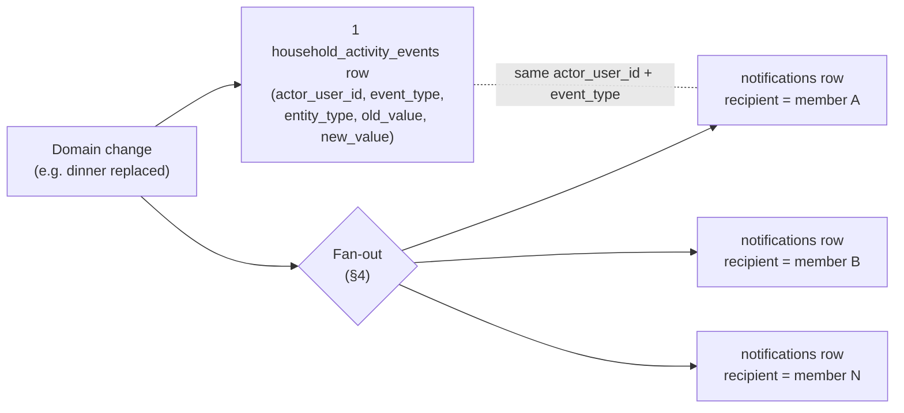
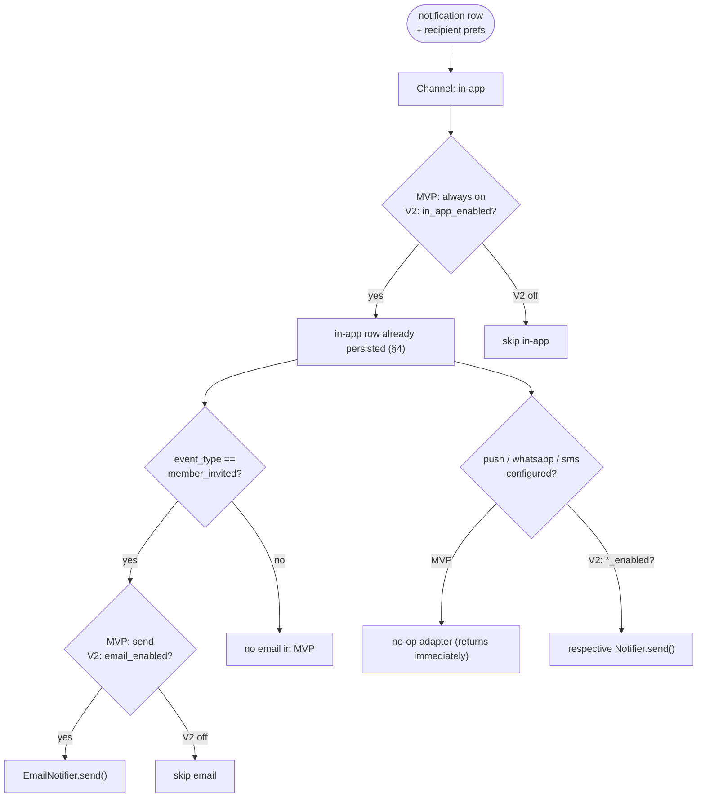

# Notifications Design

How Home Meal Planner tells household members about meal, schedule, grocery, prep,
and membership changes. This document turns the product specification in
[`../docs/09_notifications_spec.md`](../docs/09_notifications_spec.md) into a
production design: the channel abstraction, the relationship between the audit log
and per-recipient notifications, fan-out and routing rules, content templates, and
read-state retrieval.

It builds directly on:

- [`01_database_design.md`](01_database_design.md) — the `notifications`,
  `household_activity_events`, `household_members`, and (V2)
  `notification_preferences` tables. **Doc 01 is the source of truth** for every
  table, column, and enum name used below.
- [`02_system_architecture.md`](02_system_architecture.md) — the `notification`
  service, the cross-cutting `lib/events` module (activity log + notification
  dispatch), and the `pg_cron` + Edge Function scheduled jobs (`prep_reminders`).
- [`07_household_collaboration_design.md`](07_household_collaboration_design.md) —
  member roles, statuses, and the *actor* concept reused here.
- [`08_meal_planning_grocery_prep_design.md`](08_meal_planning_grocery_prep_design.md)
  — prep-task extraction that feeds prep reminders.

> **Conventions** (per [`00_design_index.md`](00_design_index.md)): database
> identifiers are `snake_case`; API request/response payloads are `camelCase`.

---

## 1. Goals & channels

Notifications keep every active member aware of changes another member (or the
system) made, without forcing anyone to poll the app.

### Goals

- One audit row per domain change; **N** per-recipient notifications fanned out
  from it.
- The actor never gets notified about their own action.
- In-app delivery is reliable and read-trackable; external delivery (email) is
  best-effort and never blocks the in-app write.
- The channel set is **pluggable** so push / WhatsApp / SMS can be added later
  without touching domain services.

### Channels

| Channel | MVP status | Used for (MVP) |
|---------|------------|----------------|
| **In-app** | ✅ MVP | All event types — always created. |
| **Email** | ✅ MVP | Invites only (`member_invited`). |
| **Dashboard prep reminders** | ✅ MVP | `prep_task_due` rendered on the dashboard from in-app rows. |
| **Push** | ⏳ Later | No-op adapter in MVP. |
| **WhatsApp** | ⏳ Later | No-op adapter in MVP. |
| **SMS** | ⏳ Later | No-op adapter in MVP. |

### Channel abstraction — a notifier port with pluggable adapters

The `notification` service ([doc 02](02_system_architecture.md) service modules)
depends on a **`Notifier` port**, not on any concrete provider. Each channel is an
adapter implementing the same interface:

```ts
// lib/events/notifier/port.ts
export type Channel = "inApp" | "email" | "push" | "whatsapp" | "sms";

export interface NotificationPayload {
  householdId: string;
  recipientUserId: string;
  actorUserId: string | null;
  eventType: string;        // matches notifications.event_type
  title: string;
  message: string;
}

export interface Notifier {
  readonly channel: Channel;
  /** Best-effort dispatch. Throws only on retryable transport errors. */
  send(payload: NotificationPayload): Promise<void>;
}
```

- `InAppNotifier` — inserts a `notifications` row (the only required channel).
- `EmailNotifier` — wraps the transactional email provider (Resend, per
  [doc 02](02_system_architecture.md)); MVP routes only invites here.
- `PushNotifier` / `WhatsAppNotifier` / `SmsNotifier` — **no-op** adapters in MVP
  (registered, return immediately) so wiring exists before providers do.

A `NotifierRegistry` maps `Channel → Notifier`. The router (§5) decides which
channels fire; the registry decides *how*. Adding push later means registering one
adapter and flipping it on in routing — no domain code changes. This is the
extraction seam called out in [doc 02 “Future scaling”](02_system_architecture.md).

---

## 2. Event taxonomy

All event identifiers below are written verbatim into
`household_activity_events.event_type` and `notifications.event_type` (both `text`
columns in [doc 01](01_database_design.md)). "Default channels" describes MVP
behavior; channels marked *(later)* are no-ops today.

### Meal events

| event_type | trigger | default channels | recipients |
|------------|---------|------------------|------------|
| `meal_changed` | A member changes a planned dish for a slot (`meal_plan_items.dish_id` updated) | in-app | active members except actor |
| `meal_rejected` | A member rejects a suggested item (`status` → `rejected`) | in-app | active members except actor |
| `meal_marked_eating_out` | Slot marked eating out (`status` → `eating_out`) | in-app | active members except actor |
| `meal_locked` | Item locked (`locked` → true) | in-app | active members except actor |
| `meal_unlocked` | Item unlocked (`locked` → false) | in-app | active members except actor |
| `weekly_plan_generated` | A new weekly `meal_plans` row reaches `active` | in-app | active members except actor |
| `weekly_plan_updated` | Regeneration / bulk edit of an active plan | in-app | active members except actor |

### Prep events

| event_type | trigger | default channels | recipients |
|------------|---------|------------------|------------|
| `prep_task_due` | `prep_reminders` job finds a `dish_prep_tasks` item entering its `required_before_minutes` window (§8) | in-app (dashboard) | active members (system actor) |
| `prep_task_completed` | A member marks a prep task done | in-app | active members except actor |
| `prep_task_missed` | Prep window elapses with the task incomplete | in-app | active members (system actor) |

### Grocery events

| event_type | trigger | default channels | recipients |
|------------|---------|------------------|------------|
| `grocery_list_generated` | A `grocery_lists` row is created/activated for a plan | in-app | active members except actor |
| `grocery_list_updated` | List regenerated or items bulk-edited | in-app | active members except actor |
| `grocery_item_checked` | A `grocery_list_items.checked` flips to true | in-app | active members except actor |

### Household events

| event_type | trigger | default channels | recipients |
|------------|---------|------------------|------------|
| `member_invited` | An invite is issued (`household_invites` created) | in-app + **email** | invited person (email) + active members except actor (in-app) |
| `invite_accepted` | Invitee accepts (`member_status` → `active`) | in-app | active members except actor |
| `invite_declined` | Invitee declines (`invite_status` → `declined`) | in-app | active members except actor |
| `member_removed` | Member removed by an admin (`member_status` → `removed`) | in-app | active members except actor + the removed user |
| `member_left` | Member leaves voluntarily (`member_status` → `left`) | in-app | active members except actor |
| `guest_expiring` | Guest within the expiry warning window | in-app | owner / admins |
| `guest_expired` | `expire_guests` job sets `member_status` → `expired` | in-app | owner / admins (system actor) |
| `role_changed` | `household_members.role` changed | in-app | active members except actor + the affected member |
| `permissions_changed` | Any `can_*` flag on `household_members` changed | in-app | the affected member + active members except actor |

> **Recipient note.** `member_removed` and `role_changed`/`permissions_changed`
> intentionally include the *affected* member even though they are not the actor —
> they must learn that they were removed or had their access changed.

---

## 3. Activity events vs notifications

Two tables, two purposes, **one actor**:

| | `household_activity_events` | `notifications` |
|---|---|---|
| Purpose | Append-only **audit log** of *what changed* | Per-recipient **inbox** of *who should be told* |
| Cardinality per change | Exactly **1** | **0..N** (one per recipient) |
| Scope | Whole household | A single `recipient_user_id` |
| Holds before/after | Yes — `old_value`, `new_value` (jsonb) | No — only `title` + `message` |
| Read tracking | No | Yes — `read_at` |
| Lifetime of actor ref | `actor_user_id` is `set null` on user delete (history survives) | `actor_user_id` is `set null` likewise |

Both rows are written from the same domain transaction and carry the **same**
`household_id`, `actor_user_id`, and `event_type`, so any notification can be traced
back to the audit entry that produced it.



The audit log records **every** change (including the actor's own and changes with
zero other recipients); notifications are produced only when there is someone to
tell. Writing the activity event is therefore never skipped, even when fan-out
yields an empty recipient set.

---

## 4. Fan-out rules

When a domain service mutates household state it calls the `lib/events` module,
which performs the spec's creation rules
([`../docs/09_notifications_spec.md` “Notification creation rules”](../docs/09_notifications_spec.md)):

1. **Write the audit row** — one `household_activity_events` row.
2. **Identify all active members** — `household_members` where `household_id = :h`
   and `status = 'active'` and `(expires_at is null or expires_at > now())`. This
   matches `is_active_member()` from [doc 01](01_database_design.md) and is served
   by the partial index `ix_members_household_active`.
3. **Exclude the actor** — drop the row whose `user_id = actor_user_id`.
   *(System-generated events such as `prep_task_due` / `guest_expired` have
   `actor_user_id = null`, so nobody is excluded.)*
4. **(V2) Apply preferences** — for each remaining recipient, consult
   `notification_preferences` (§10) to gate channels. **In MVP this step is
   skipped** — everything is on.
5. **Add special recipients** — events in §2 that target the *affected* member or
   the *invited* person (e.g. `member_removed`, `member_invited`) add those user
   ids even if they are not active members of the in-app audience.
6. **Insert one `notifications` row per recipient** in a single batch insert,
   inside the same transaction as step 1.
7. **Dispatch external channels** — *after commit*, hand each row to the router
   (§5). External sends are best-effort and out of the transaction (§9).

### Sequence

```mermaid
sequenceDiagram
    autonumber
    participant SVC as Domain service<br/>(e.g. mealPlan)
    participant EV as lib/events
    participant DB as Postgres
    participant ROUTER as Channel router (§5)
    participant EXT as Email / Push adapter

    SVC->>EV: emit(eventType, actorUserId, householdId, entity, old/new, vars)
    activate EV
    Note over EV,DB: single transaction
    EV->>DB: INSERT household_activity_events (1 audit row)
    EV->>DB: SELECT active members (status='active', not expired)
    DB-->>EV: member rows
    EV->>EV: exclude actor; (V2) apply notification_preferences; add affected/invited recipients
    EV->>EV: render title + message per recipient (§6)
    EV->>DB: INSERT notifications (batch, 1 row / recipient)
    EV->>DB: COMMIT
    deactivate EV
    Note over EV,ROUTER: after commit — best-effort, non-blocking
    EV->>ROUTER: dispatch(rows)
    loop per recipient × enabled external channel
        ROUTER->>EXT: send(payload)
        alt send fails
            EXT-->>ROUTER: error
            ROUTER->>ROUTER: log + schedule retry (§9); in-app row already persisted
        else delivered
            EXT-->>ROUTER: ok
        end
    end
```

The in-app notification is durable the moment the transaction commits; everything
after the commit line is optional and recoverable.

---

## 5. Channel routing

For each `(notification row, recipient)` the router decides which adapters fire. In
MVP the decision is static (in-app always; email only for invites; everything else
no-op). The same function reads `notification_preferences` in V2.



Routing rules, stated plainly:

- **In-app:** always created in MVP (it is the §4 insert, not a separate send).
- **Email:** only `member_invited` in MVP, addressed to `household_invites.invited_email`.
- **Push / WhatsApp / SMS:** routed to **no-op** adapters in MVP; enabled per-channel
  in V2 behind `notification_preferences`.

---

## 6. Content templates

Each event type has a `title` template and a `message` template. The `lib/events`
module renders them against a variable bag and writes the results into
`notifications.title` / `notifications.message` (both `not null text`,
[doc 01](01_database_design.md)). Examples below are the **exact** examples from
[`../docs/09_notifications_spec.md`](../docs/09_notifications_spec.md).

### Variables available to templates

| Variable | Source |
|----------|--------|
| `{{actorName}}` | `users.display_name` of `actor_user_id` |
| `{{fromDish}}` / `{{toDish}}` | `dishes.name` (old/new), from the audit `old_value` / `new_value` |
| `{{dish}}` | `dishes.name` of the affected `meal_plan_items.dish_id` |
| `{{slotLabel}}` | `meal_plan_items.meal_slot` (e.g. "dinner") + day word ("tonight", weekday) derived from `date` |
| `{{date}}` / `{{dueTime}}` | formatted `meal_plan_items.date` / prep due clock time |
| `{{householdName}}` | `households.name` |
| `{{memberName}}` | invited/affected `users.display_name` |
| `{{guestUntil}}` | formatted `household_members.expires_at` |

### Key templates (verbatim spec examples)

**`meal_changed`**
- Title: `Dinner changed`
- Message: `{{actorName}} changed {{slotLabel}} from {{fromDish}} to {{toDish}}.`
- Rendered: *"Aishvarya changed tonight's dinner from Rajma Rice to Paneer Bhurji."*

**`meal_marked_eating_out`**
- Title: `Meal marked as eating out`
- Message: `{{actorName}} marked {{slotLabel}} as eating out.`
- Rendered: *"Riya marked Saturday dinner as eating out."*

**`invite_accepted`**
- Title: `New household member`
- Message: `{{memberName}} joined {{householdName}} as a guest until {{guestUntil}}.`
- Rendered: *"Rahul joined Suhane Household as a guest until May 26."*

**`prep_task_due`**
- Title: `Prep needed tonight`
- Message: `{{prepTaskName}} by {{dueTime}} for tomorrow's {{dish}}.`
- Rendered: *"Soak chickpeas by 9 PM for tomorrow's Chole Rice."*
- Actor is the system (`actor_user_id = null`), so `{{actorName}}` is unused.

### Interpolation

Rendering is a pure function — `render(eventType, vars) → { title, message }` — with
one template per event type and HTML-escaping for the email adapter only (the in-app
client renders plain text). Templates live in `lib/events/templates/` keyed by
`event_type`; an unknown key fails fast in tests rather than shipping an empty
notification. Variables are resolved once during fan-out (§4 step 6) so every
recipient row is self-contained and needs no joins to display.

---

## 7. Read state & retrieval

### Schema

`notifications.read_at` is a nullable `timestamptz`
([doc 01](01_database_design.md)). `read_at IS NULL` ⇒ unread. The partial index

```sql
create index ix_notifications_recipient_unread
  on notifications (recipient_user_id, created_at desc) where read_at is null;
```

makes both the unread list and the unread **badge count** index-only scans.

### Endpoints (camelCase payloads)

**`GET /api/notifications`** — the signed-in user's inbox.

Query params: `unreadOnly` (boolean, default `false`), `cursor`, `limit` (default 20).

```jsonc
// 200 OK
{
  "items": [
    {
      "id": "…",
      "householdId": "…",
      "actorUserId": "…",
      "eventType": "meal_changed",
      "title": "Dinner changed",
      "message": "Aishvarya changed tonight's dinner from Rajma Rice to Paneer Bhurji.",
      "readAt": null,
      "createdAt": "2026-05-22T13:05:00Z"
    }
  ],
  "unreadCount": 3,
  "nextCursor": "…"
}
```

RLS scopes reads to the recipient (`notifications` read = recipient, per
[doc 01](01_database_design.md) RLS table); the query also filters
`recipient_user_id = auth.uid()` explicitly for clarity.

**`POST /api/notifications/{id}/read`** — mark one notification read.

```jsonc
// 200 OK
{ "id": "…", "readAt": "2026-05-22T13:06:11Z" }
```

Sets `read_at = now()` only when currently `null` (idempotent — a second call is a
no-op, §9). Optional companion `POST /api/notifications/read-all` clears the badge in
one statement (`update … set read_at = now() where recipient_user_id = auth.uid()
and read_at is null`).

### Unread badge

The header badge is the count served by `unreadCount` above, backed by
`ix_notifications_recipient_unread`. The browser client may subscribe to Supabase
realtime on `notifications` filtered by `recipient_user_id` to live-update the badge
without polling ([doc 02](02_system_architecture.md) browser client strategy).

---

## 8. Prep reminders

Prep reminders are the one event type **not** triggered by a user action. They are
produced by the hourly **`prep_reminders`** scheduled job — a `pg_cron`-invoked Edge
Function running with the service-role client
([doc 02 “Scheduled jobs”](02_system_architecture.md)).

Logic (per [doc 02](02_system_architecture.md) and
[doc 08](08_meal_planning_grocery_prep_design.md)):

1. For each household with an `active` meal plan, find upcoming `meal_plan_items`
   whose attached dish has `dish_prep_tasks`.
2. For each prep task, compute its due moment as
   `meal_time − required_before_minutes` (tz-aware per household locale).
3. Select tasks **entering their window this hour** that are not already complete.
4. For each, fan out a `prep_task_due` notification to active members via the same
   `lib/events` path (§4) — but with `actor_user_id = null` (system actor), so no one
   is excluded.
5. The dashboard reads these in-app rows to show prep reminders (MVP — no push).

The job is **idempotent**: it must not create a second `prep_task_due` for the same
`(meal_plan_item, prep_task, recipient)` if it runs twice or overlaps an hour
boundary — see §9.

---

## 9. Delivery, idempotency & failure handling

### Idempotency

- **In-app inserts** — the §4 fan-out runs inside the domain transaction; a retried
  domain action either commits once or rolls back wholesale, so no duplicate rows.
- **Prep reminders** — because the job is replayable, it dedupes on
  `(recipient_user_id, event_type, entity_id)` for the current window before
  inserting. (`entity_id` on the audit row references the `meal_plan_item`; the job
  also keys on the prep task.) A unique guard / `on conflict do nothing` prevents a
  double-fire across an overlapping run.
- **Mark-read** — `POST …/read` only writes when `read_at IS NULL`, so repeated
  calls are no-ops and return the same `readAt`.

### Failure handling

- **External send failures never block in-app.** The in-app row is committed before
  any adapter is called (§4). If `EmailNotifier`/`PushNotifier` throws, the failure is
  logged and queued for retry; the user still sees the notification in the app.
- **Invite emails are retried.** A failed `member_invited` email is retried with
  bounded exponential backoff (the invite itself is already persisted in
  `household_invites`, and the invitee can also accept via the in-app/link flow).
  Other external channels in MVP are no-ops and cannot fail.
- **No-op adapters** for push/WhatsApp/SMS always succeed, so MVP routing has no
  partial-failure surface beyond email.
- Errors are surfaced through the typed error model in
  [doc 02 “Cross-cutting concerns”](02_system_architecture.md); transport errors are
  retryable, validation/template errors are not (they fail tests, not production).

---

## 10. Notification preferences (V2)

Deferred per [`../docs/09_notifications_spec.md`](../docs/09_notifications_spec.md)
and sketched in [doc 01](01_database_design.md). The table is keyed by
`(user_id, household_id)` so preferences are per-membership:

| Column | Type | Default | Gates |
|--------|------|---------|-------|
| `user_id` | uuid (PK) | — | — |
| `household_id` | uuid (PK) | — | — |
| `in_app_enabled` | boolean | `true` | the in-app channel (§5) |
| `email_enabled` | boolean | `true` | the email channel |
| `push_enabled` | boolean | `false` | the push channel |
| `whatsapp_enabled` | boolean | `false` | the WhatsApp channel |
| `prep_reminders_enabled` | boolean | `true` | `prep_task_*` event group |
| `menu_change_enabled` | boolean | `true` | meal events group (§2) |
| `grocery_updates_enabled` | boolean | `true` | grocery events group (§2) |

How they gate (V2): the fan-out step 4 (§4) drops a recipient from an **event group**
when its `*_enabled` flag is false, then the router (§5) drops individual **channels**
when their `*_enabled` flag is false. The two layers compose — e.g. a member with
`menu_change_enabled = false` gets no meal notifications at all, while a member with
`menu_change_enabled = true` but `email_enabled = false` still gets them in-app only.

**MVP behavior:** the table is not yet created; the service treats every flag as its
default-on value and skips the preference lookup entirely (§4 step 4 is a no-op). When
the table ships, absence of a row is read as all-defaults, so existing households need
no backfill.

---

## 11. MVP scope checklist

Mapping to the **MVP notification rules** in
[`../docs/09_notifications_spec.md`](../docs/09_notifications_spec.md):

| Spec MVP rule | Covered by | In scope |
|---------------|-----------|----------|
| In-app notifications for menu/schedule changes | §2 meal events, §4 fan-out, §6 templates | ✅ |
| Email invite notification | §1 channels, §5 routing (`member_invited` → email), §9 retry | ✅ |
| In-app notifications for member joined/left | §2 household events (`invite_accepted`, `member_left`, etc.) | ✅ |
| Prep reminders shown on dashboard | §8 `prep_reminders` job → `prep_task_due` in-app rows | ✅ |
| Push notifications can wait | §1 + §5 no-op adapters; §10 `push_enabled` default `false` | ✅ (deferred) |

Also in MVP, beyond the literal rule list:

- One audit row per change with full fan-out (§3, §4).
- Actor exclusion + system-actor handling (§4).
- Read state, retrieval endpoints, and unread badge (§7).
- Idempotent inserts and non-blocking external sends (§9).

**Explicitly deferred (V2+):** push / WhatsApp / SMS delivery, the
`notification_preferences` table and per-channel gating (§10), and any digest/batching
of notifications.
